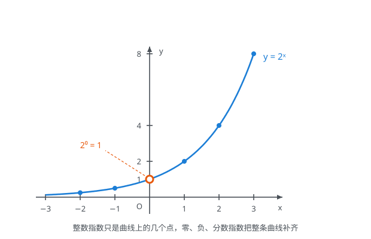
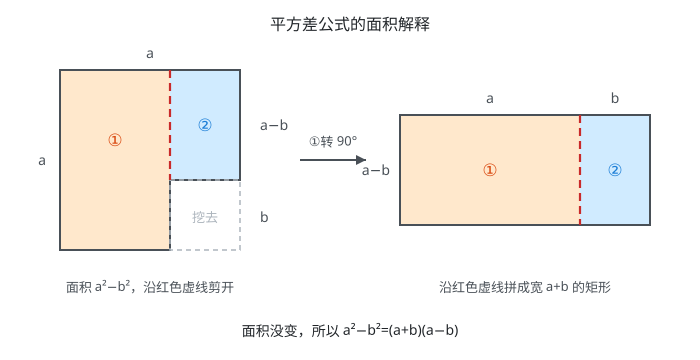
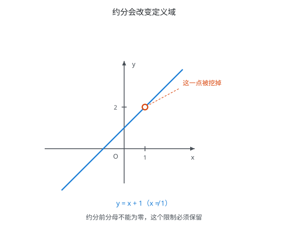
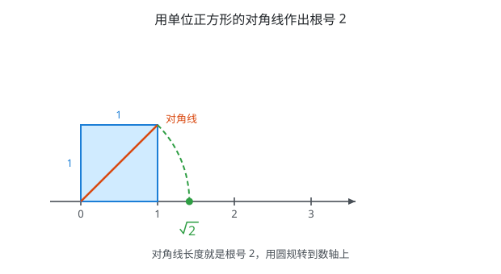
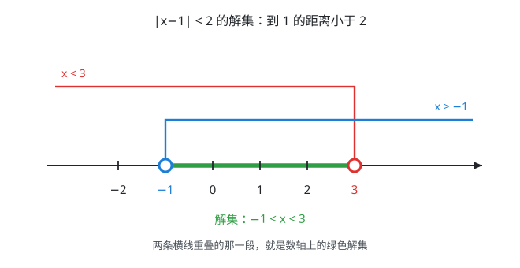

# 具身智能数学基础(01)：代数变形

| 内容 | 必须掌握的 | 后面在哪用到 |
| --- | --- | --- |
| 幂的运算 | 五条法则；零指数、负指数、分数指数 | 矩阵幂与矩阵指数、复杂度记号、指数衰减、$p$ 范数 |
| 因式分解 | 平方差、完全平方、立方和差；**配方法** | 特征多项式分解、二次型化标准形、卡尔曼滤波更新公式的推导、二次代价函数求最小值 |
| 分式化简 | 通分约分；约分会改变定义域；部分分式分解 | 除零保护、条件数、拉普拉斯逆变换、传递函数拆成一阶环节 |
| 根式 | $\sqrt{a^2}=\lvert a \rvert$；分母有理化 | 向量的模、欧氏距离、归一化、相消误差 |
| 绝对值 | 绝对值即距离；三角不等式 | 一维范数、L1 正则、鲁棒核、A 星启发函数的可采纳性 |

## 一、幂的运算

$a^n$ 表示 $n$ 个 $a$ 相乘，$a$ 是**底数**，$n$ 是**指数**。

### 五条运算法则

底数相同才能合并：

- 同底数幂相乘，**指数相加**：$a^m \cdot a^n = a^{m+n}$
- 同底数幂相除，**指数相减**：$a^m \div a^n = a^{m-n}$（$a \ne 0$）
- 幂的乘方，**指数相乘**：$(a^m)^n = a^{mn}$
- 积的乘方：$(ab)^n = a^n b^n$
- 商的乘方：$\left(\dfrac{a}{b}\right)^n = \dfrac{a^n}{b^n}$（$b \ne 0$）

幂对乘法可分配，**对加法不行**：$(a+b)^n \ne a^n+b^n$。

**矩阵不满足后两条**，因为矩阵乘法不交换：$(AB)^n \ne A^n B^n$，$(A+B)^2 = A^2+AB+BA+B^2$（中间两项合并不成 $2AB$）。

### 指数的三次扩展

- **零指数**：$a^0 = 1$（$a \ne 0$，$0^0$ 无定义）
- **负整数指数**：$a^{-n} = \dfrac{1}{a^n}$（$a \ne 0$）
- **分数指数**：$a^{\frac{1}{n}} = \sqrt[n]{a}$，$a^{\frac{m}{n}} = \sqrt[n]{a^m}$（$a \gt 0$）

这三条是"让上面五条法则继续成立"推出来的：

- $a^m \div a^m = a^{m-m} = a^0$，而左边等于 $1$，所以 $a^0 = 1$
- $a^0 \div a^n = a^{-n}$，而左边等于 $\dfrac{1}{a^n}$，所以 $a^{-n} = \dfrac{1}{a^n}$
- $\left(a^{\frac{1}{2}}\right)^2 = a^{\frac{1}{2} \times 2} = a$，所以 $a^{\frac{1}{2}} = \sqrt{a}$

最后一条把幂和根式统一了：**根式就是分数指数的另一种写法**。

### 图示：指数函数

$y=2^x$ 是一条光滑连续的曲线，整数指数只是它上面的几个孤立点。零指数、负指数、分数指数的定义，正是把这条曲线补齐——补法唯一，因为要保证运算法则处处成立。曲线恒在 $x$ 轴上方且不与之相交，所以 $a^x \gt 0$ 恒成立。

## 二、因式分解

把多项式写成**几个整式相乘**，是展开的逆运算。乘积形式能直接读出零点：$(x+1)(x+2)=0$ 的根是 $-1$ 和 $-2$。

### 五种方法

**1. 提公因式**：$ma+mb+mc = m(a+b+c)$

**2. 公式法**：

- 平方差：$a^2-b^2 = (a+b)(a-b)$
- 完全平方：$a^2 \pm 2ab+b^2 = (a \pm b)^2$
- 立方和：$a^3+b^3 = (a+b)(a^2-ab+b^2)$
- 立方差：$a^3-b^3 = (a-b)(a^2+ab+b^2)$

**3. 十字相乘**：$x^2+(p+q)x+pq = (x+p)(x+q)$。找两个数，和为一次项系数，积为常数项。

**4. 分组分解**：$ax+ay+bx+by = a(x+y)+b(x+y) = (a+b)(x+y)$

**5. 试根法**（三次及以上）：若 $x=r$ 代入结果为 $0$，则 $(x-r)$ 是因式。有理根只可能是"常数项的因数除以首项系数的因数"。

### 配方法

把二次式凑成"完全平方 + 常数"：

$ax^2+bx+c = a\left(x+\dfrac{b}{2a}\right)^2+c-\dfrac{b^2}{4a}$

做法是提出二次项系数，在括号内加上一次项系数一半的平方、再减掉：

$x^2+6x+5 = (x^2+6x+9)-9+5 = (x+3)^2-4$

配成这个形式后极值直接可读：平方项最小为 $0$，故最小值 $-4$，在 $x=-3$ 处取到。$a \gt 0$ 时是最小值，$a \lt 0$ 时是最大值。

多元形式是把 $\mathbf{x}^{T}A\mathbf{x}+\mathbf{b}^{T}\mathbf{x}+c$ 配成 $(\mathbf{x}-\mathbf{x}_0)^{T}A(\mathbf{x}-\mathbf{x}_0)+\text{常数}$，做法完全一样。

### 图示：平方差公式

边长 $a$ 的正方形挖掉边长 $b$ 的正方形，剩下面积 $a^2-b^2$。沿红色虚线剪成①$(a-b) \times a$ 和②$b \times (a-b)$ 两块，①转 $90^{\circ}$ 后与②拼合，得到宽 $a+b$、高 $a-b$ 的矩形。面积不变，故 $a^2-b^2=(a+b)(a-b)$。

## 三、分式化简

分子分母都是整式、分母含字母的式子。核心性质一条：

**分子分母同乘或同除一个不为零的整式，分式的值不变。**

由它派生出**通分**（化成同分母，用于加减）与**约分**（约去公因式，用于化简）。

### 约分会改变定义域

$\dfrac{x^2-1}{x-1} = \dfrac{(x+1)(x-1)}{x-1} = x+1$

约分在代数上合法，但**原式在 $x=1$ 处无定义**，所以正确写法必须带条件：

$\dfrac{x^2-1}{x-1} = x+1 \quad (x \ne 1)$

图中空心圆就是被挖掉的点 $(1,2)$。约分**扩大了定义域**，由此两条纪律：

- **解分式方程必须验根**。去分母那一步丢掉了"分母不为零"，解出的根若让某个分母为零就是**增根**，必须舍掉
- **动手前先写定义域**

### 部分分式分解

通分的逆操作，把复杂分式拆成简单分式之和：

$\dfrac{1}{x^2-1} = \dfrac{1}{(x-1)(x+1)} = \dfrac{1}{2}\left(\dfrac{1}{x-1}-\dfrac{1}{x+1}\right)$

做法：设成 $\dfrac{A}{x-1}+\dfrac{B}{x+1}$，通分后比较分子，定出 $A=\dfrac{1}{2}$、$B=-\dfrac{1}{2}$。

一般规则：分母有几个不同的一次因式，就拆成几项；若某因式是 $k$ 重根，要拆出 $\dfrac{A_1}{x-r}+\dfrac{A_2}{(x-r)^2}+\dots+\dfrac{A_k}{(x-r)^k}$。

## 四、根式

$\sqrt{a}$ 就是 $a^{\frac{1}{2}}$，是 $a$ 的**算术平方根**，两个前提：

- 被开方数非负：$a \ge 0$
- 结果本身也非负：$\sqrt{a} \ge 0$

第二条导出这一节最重要的公式：

$\sqrt{a^2} = \lvert a \rvert$

**是 $\lvert a \rvert$ 不是 $a$**。$\sqrt{(-3)^2} = 3$，不是 $-3$。所以遇到 $\sqrt{(\text{某式})^2}$，去根号前必须先判断括号内的正负：$\sqrt{(1-\sqrt{2})^2} = \sqrt{2}-1$，因为 $\sqrt{2} \gt 1$。

### 运算法则

- 乘除：$\sqrt{a} \cdot \sqrt{b} = \sqrt{ab}$，$\dfrac{\sqrt{a}}{\sqrt{b}} = \sqrt{\dfrac{a}{b}}$（$a \ge 0$，$b \gt 0$）
- 加减：只有**同类二次根式**能合并。$2\sqrt{3}+5\sqrt{3} = 7\sqrt{3}$，而 $\sqrt{2}+\sqrt{3}$ 合并不了
- **分母有理化**：
  - 单项：$\dfrac{1}{\sqrt{a}} = \dfrac{\sqrt{a}}{a}$
  - 两项：$\dfrac{1}{\sqrt{a}+\sqrt{b}} = \dfrac{\sqrt{a}-\sqrt{b}}{a-b}$，用的是平方差公式

### 图示：根号 2 的几何位置

以数轴上 $0$ 到 $1$ 为边作单位正方形，对角线长由勾股定理得 $\sqrt{2}$。以原点为圆心、对角线长为半径画弧交数轴，交点即 $\sqrt{2}$。根式是一个明确的几何长度，不是"算不出来的数"。

## 五、绝对值

代数定义分段：$a \ge 0$ 时 $\lvert a \rvert = a$，$a \lt 0$ 时 $\lvert a \rvert = -a$。

几何定义更好用：

- $\lvert a \rvert$ 是数轴上 $a$ 到**原点**的距离
- $\lvert a-b \rvert$ 是 $a$ 与 $b$ **两点之间**的距离

### 基本性质

- $\lvert a \rvert \ge 0$，且 $\lvert a \rvert = 0$ 当且仅当 $a=0$
- $\lvert ab \rvert = \lvert a \rvert \cdot \lvert b \rvert$，$\left\lvert \dfrac{a}{b} \right\rvert = \dfrac{\lvert a \rvert}{\lvert b \rvert}$
- $\lvert a \rvert^2 = a^2$，$\lvert -a \rvert = \lvert a \rvert$
- **三角不等式**：$\lvert a+b \rvert \le \lvert a \rvert+\lvert b \rvert$
- **反向三角不等式**：$\bigl\lvert \lvert a \rvert-\lvert b \rvert \bigr\rvert \le \lvert a-b \rvert$

### 绝对值不等式

从"距离"直接读出：

- $\lvert x \rvert \lt r$（$r \gt 0$）等价于 $-r \lt x \lt r$——距离小于 $r$，**解集是一段**
- $\lvert x \rvert \gt r$ 等价于 $x \lt -r$ 或 $x \gt r$——距离大于 $r$，**解集是两段**

一般形式：$\lvert x-a \rvert \lt r$ 等价于 $a-r \lt x \lt a+r$，即以 $a$ 为中心、半径 $r$ 的开区间。

### 图示：数轴上求解集

$\lvert x-1 \rvert \lt 2$ 是**两个不等式同时成立**，画成两条横线：红线 $x \lt 3$ 向左延伸、在 $3$ 处折下；蓝线 $x \gt -1$ 向右延伸、在 $-1$ 处折下。**两条横线水平重叠的那一段就是交集**，即数轴上的绿色粗线段 $(-1,3)$。端点空心圆表示取不到。

## 对应视频

正文看得懂就跳过，卡住了再看对应那一段。下面只列真正值得看的。

- **因式分解**
  - [P5 乘法公式大全以及使用方法](https://www.bilibili.com/video/BV1qE411H7Uv?p=5)（13:12）— **全集必看**
  - [P3 十字相乘法](https://www.bilibili.com/video/BV1qE411H7Uv?p=3)（14:58）— 只看开头讲十字相乘那段
- **分式化简**
  - [P2 数与式的化简求值](https://www.bilibili.com/video/BV1qE411H7Uv?p=2)（10:05）— 只看通分约分的操作流程
- **绝对值**
  - [P4 绝对值的意义与解题方法](https://www.bilibili.com/video/BV1qE411H7Uv?p=4)（16:58）— 只看前半"意义"部分

实际要看的约 40 分钟。**幂的运算、配方法、部分分式分解、根式**这几块合集里没有对应视频，以正文为准。

集数、标题、时长取自 B 站页面，未逐集观看。
