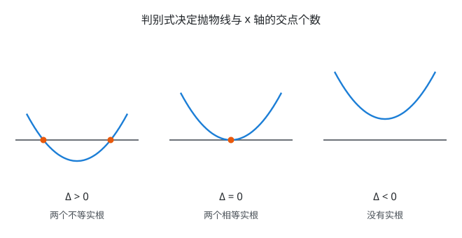
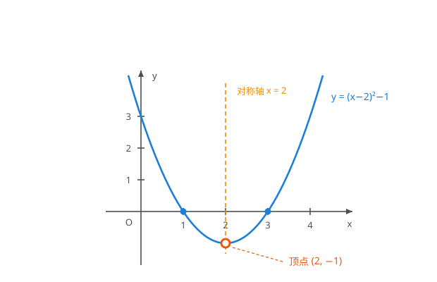
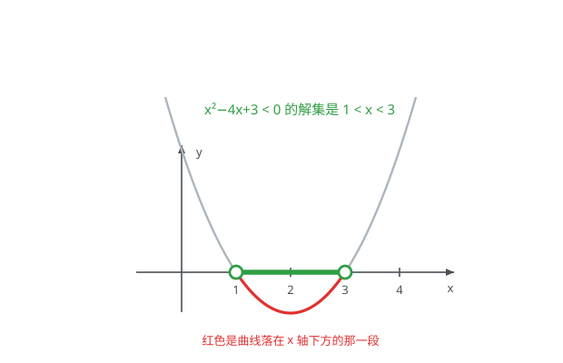

# 具身智能数学基础(02)：一元二次方程与二次函数

| 内容 | 必须掌握的 | 后面在哪用到 |
| --- | --- | --- |
| 一元二次方程 | 求根公式（由配方推出）；判别式的三种情况 | 阻尼振子的过阻尼/临界/欠阻尼判别、特征方程求特征值、二次型正定性判据 |
| 韦达定理 | 两根之和 $-\dfrac{b}{a}$、两根之积 $\dfrac{c}{a}$ | 矩阵的迹等于特征值之和、行列式等于特征值之积 |
| 二次函数 | 三种形式互化；开口、对称轴、顶点 | 二次代价函数、LQR 的代价、高斯分布的指数部分 |
| 最值 | 顶点处取最值；闭区间上的最值分类 | 最小二乘、二次规划、带约束优化的一维原型 |
| 二次不等式 | 解集与判别式的关系；图像法 | 可行域、凸约束、Lyapunov 稳定性条件 |

## 一、一元二次方程

一般式 $ax^2+bx+c=0$（$a \ne 0$）。

### 求根公式

$x = \dfrac{-b \pm \sqrt{b^2-4ac}}{2a}$

**求根公式不是背下来的，是配方的结果**（推导见后面）。根号里那一坨就是判别式。

### 判别式

$\Delta = b^2-4ac$

- $\Delta \gt 0$：两个不等实根
- $\Delta = 0$：两个相等实根（重根），$x = -\dfrac{b}{2a}$
- $\Delta \lt 0$：无实根，有两个共轭复根 $\dfrac{-b \pm \mathrm{i}\sqrt{4ac-b^2}}{2a}$

判别式的符号等价于抛物线与 $x$ 轴交点的个数：两个、一个（相切）、零个。

复根那一条不要跳过：二阶系统的特征方程判别式为负时，两个共轭复根的虚部就是振荡频率、实部就是衰减率。

## 二、韦达定理

设 $x_1$、$x_2$ 是 $ax^2+bx+c=0$ 的两根，则

- $x_1+x_2 = -\dfrac{b}{a}$
- $x_1 x_2 = \dfrac{c}{a}$

由求根公式直接相加、相乘可以验证：两根相加时根号项抵消，得 $x_1+x_2=-\dfrac{b}{a}$；相乘时用平方差得到 $x_1x_2=\dfrac{b^2-(b^2-4ac)}{4a^2}=\dfrac{c}{a}$。

**逆用**：已知两数之和为 $s$、之积为 $p$，它们就是 $x^2-sx+p=0$ 的两根。这个方向比正用更常用。

**推广到 $n$ 次**：$n$ 次多项式所有根之和等于 $-\dfrac{a_{n-1}}{a_n}$，所有根之积等于 $(-1)^n\dfrac{a_0}{a_n}$。

## 三、二次函数

$y=ax^2+bx+c$（$a \ne 0$），图像是抛物线。三种形式，按需要互化：

- **一般式** $y=ax^2+bx+c$——直接读出与 $y$ 轴的交点 $(0,c)$
- **顶点式** $y=a(x-h)^2+k$——直接读出顶点 $(h,k)$，由一般式配方得到
- **交点式** $y=a(x-x_1)(x-x_2)$——直接读出与 $x$ 轴的交点，仅当 $\Delta \ge 0$ 时存在

由配方得到顶点坐标：

- 对称轴：$x = -\dfrac{b}{2a}$
- 顶点：$\left(-\dfrac{b}{2a},\ \dfrac{4ac-b^2}{4a}\right)$

其余性质：

- $a \gt 0$ 开口向上，$a \lt 0$ 开口向下
- $\lvert a \rvert$ 越大开口越窄，$\lvert a \rvert$ 越小越平缓
- 图像关于对称轴左右对称，故 $f(h+t)=f(h-t)$ 对任意 $t$ 成立

图中 $y=x^2-4x+3$ 配方后是 $(x-2)^2-1$：顶点 $(2,-1)$，对称轴 $x=2$，与 $x$ 轴交于 $1$ 和 $3$，与 $y$ 轴交于 $3$。

## 四、最值

### 无约束

顶点处取到最值：$a \gt 0$ 时最小值为 $\dfrac{4ac-b^2}{4a}$，$a \lt 0$ 时该值为最大值。另一侧无界。

### 闭区间 $[m,n]$ 上

设对称轴 $h=-\dfrac{b}{2a}$，以 $a \gt 0$ 为例，按 $h$ 与区间的位置分三种情况：

- $h \lt m$：函数在 $[m,n]$ 上单调递增，最小值 $f(m)$，最大值 $f(n)$
- $m \le h \le n$：最小值 $f(h)$（顶点在区间内），最大值取 $f(m)$ 与 $f(n)$ 中较大者
- $h \gt n$：函数在 $[m,n]$ 上单调递减，最小值 $f(n)$，最大值 $f(m)$

$a \lt 0$ 时最大最小互换。

**要点是先看顶点在不在区间内**。这正是带约束优化的一维原型：无约束最优点落在可行域内就直接用它，落在外面就取到边界上。

## 五、二次不等式

以 $a \gt 0$ 为例（$a \lt 0$ 时两边同乘 $-1$ 化成 $a \gt 0$，注意不等号变向）：

| 判别式 | $ax^2+bx+c \gt 0$ | $ax^2+bx+c \lt 0$ |
| --- | --- | --- |
| $\Delta \gt 0$（两根 $x_1 \lt x_2$） | $x \lt x_1$ 或 $x \gt x_2$ | $x_1 \lt x \lt x_2$ |
| $\Delta = 0$（重根 $x_0$） | $x \ne x_0$ | 无解 |
| $\Delta \lt 0$ | 全体实数 | 无解 |

口诀式的记法是"大于取两边，小于取中间"，但真正可靠的做法是画图看曲线在 $x$ 轴的哪一侧。

解 $x^2-4x+3 \lt 0$：先求根得 $1$ 和 $3$，画出开口向上的抛物线，取曲线落在 $x$ 轴**下方**的那一段，对应 $1 \lt x \lt 3$。若不等号是 $\gt$，就取曲线在轴上方的两段。

$\Delta \lt 0$ 那一行值得单独记：**开口向上且无实根，等价于这个二次式恒为正**。

## 推导与证明

### 求根公式的配方推导

对一般式配方（第 1 篇的方法）：

$ax^2+bx+c = a\left(x+\dfrac{b}{2a}\right)^2+\dfrac{4ac-b^2}{4a} = 0$

移项、两边除以 $a$：

$\left(x+\dfrac{b}{2a}\right)^2 = \dfrac{b^2-4ac}{4a^2}$

开方，注意 $\sqrt{4a^2}=\lvert 2a \rvert$，正负号已被 $\pm$ 吸收：

$x = \dfrac{-b \pm \sqrt{b^2-4ac}}{2a}$

## 对应视频

正文看得懂就跳过，卡住了再看对应那一段。下面只列真正值得看的。

- **二次函数基础**
  - [P3 十字相乘法；二次函数、方程、不等式基础知识梳理](https://www.bilibili.com/video/BV1qE411H7Uv?p=3)（14:58）— 看后半段的二次函数与不等式部分（前半的十字相乘第 1 篇已看）
- **系数与图像的关系**
  - [P15 二次函数中的 a、b、c 考点汇总](https://www.bilibili.com/video/BV1qE411H7Uv?p=15)（19:55）— 只看 $a$、$b$、$c$ 分别怎么影响开口、对称轴、截距这部分，后面的判定题型跳过
- **韦达定理**
  - [P12 韦达定理运用策略](https://www.bilibili.com/video/BV1qE411H7Uv?p=12)（25:37）— 只看开头讲定理本身和推导的部分，后面大段是应试变形

实际要看的约 30 分钟。**求根公式的配方推导、闭区间最值的三种情况、二次不等式与判别式的对应表**这几块以正文为准，视频里讲得比正文散。

集数、标题、时长取自 B 站页面，未逐集观看。
