# 具身智能数学基础(03)：平面几何

| 内容 | 必须掌握的 | 后面在哪用到 |
| --- | --- | --- |
| 三角形基本性质 | 内角和与外角定理、三边关系、三线合一、中位线 | 三边关系就是**三角不等式**的几何原型 |
| 全等与相似 | 判定条件；面积比是相似比的平方 | **针孔相机模型**、单目测距、图像金字塔 |
| 角平分线定理 | $AB:AC = BD:DC$ | 按边长比例分割线段 |
| 垂直与斜率 | $l_1\perp l_2 \iff k_1k_2=-1$ | 法线与切线垂直、梯度与等高线垂直、三维点积为零的二维特例 |
| 勾股定理 | 定理与逆定理；勾股数 | 欧氏距离、向量的模、二范数的几何来源 |
| 圆与角 | 圆周角定理及推论、垂径定理、切线、四心 | 隐圆判定、RANSAC 圆拟合、质心与**重心坐标** |
| 位置关系 | 点/直线/圆与圆的位置判定 | **包围圆碰撞检测**、符号距离场 SDF、射线求交 |
| 弧长与扇形 | $l=\theta r$、$S=\frac{1}{2}\theta r^2$ | 弧度制的由来、角速度与线速度的换算 |
| 三角形面积 | 底乘高、两边夹角、坐标形式 | 坐标形式就是**二维叉乘** |

## 一、三角形的基本性质

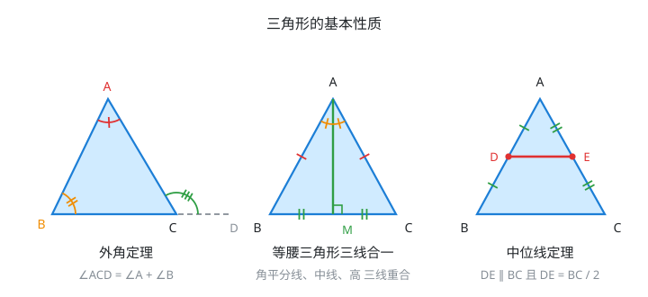

**内角和**：$\angle A + \angle B + \angle C = 180^{\circ}$。

**外角定理**：三角形的一个外角，等于与它不相邻的两个内角之和。图左中 $\angle ACD = \angle A + \angle B$，由内角和直接得到：$\angle ACD = 180^{\circ}-\angle ACB = \angle A + \angle B$。这条在上一章圆周角定理的证明里是关键一步。

**三边关系**：任意两边之和大于第三边，任意两边之差的绝对值小于第三边：

$\lvert b-c \rvert \lt a \lt b+c$

**这就是三角不等式的几何原型**。第 1 篇里的 $\lvert a+b \rvert \le \lvert a \rvert + \lvert b \rvert$ 是它的代数版本，后面向量的 $\lVert \mathbf{u}+\mathbf{v} \rVert \le \lVert \mathbf{u} \rVert + \lVert \mathbf{v} \rVert$ 是它的高维版本。三者说的是同一件事：**折线走不过直线**。

**等腰三角形**：两腰相等则两底角相等（等边对等角），反过来也成立。核心是**三线合一**——顶角平分线、底边上的中线、底边上的高，三条线重合（图中）。垂径定理的证明用的就是这一条。

**中位线定理**：连接三角形两边中点的线段，平行于第三边且等于第三边的一半（图右）。

$DE \parallel BC$ 且 $DE = \dfrac{1}{2}BC$

证明用相似：$AD:AB = AE:AC = 1:2$ 且夹角 $\angle A$ 公共，由 SAS 得 $\triangle ADE \sim \triangle ABC$，相似比 $1:2$，于是对应边成比例、对应角相等（同位角相等推出平行）。

## 二、全等与相似

**全等**是形状和大小都相同，**相似**只要求形状相同、大小可以不同。

### 判定条件

全等三角形：

- **SSS**：三边对应相等
- **SAS**：两边及其夹角对应相等
- **ASA / AAS**：两角及一边对应相等
- **HL**：直角三角形，斜边和一条直角边对应相等

相似三角形：

- **AA**：两角对应相等（最常用，因为角度信息最容易获得）
- **SAS**：两边对应成比例且夹角相等
- **SSS**：三边对应成比例

### 性质

设相似比为 $k$（对应边之比）：

- 对应边之比都等于 $k$，对应角相等
- 周长之比等于 $k$
- **面积之比等于 $k^2$**
- 对应中线、对应高、对应角平分线之比都等于 $k$

**面积之比等于相似比的平方**这一条要特别记牢，很多题目会用到。

### 平行线分线段成比例

三条平行线截两条直线，所得对应线段成比例。用在三角形上就是**基本比例定理**：

平行于三角形一边的直线，截其他两边所得的对应线段成比例。即 $DE \parallel BC$ 时

$\dfrac{AD}{DB} = \dfrac{AE}{EC}$

$DE \parallel BC$ 时可推出 $\triangle ADE \sim \triangle ABC$；反过来也成立，比例相等可以反推平行。

### 角平分线定理

三角形一个内角的平分线，把对边分成的两条线段之比，等于这个角的两边之比：

**$AD$ 平分 $\angle A$，$D$ 在 $BC$ 上，则 $\dfrac{AB}{AC} = \dfrac{BD}{DC}$**

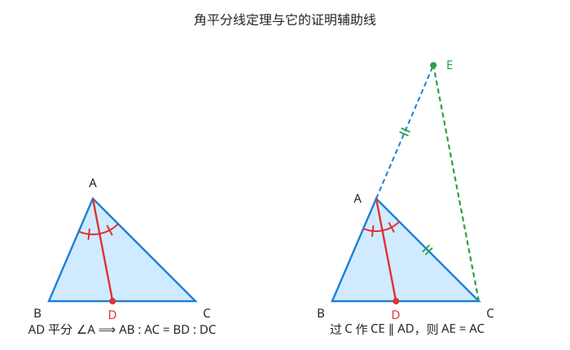

推导见后面。**外角平分线**同样成立，只是 $D$ 落在 $BC$ 的延长线上，结论写成 $\dfrac{AB}{AC} = \dfrac{BD}{DC}$ 不变。

### 垂直与斜率之积

两条不垂直于坐标轴的直线 $l_1$、$l_2$ 互相垂直，当且仅当它们的斜率满足

$k_1 k_2 = -1$

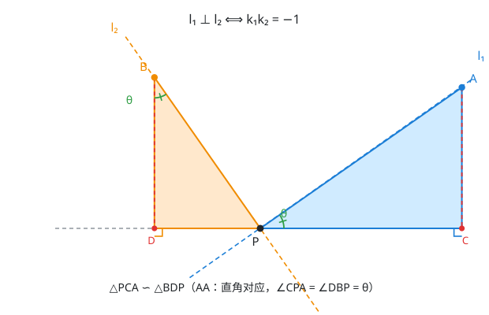

证明（只用相似，不用三角函数）见后面。

## 三、勾股定理

直角三角形中，两直角边 $a$、$b$ 与斜边 $c$ 满足

$a^2+b^2 = c^2$

**逆定理**同样重要：若三边满足 $a^2+b^2=c^2$，则该三角形必是直角三角形。逆定理是判定垂直的手段，不需要量角度。

### 图示：面积证明

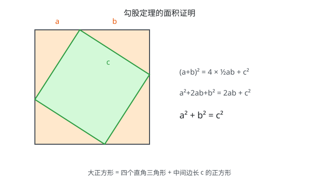

证明见后面。

### 常见勾股数

整数解 $(a,b,c)$ 满足 $a^2+b^2=c^2$ 的叫勾股数，记住这几组能加快心算：

- $(3,4,5)$ 及其倍数 $(6,8,10)$、$(9,12,15)$
- $(5,12,13)$
- $(8,15,17)$
- $(7,24,25)$

### 推广到坐标与高维

平面上两点 $(x_1,y_1)$、$(x_2,y_2)$ 的距离

$d = \sqrt{(x_2-x_1)^2+(y_2-y_1)^2}$

就是把坐标差当直角边用一次勾股定理。三维再套一次：

$d = \sqrt{(\Delta x)^2+(\Delta y)^2+(\Delta z)^2}$

推到 $n$ 维就是向量的二范数 $\lVert \mathbf{v} \rVert_2 = \sqrt{\sum v_i^2}$。

## 四、圆与角

圆是平面上到定点（圆心）距离等于定值（半径）的点的集合，写成方程就是 $(x-a)^2+(y-b)^2 = r^2$。

先约定名称：

- **圆心角**：顶点在圆心的角，如 $\angle BOC$
- **圆周角**：顶点在圆上、两边都与圆相交的角，如 $\angle BAC$
- **弧**：圆上两点间的一段，$\overset{\frown}{BC}$。一条弦把圆分成劣弧和优弧两段
- **同弧**：指同一条弧。"同弧所对的角"意思是这个角的两边分别经过这条弧的两个端点，而角的顶点不在这条弧上

弧、弦、圆心角三者一一对应：**在同一个圆里，两条弧相等 ⟺ 所对的弦相等 ⟺ 所对的圆心角相等**。所以后面说"弧相等"和说"圆心角相等"是一回事。

### 圆周角定理

**同一条弧所对的圆周角，等于它所对的圆心角的一半。**

$\angle BAC = \dfrac{1}{2}\angle BOC$

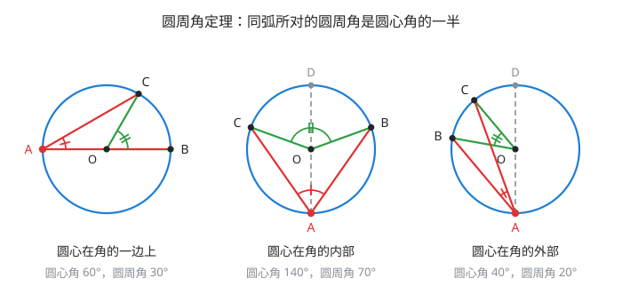

证明按圆心 $O$ 相对于 $\angle BAC$ 的位置分三种情况，见后面。

### 三个推论

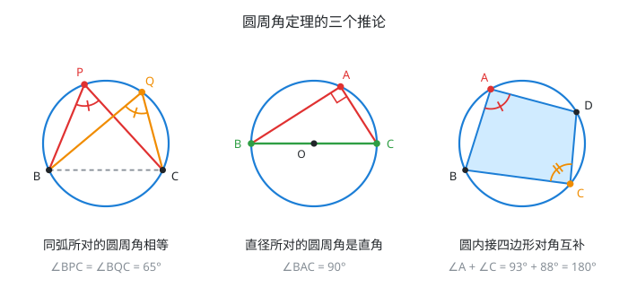

**推论一：同弧或等弧所对的圆周角相等。** 因为它们都等于同一个圆心角的一半。图左中 $P$、$Q$ 是优弧上任意两点，$\angle BPC = \angle BQC$，与点在优弧上怎么滑动无关。

这条的逆命题给出**四点共圆的判定**：若 $P$、$Q$ 在直线 $BC$ 同侧且 $\angle BPC = \angle BQC$，则 $B$、$C$、$P$、$Q$ 四点共圆。

**推论二：半圆（直径）所对的圆周角是直角。** 直径对应的圆心角是平角 $180^{\circ}$，一半即 $90^{\circ}$。

逆命题同样成立且更常用：**若 $\angle BAC = 90^{\circ}$，则 $A$ 落在以 $BC$ 为直径的圆上**。于是"直角"这个条件可以直接翻译成"点在某个圆上"，这就是解题中所谓的隐圆。

**推论三：圆内接四边形对角互补。**

$\angle A + \angle C = 180^{\circ}$，$\angle B + \angle D = 180^{\circ}$

证明：$\angle A$ 与 $\angle C$ 分别对着 $\overset{\frown}{BCD}$ 和 $\overset{\frown}{BAD}$ 这两条弧，它们合起来是整个圆周 $360^{\circ}$。由圆周角定理，两角之和等于这两条弧对应圆心角之和的一半，即 $\dfrac{360^{\circ}}{2}=180^{\circ}$。

逆命题也成立，是四点共圆的另一个判定。

### 垂径定理

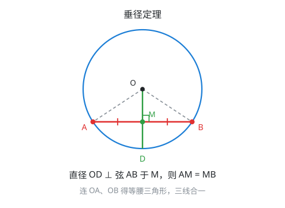

**垂直于弦的直径，平分这条弦，并且平分弦所对的两条弧。**

证明：连 $OA$、$OB$。$OA = OB$（半径），故 $\triangle OAB$ 等腰。等腰三角形三线合一——顶角平分线、底边中线、底边高互相重合。已知 $OD \perp AB$ 于 $M$，即 $OM$ 是底边上的高，所以它同时是中线，$AM = MB$；也是顶角平分线，$\angle AOD = \angle BOD$，所以两条弧也相等。

逆定理：平分弦（这条弦不是直径）的直径，必定垂直于这条弦。

由垂径定理直接得**弦长公式**：圆心到弦的距离为 $d$，半径为 $r$，则

弦长 $= 2\sqrt{r^2-d^2}$

推导就是在 $\triangle OMA$ 里用一次勾股定理。

### 切线

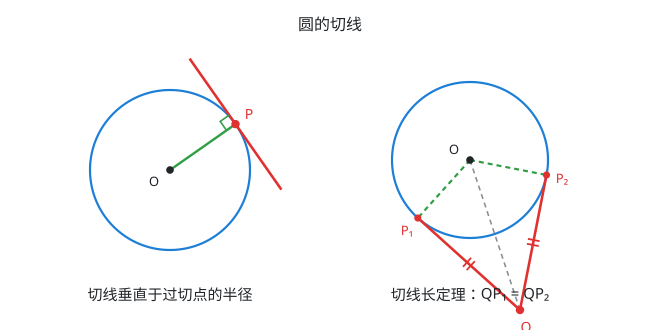

**切线性质：圆的切线垂直于过切点的半径。**

证明（反证法）：设切线 $l$ 与圆切于 $P$，若 $OP$ 不垂直于 $l$，作 $OH \perp l$ 于 $H$，则 $OH \lt OP = r$。这说明圆心到直线的距离小于半径，直线必与圆有两个交点，与"切线只有一个公共点"矛盾。故 $OP \perp l$。

**切线判定**：过半径外端且垂直于这条半径的直线是圆的切线。

**切线长定理**：从圆外一点 $Q$ 引圆的两条切线，两条切线长相等，即 $QP_1 = QP_2$；且 $OQ$ 平分 $\angle P_1QP_2$。

证明：$OP_1 = OP_2 = r$，$\angle OP_1Q = \angle OP_2Q = 90^{\circ}$，$OQ$ 公共，由 HL 判定 $\triangle OP_1Q \cong \triangle OP_2Q$，于是对应边 $QP_1 = QP_2$、对应角 $\angle P_1QO = \angle P_2QO$。

### 外接圆与内切圆

这两个概念最容易混，先记住区别：**外接圆过三个顶点，内切圆与三条边相切**。

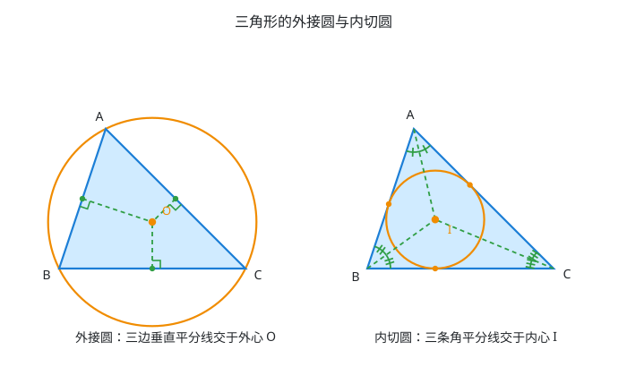

**外接圆**：过三角形三个顶点的圆。圆心叫**外心**，是**三边垂直平分线的交点**。

证明：垂直平分线的本质是"到线段两端距离相等的点的集合"。设 $BC$ 与 $AB$ 的垂直平分线交于 $O$，则 $O$ 在 $BC$ 的垂直平分线上 $\Rightarrow OB = OC$；$O$ 在 $AB$ 的垂直平分线上 $\Rightarrow OA = OB$。于是 $OA = OB = OC$。由 $OA = OC$ 反推，$O$ 也必在 $AC$ 的垂直平分线上，三线共点。以 $O$ 为圆心、$OA$ 为半径的圆同时过三个顶点。

外心的位置随三角形形状变化：锐角三角形在内部，直角三角形恰在**斜边中点**（因为斜边所对的圆周角是直角，斜边就是直径），钝角三角形在外部。

外接圆半径 $R = \dfrac{abc}{4S}$，其中 $S$ 是三角形面积。

**内切圆**：与三角形三条边都相切的圆。圆心叫**内心**，是**三条角平分线的交点**。

证明：角平分线的本质是"到角两边距离相等的点的集合"。设 $\angle A$ 与 $\angle B$ 的平分线交于 $I$，则 $I$ 在 $\angle A$ 的平分线上 $\Rightarrow$ $I$ 到 $AB$ 与 $AC$ 的距离相等；$I$ 在 $\angle B$ 的平分线上 $\Rightarrow$ $I$ 到 $AB$ 与 $BC$ 的距离相等。于是 $I$ 到三条边的距离全部相等。由"到 $AC$、$BC$ 距离相等"反推，$I$ 也在 $\angle C$ 的平分线上，三线共点。以 $I$ 为圆心、这个公共距离为半径的圆与三边都相切（半径垂直于边，正是切线判定）。

内心永远在三角形内部，这一点和外心不同。

内切圆半径由面积得出：把三角形按内心切成三块，每块以一条边为底、以 $r$ 为高，于是 $S = \dfrac{1}{2}r(a+b+c) = rp$，其中 $p$ 是半周长，解得

$r = \dfrac{S}{p}$

**两个圆心的对照**：

| | 外接圆 | 内切圆 |
| --- | --- | --- |
| 与三角形的关系 | 过三个顶点 | 与三条边相切 |
| 圆心叫法 | 外心 | 内心 |
| 圆心是什么的交点 | 三边**垂直平分线** | 三条**角平分线** |
| 圆心的本质性质 | 到三个**顶点**距离相等 | 到三条**边**距离相等 |
| 位置 | 可能在三角形外 | 一定在三角形内 |
| 半径 | $R = \dfrac{abc}{4S}$ | $r = \dfrac{S}{p}$ |

### 三角形的四心

上面讲了外心和内心，把四个心放在一起对照。

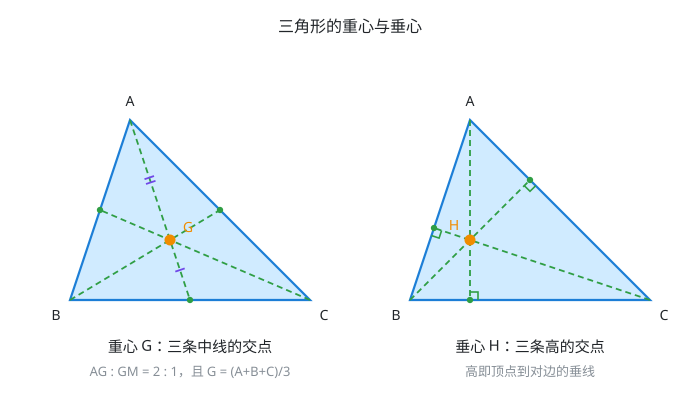

**重心 $G$**：三条中线的交点。两条关键性质（证明见后面）：

- 重心把每条中线分成 $2:1$ 两段，靠近顶点的那段是靠近对边的两倍
- 坐标就是三个顶点的算术平均：$G = \dfrac{A+B+C}{3}$

第二条把重心和"质心"直接连起来：均匀薄片三角形的质心就是重心；推广到 $n$ 个点，质心就是 $\dfrac{1}{n}\sum P_i$。

再推广一步得到**重心坐标**：三角形内任一点都能唯一写成

$P = \alpha A + \beta B + \gamma C$，其中 $\alpha+\beta+\gamma = 1$，$\alpha,\beta,\gamma \ge 0$

重心对应 $\alpha=\beta=\gamma=\dfrac{1}{3}$。这套坐标是三角网格插值、点在三角形内判定、光栅化的标准工具，$\alpha,\beta,\gamma$ 的几何意义就是三个小三角形的面积占比。

**垂心 $H$**：三条高的交点。锐角三角形在内部，直角三角形恰在直角顶点，钝角三角形在外部。

**欧拉线**：外心 $O$、重心 $G$、垂心 $H$ 三点永远共线，且 $OG:GH = 1:2$。

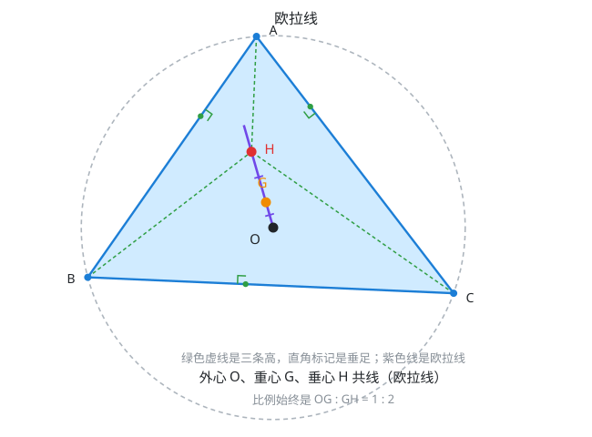

图中绿色虚线是三条高，垂足处的直角标记表示它们确实垂直于对边；紫色线是欧拉线，$O$、$G$、$H$ 依次排开。证明用位置向量，放在后面。

| 心 | 是什么的交点 | 到什么等距 | 是否总在内部 |
| --- | --- | --- | --- |
| 外心 $O$ | 三边垂直平分线 | 三个顶点 | 否 |
| 内心 $I$ | 三条角平分线 | 三条边 | 是 |
| 重心 $G$ | 三条中线 | —（是顶点的平均） | 是 |
| 垂心 $H$ | 三条高 | — | 否 |

### 位置关系

判断两个几何体的相对位置，只需要比较**距离**和**半径**。

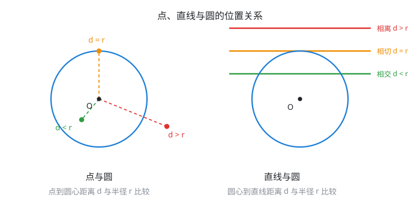

**点与圆**：设点到圆心的距离为 $d$。

- $d \lt r$：点在圆内
- $d = r$：点在圆上
- $d \gt r$：点在圆外

写成一个量就是 $d - r$：负数在内、零在边界、正数在外。

**直线与圆**：设圆心到直线的距离为 $d$。

- $d \gt r$：相离，无交点
- $d = r$：相切，一个交点
- $d \lt r$：相交，两个交点，弦长 $2\sqrt{r^2-d^2}$

判别时用点到直线距离公式算 $d$，不必联立方程。

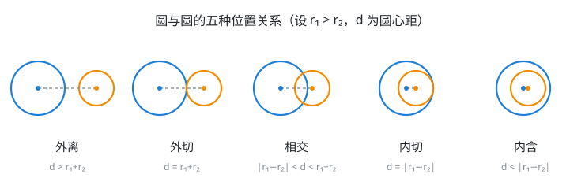

**圆与圆**：设圆心距为 $d$，半径 $r_1 \gt r_2$。

| 关系 | 条件 | 公切线条数 |
| --- | --- | --- |
| 外离 | $d \gt r_1+r_2$ | 4 |
| 外切 | $d = r_1+r_2$ | 3 |
| 相交 | $\lvert r_1-r_2 \rvert \lt d \lt r_1+r_2$ | 2 |
| 内切 | $d = \lvert r_1-r_2 \rvert$ | 1 |
| 内含 | $d \lt \lvert r_1-r_2 \rvert$ | 0 |

第一行的否定给出判据：**两个圆有公共点 $\iff d \le r_1+r_2$**。

### 弧长与扇形面积

设圆心角为 $n$ 度，半径 $r$：

- 弧长 $l = \dfrac{n\pi r}{180}$
- 扇形面积 $S = \dfrac{n\pi r^2}{360} = \dfrac{1}{2}lr$

角度制下这两个公式都带着 $\dfrac{\pi}{180}$ 这个累赘。改用**弧度制**——把圆心角 $\theta$ 定义为"所对弧长与半径之比"$\theta = \dfrac{l}{r}$——公式立刻变成

$l = \theta r$，$S = \dfrac{1}{2}\theta r^2$

**这就是弧度制存在的理由**：它让弧长公式退化成一个乘法，角速度与线速度的换算 $v=\omega r$ 正是 $l=\theta r$ 对时间求导。

### 圆幂定理

从一点 $P$ 引直线与圆交于两点，两段线段长之积是定值，与直线怎么转无关。这个定值叫**点 $P$ 对圆的幂**，等于 $d^2-r^2$（$d$ 是 $P$ 到圆心的距离）。

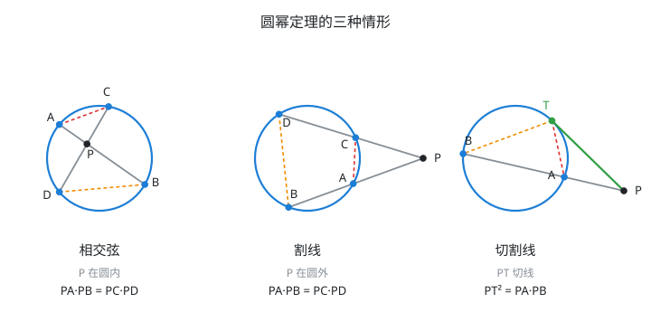

**情形一，相交弦定理**（$P$ 在圆内）：弦 $AB$、$CD$ 交于圆内一点 $P$，则

$PA \cdot PB = PC \cdot PD = r^2-d^2$

**情形二，割线定理**（$P$ 在圆外）：两条割线分别交圆于 $A,B$ 和 $C,D$（$A$、$C$ 是近点），则

$PA \cdot PB = PC \cdot PD = d^2-r^2$

**这两种情形用的是同一个相似三角形结构**，只是 $P$ 在圆内还是圆外决定了对应角是对顶角还是公共角（证明见后面）。

**情形三，切割线定理**（$P$ 在圆外，一条线是切线）：切线切于 $T$，割线交圆于 $A$、$B$（$A$ 是近点），则

$PT^2 = PA \cdot PB = d^2-r^2$

证明要先补一条引理——**切线弦角定理**：切线与弦的夹角，等于这条弦在弦的另一侧所对的圆周角。引理和定理本身的证明都放在后面。

**三种情形本质上是同一条定理**：只要过 $P$ 的两条直线与圆各交出两点，两条直线上各自的两段之积就相等；切线是割线两个交点重合的极限情形，所以 $PA\cdot PB$ 退化成 $PT\cdot PT=PT^2$。

注意 $d^2-r^2$ 与上面点与圆位置关系里的 $d-r$ 是同一件事的两种写法，符号相同：圆外为正、圆上为零、圆内为负。工程上更常用 $d^2-r^2$，因为它避免了开方。

### 三点定圆

不共线的三点确定唯一一个圆——这正是上面外接圆存在唯一性的另一种说法。

"三点不共线"这个条件很关键：若三点接近共线，解出的圆心会跑到极远处、半径趋于无穷，数值上极不稳定。

## 五、三角形的面积

三个公式，按已知条件选用：

- 已知底和高：$S = \dfrac{1}{2}ah$
- 已知两边及夹角：$S = \dfrac{1}{2}ab\sin C$
- 已知三个顶点坐标 $(x_1,y_1)$、$(x_2,y_2)$、$(x_3,y_3)$：

  $S = \dfrac{1}{2}\left\lvert (x_2-x_1)(y_3-y_1)-(x_3-x_1)(y_2-y_1) \right\rvert$

坐标公式的证明放在后面。

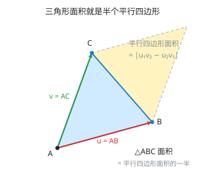

几何上看，绝对值内部那一坨 $u_1v_2-u_2v_1$（$\mathbf{u}=(x_2-x_1,\ y_2-y_1)$，$\mathbf{v}=(x_3-x_1,\ y_3-y_1)$）是 $\mathbf{u}$、$\mathbf{v}$ 张成的**平行四边形**的面积（图中黄色三角形与蓝色三角形拼成的平行四边形），三角形恰好是它的一半——这也是"叉乘的模等于两向量张成平行四边形面积"这条性质在二维的由来。

这一坨 $u_1v_2-u_2v_1$ 就是向量 $\mathbf{u}$ 与 $\mathbf{v}$ 的**二维叉乘**。它有三个用处：

- 取绝对值再除以 $2$，得到面积
- 只看**符号**，就能判断第三点在前两点连线的哪一侧（正为左侧，负为右侧，零为共线）
- 符号为零即三点共线，这是判定共线最省事的办法（不用除法，没有斜率不存在的特例）

## 推导与证明

### 角平分线定理的证明

过点 $C$ 作 $CE \parallel AD$，与 $BA$ 的延长线交于点 $E$。

第一步，证明 $\triangle ACE$ 是等腰三角形。

- $AD \parallel CE$，$BE$ 是截线，同位角相等：$\angle BAD = \angle AEC$
- $AD \parallel CE$，$AC$ 是截线，内错角相等：$\angle DAC = \angle ACE$
- 已知 $AD$ 平分 $\angle A$，即 $\angle BAD = \angle DAC$

三式连起来得 $\angle AEC = \angle ACE$，所以 $\triangle ACE$ 等腰，$AE = AC$。

第二步，在 $\triangle BEC$ 中用基本比例定理。$AD \parallel EC$，$AD$ 截 $BE$、$BC$ 两边，于是

$\dfrac{BD}{DC} = \dfrac{BA}{AE}$

第三步，把 $AE = AC$ 代进去：

$\dfrac{BD}{DC} = \dfrac{AB}{AC}$

**另一种推法**（用第五节的面积公式，两行）：$\triangle ABD$ 与 $\triangle ACD$ 共用从 $A$ 出发的高，面积比等于底之比 $BD:DC$；同时按 $S=\frac{1}{2}ab\sin C$，两者面积比又等于 $AB \cdot AD \sin\angle BAD$ 与 $AC \cdot AD \sin\angle DAC$ 之比，因两角相等，化简即得 $AB:AC$。两式相等即证。

### 垂直与斜率之积的证明

设两线交于 $P$，取 $l_1$ 上一点 $A$、$l_2$ 上一点 $B$（在 $P$ 两侧），分别向过 $P$ 的水平参照线作垂线，垂足是 $C$、$D$。

第一步，两个直角三角形的一个锐角相等。$\angle APC$ 与 $\angle BPD$ 互余于 $\angle APB=90^{\circ}$（$P$、$C$、$D$ 共线于水平参照线，$\angle APC+\angle APB+\angle BPD=180^{\circ}$，代入 $\angle APB=90^{\circ}$ 得 $\angle APC+\angle BPD=90^{\circ}$）；又在直角三角形 $BDP$ 中 $\angle DBP+\angle BPD=90^{\circ}$。两式消去 $\angle BPD$，得

$\angle CPA = \angle DBP \;(=\theta)$

第二步，AA 判定相似。$\triangle PCA$ 与 $\triangle BDP$ 中，$\angle PCA=\angle BDP=90^{\circ}$，且 $\angle CPA=\angle DBP$，所以

$\triangle PCA \sim \triangle BDP$

对应边成比例：$\dfrac{CA}{DP} = \dfrac{PC}{BD}$，交叉相乘得

$PC \cdot PD = CA \cdot DB$

第三步，代入斜率。设 $C$、$D$ 在参照线上分别位于 $P$ 的右侧、左侧，则

$k_1 = \dfrac{CA}{PC}$，$k_2 = -\dfrac{DB}{PD}$

负号是因为 $B$ 相对 $P$ 在 $x$ 减小的方向，斜率必须为负。两式相乘：

$k_1 k_2 = \dfrac{CA}{PC} \cdot \left(-\dfrac{DB}{PD}\right) = -\dfrac{CA \cdot DB}{PC \cdot PD}$

代入第二步的 $PC \cdot PD = CA \cdot DB$，分子分母相等：

$k_1 k_2 = -1$

反之若 $k_1k_2=-1$，把上述步骤逆推回去可知 $\angle CPA=\angle DBP$，从而 $\angle APB=90^{\circ}$，两线垂直。充要性成立。

### 勾股定理的面积证明

边长 $a+b$ 的大正方形，四个角上各放一个直角边为 $a$、$b$ 的直角三角形，中间围出的是边长为 $c$ 的正方形。按面积相等：

$(a+b)^2 = 4 \times \dfrac{1}{2}ab + c^2$

左边展开 $a^2+2ab+b^2$，两边同时减去 $2ab$，得 $a^2+b^2=c^2$。

中间那块是正方形而不是一般四边形，理由是：四条边都等于 $c$，且每个顶点处两个锐角之和为 $90^{\circ}$，所以内角都是直角。

### 圆周角定理的证明

核心工具只有两个：**半径相等构成等腰三角形**，以及**三角形的外角等于不相邻两内角之和**。

**情况一，圆心在角的一边上**（$AB$ 恰好是直径）。连 $OC$。因为 $OA = OC$（同圆半径），$\triangle OAC$ 是等腰三角形，所以

$\angle OAC = \angle OCA$

$\angle BOC$ 是 $\triangle OAC$ 在顶点 $O$ 处的外角，等于不相邻两内角之和：

$\angle BOC = \angle OAC + \angle OCA = 2\angle OAC = 2\angle BAC$

**情况二，圆心在角的内部**。作直径 $AD$，把 $\angle BAC$ 拆成 $\angle BAD$ 与 $\angle DAC$。这两个角各自都落回情况一，于是

$\angle BOD = 2\angle BAD$，$\angle DOC = 2\angle DAC$

两式相加：$\angle BOC = \angle BOD + \angle DOC = 2(\angle BAD + \angle DAC) = 2\angle BAC$

**情况三，圆心在角的外部**。同样作直径 $AD$，此时 $\angle BAC$ 是两个角的**差**而不是和：

$\angle DOC = 2\angle DAC$，$\angle DOB = 2\angle DAB$

两式相减：$\angle BOC = \angle DOC - \angle DOB = 2(\angle DAC - \angle DAB) = 2\angle BAC$

三种情况都成立，定理得证。**作直径把一般情形归约到情况一**，是这个证明的全部技巧。

### 重心性质的证明

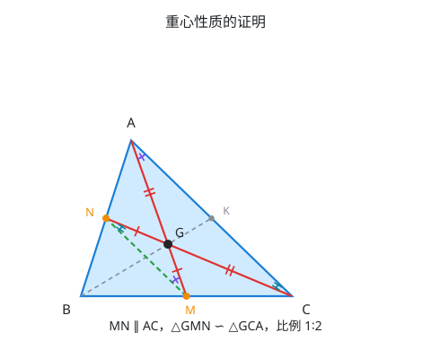

设 $M$ 是 $BC$ 中点，$N$ 是 $AB$ 中点，中线 $AM$ 与 $CN$ 交于 $G$。

第一步，连接 $MN$。由中位线定理，$MN$ 是 $\triangle ABC$ 中连接 $BC$、$AB$ 两边中点的线段，所以

$MN \parallel AC$ 且 $MN = \dfrac{1}{2}AC$

第二步，用 AA 判定相似。$MN \parallel AC$ 被直线 $AM$、$CN$ 所截，产生两组内错角：

- $\angle NMG = \angle GAC$（$AM$ 截 $MN$、$AC$）
- $\angle MNG = \angle GCA$（$CN$ 截 $MN$、$AC$）

于是 $\triangle GMN \sim \triangle GCA$，相似比等于 $MN:CA = 1:2$。

第三步，读出比例。相似比给出 $GM:GA = GN:GC = 1:2$，即

$AG:GM = 2:1$，$CG:GN = 2:1$

第四步，证明三线共点。设第三条中线（由 $B$ 到 $AC$ 中点 $K$）与 $AM$ 交于 $G^{\prime}$，对 $(AM,\,BK)$ 这一对中线重复上面的论证，同样得到 $AG^{\prime}:G^{\prime}M=2:1$。而在线段 $AM$ 上，满足 $AG:GM=2:1$ 的点唯一，所以 $G^{\prime}=G$。三条中线交于同一点。

第五步，坐标公式。由 $AG:GM=2:1$，$G$ 把 $AM$ 分成 $2:1$，代入定比分点：

$G = A + \dfrac{2}{3}(M-A) = \dfrac{1}{3}A + \dfrac{2}{3} \cdot \dfrac{B+C}{2} = \dfrac{A+B+C}{3}$

### 欧拉线的证明

**准备工作：位置向量是什么**。取外心 $O$ 作坐标原点，每个点就用"从 $O$ 出发指向它的向量"来表示——这其实就是把 $O$ 当成 $(0,0)$，$A$、$B$、$C$ 的**坐标**就是它们的**位置向量**，记作 $\mathbf{a}$、$\mathbf{b}$、$\mathbf{c}$。因为 $O$ 是外心，$A$、$B$、$C$ 都在外接圆上，所以

$\lvert\mathbf{a}\rvert=\lvert\mathbf{b}\rvert=\lvert\mathbf{c}\rvert=R$

**要用到的一个事实：点积为零 $\iff$ 垂直**。两个非零向量 $\mathbf{u}$、$\mathbf{v}$ 的点积定义为 $\mathbf{u}\cdot\mathbf{v}=\lvert\mathbf{u}\rvert\lvert\mathbf{v}\rvert\cos\theta$（$\theta$ 是夹角）。当 $\theta=90^{\circ}$ 时 $\cos\theta=0$，点积为零；反过来点积为零也只能是 $\cos\theta=0$。所以后面只要算出某两个向量的点积等于 $0$，就等于证明了它们垂直——这是整个证明唯一要用的工具。

**第一步：猜一个点，验证它是垂心**。直接定义

$H = \mathbf{a}+\mathbf{b}+\mathbf{c}$

先验证它满足"垂心"的定义——从每个顶点出发的高都经过它。只需验证 $AH \perp BC$（其余两条同理，换个字母重复一遍就行）。

对任意两点 $P$、$Q$，从 $P$ 指向 $Q$ 的向量 $\overrightarrow{PQ}$ 等于 $Q$ 的位置向量减去 $P$ 的位置向量，即 $\overrightarrow{PQ}=\mathbf q-\mathbf p$（向量加法三角形法则的直接推论：$\mathbf p+\overrightarrow{PQ}=\mathbf q$，移项即得）。

代入 $A$、$H$、$B$、$C$ 各自的位置向量：

$\overrightarrow{AH} = H-\mathbf{a} = (\mathbf a+\mathbf b+\mathbf c)-\mathbf a = \mathbf{b}+\mathbf{c}$，$\overrightarrow{BC} = \mathbf{c}-\mathbf{b}$

把这两个向量点乘，逐项展开（点积对加减法可以像乘法分配律一样展开）：

$\overrightarrow{AH}\cdot\overrightarrow{BC} = (\mathbf{b}+\mathbf{c})\cdot(\mathbf{c}-\mathbf{b}) = \mathbf{b}\cdot\mathbf{c}-\mathbf{b}\cdot\mathbf{b}+\mathbf{c}\cdot\mathbf{c}-\mathbf{c}\cdot\mathbf{b}$

$\mathbf{b}\cdot\mathbf{c}$ 与 $\mathbf{c}\cdot\mathbf{b}$ 是同一个数（点积可交换），正负抵消；$\mathbf{b}\cdot\mathbf{b}=\lvert\mathbf{b}\rvert^2$，$\mathbf{c}\cdot\mathbf{c}=\lvert\mathbf{c}\rvert^2$，所以

$\overrightarrow{AH}\cdot\overrightarrow{BC} = \lvert\mathbf{c}\rvert^2-\lvert\mathbf{b}\rvert^2$

由准备工作，$\lvert\mathbf{b}\rvert=\lvert\mathbf{c}\rvert=R$，所以这个值等于 $R^2-R^2=0$。

点积为零，所以 $AH \perp BC$——也就是说，**过 $A$ 且垂直于 $BC$ 的那条高，正好经过 $H$**。把 $A$ 换成 $B$、$C$ 重复同样的计算（只是字母轮换），可得 $BH\perp AC$、$CH\perp AB$。三条高都过 $H$，所以 $H$ 就是垂心。

**第二步：比较 $G$ 和 $H$，得到共线和比例**。前面已经证明重心 $G=\dfrac{\mathbf{a}+\mathbf{b}+\mathbf{c}}{3}$，而这里 $H=\mathbf{a}+\mathbf{b}+\mathbf{c}$，两式对比，$G$ 恰好是 $H$ 的 $\dfrac13$：

$G = \dfrac{1}{3}H$，也就是 $\overrightarrow{OG} = \dfrac{1}{3}\overrightarrow{OH}$

$\overrightarrow{OG}$ 和 $\overrightarrow{OH}$ 方向相同（一个是另一个乘以正数 $\dfrac13$），这意味着 $G$ 就落在射线 $OH$ 上——也就是说 $O$、$G$、$H$ 三点共线。再比较长度：

$OG=\dfrac13 OH$，所以 $GH = OH-OG = \dfrac23 OH$，故 $OG:GH=\dfrac13:\dfrac23 = 1:2$

这条证明顺带给出一个副产品：**垂心的位置向量就是三个顶点位置向量之和**（以外心为原点时）——这是一条比"三条高的交点"直观得多的垂心刻画方式。

### 圆幂定理三种情形的证明

**情形一，相交弦定理**：连 $AC$、$DB$。$\angle PAC$ 与 $\angle PDB$ 是同弧 $\overset{\frown}{BC}$ 所对的圆周角，由圆周角定理相等；$\angle APC$ 与 $\angle DPB$ 是对顶角，也相等。于是

$\triangle APC \sim \triangle DPB$（AA）

对应边成比例：$\dfrac{PA}{PD} = \dfrac{PC}{PB}$，交叉相乘得 $PA \cdot PB = PC \cdot PD$。

**情形二，割线定理**：连 $AC$、$DB$。$\angle PAC$ 与 $\angle PDB$（即 $\angle BDC$）同样是同弧 $\overset{\frown}{BC}$ 所对的圆周角，相等；$\angle P$ 是 $\triangle PAC$ 与 $\triangle PDB$ 的公共角。于是同样由 AA 得

$\triangle PAC \sim \triangle PDB$

$\dfrac{PA}{PD} = \dfrac{PC}{PB} \;\Rightarrow\; PA \cdot PB = PC \cdot PD$

**情形三，切割线定理**：先证引理——**切线弦角定理**：切线与弦的夹角，等于这条弦在弦的另一侧所对的圆周角，即 $\angle PTA = \angle TBA$。

引理的证明：连 $OT$、$OA$。切线垂直半径，$\angle OTP=90^{\circ}$，所以

$\angle PTA = \angle OTP - \angle OTA = 90^{\circ}-\angle OTA$

$\triangle OTA$ 中 $OT=OA=r$，是等腰三角形，$\angle OTA=\angle OAT=\dfrac{180^{\circ}-\angle TOA}{2}=90^{\circ}-\dfrac{\angle TOA}{2}$，代入：

$\angle PTA = 90^{\circ}-\left(90^{\circ}-\dfrac{\angle TOA}{2}\right)=\dfrac{\angle TOA}{2}$

而 $\angle TOA$ 正是 $\overset{\frown}{TA}$ 的圆心角，由圆周角定理，$\dfrac{\angle TOA}{2}=\angle TBA$（$B$ 在优弧上）。两式相等，$\angle PTA=\angle TBA$，引理得证。

回到切割线定理：$\triangle PTA$ 与 $\triangle PBT$ 中，$\angle P$ 是公共角，$\angle PTA=\angle PBT$（引理），由 AA 得

$\triangle PTA \sim \triangle PBT$

$\dfrac{PT}{PB} = \dfrac{PA}{PT} \;\Rightarrow\; PT^2 = PA \cdot PB$

### 三角形面积坐标公式的证明

设 $\mathbf{u}=(x_2-x_1,\ y_2-y_1)$、$\mathbf{v}=(x_3-x_1,\ y_3-y_1)$，即 $A$ 出发的两条边 $AB$、$AC$。平移不改变面积，把 $A$ 移到原点，问题变成：向量 $\mathbf{u}$、$\mathbf{v}$ 张成的三角形面积是多少。

已知公式 $S = \dfrac{1}{2}\lvert\mathbf{u}\rvert\lvert\mathbf{v}\rvert\sin\theta$（本节第二个公式，$\theta$ 是 $\mathbf{u}$、$\mathbf{v}$ 的夹角）。要证它等于 $\dfrac{1}{2}\lvert u_1v_2-u_2v_1\rvert$，只需证

$\lvert\mathbf{u}\rvert\lvert\mathbf{v}\rvert\sin\theta = \lvert u_1v_2-u_2v_1\rvert$

这是一个纯代数恒等式（拉格朗日恒等式），直接展开验证：

$(u_1v_2-u_2v_1)^2+(u_1v_1+u_2v_2)^2 = u_1^2v_2^2-2u_1u_2v_1v_2+u_2^2v_1^2+u_1^2v_1^2+2u_1u_2v_1v_2+u_2^2v_2^2$

右边中间两项抵消，合并得 $(u_1^2+u_2^2)(v_1^2+v_2^2) = \lvert\mathbf{u}\rvert^2\lvert\mathbf{v}\rvert^2$。所以

$(u_1v_2-u_2v_1)^2 = \lvert\mathbf{u}\rvert^2\lvert\mathbf{v}\rvert^2-(u_1v_1+u_2v_2)^2 = \lvert\mathbf{u}\rvert^2\lvert\mathbf{v}\rvert^2-(\mathbf{u}\cdot\mathbf{v})^2$

代入 $\mathbf{u}\cdot\mathbf{v}=\lvert\mathbf{u}\rvert\lvert\mathbf{v}\rvert\cos\theta$：

$(u_1v_2-u_2v_1)^2 = \lvert\mathbf{u}\rvert^2\lvert\mathbf{v}\rvert^2(1-\cos^2\theta) = \lvert\mathbf{u}\rvert^2\lvert\mathbf{v}\rvert^2\sin^2\theta$

两边开方即证。代回 $S=\dfrac{1}{2}\lvert\mathbf{u}\rvert\lvert\mathbf{v}\rvert\sin\theta$，得

$S = \dfrac{1}{2}\lvert u_1v_2-u_2v_1\rvert = \dfrac{1}{2}\left\lvert (x_2-x_1)(y_3-y_1)-(x_3-x_1)(y_2-y_1) \right\rvert$

## 对应视频

正文看得懂就跳过，卡住了再看对应那一段。下面只列真正值得看的。

- **全等与相似**
  - [P17 三角形的全等与相似](https://www.bilibili.com/video/BV1qE411H7Uv?p=17)（20:38）— **全集必看**，判定条件讲得完整
- **圆的性质**
  - [P21 圆的知识梳理（含四点共圆、圆幂定理）](https://www.bilibili.com/video/BV1qE411H7Uv?p=21)（20:10）— **全集必看**，圆的性质一次过完
  - [P22 与圆有关的角](https://www.bilibili.com/video/BV1qE411H7Uv?p=22)（24:04）— 只看圆周角定理及其推论那一段
  - [P23 垂径定理的使用策略](https://www.bilibili.com/video/BV1qE411H7Uv?p=23)（19:24）— 只看开头讲定理本身的部分，"使用策略"是应试

实际要看的约 55 分钟。**勾股定理、三点定圆、三角形面积的坐标公式**这几块合集里没有对应内容——勾股定理初中默认已会，后两个超出中考范围，以正文为准。

集数、标题、时长取自 B 站页面，未逐集观看。
