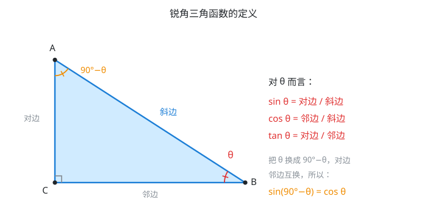
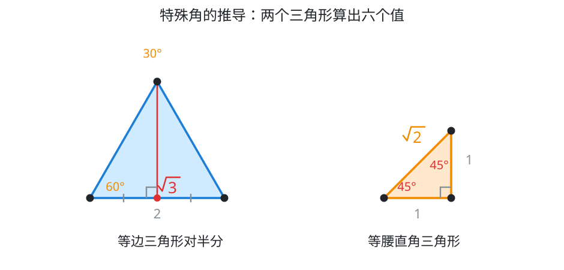
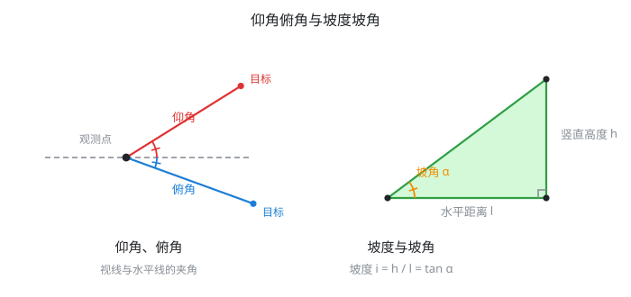

# 具身智能数学基础(04)：锐角三角比

| 内容 | 必须掌握的 | 后面在哪用到 |
| --- | --- | --- |
| 三角比的定义 | 直角三角形中 $\sin\theta$、$\cos\theta$、$\tan\theta$ 的定义 | 2D 旋转矩阵的四个元素、机械臂关节到末端位置的换算 |
| 特殊角的值 | $30°$、$45°$、$60°$ 的三个比值，且知道怎么推 | 心算校验、后面单位圆定义的锚点 |
| 同角关系 | $\sin^2\theta+\cos^2\theta=1$，$\tan\theta=\dfrac{\sin\theta}{\cos\theta}$ | 三角恒等变换的地基、四元数归一化的检验方式 |
| 互余关系 | $\sin(90°-\theta)=\cos\theta$ | 换算俯仰角与仰角、不同角度约定间的转换 |
| 解直角三角形 | 已知两个条件（至少一边）求其余边角 | 三角测距、已知关节角求末端坐标 |
| 仰角俯角与坡度 | 仰角俯角是视线与水平线的夹角；坡度 $i=\tan\alpha$ | 传感器俯仰角、观测目标角度、地形可通过性评估 |

## 一、三角比的定义

在直角三角形里，相对某个锐角 $\theta$，三条边各有名字：$\theta$ 所对的边叫**对边**，$\theta$ 夹着的那条直角边叫**邻边**，直角所对的边叫**斜边**。三个比值就用这三条边定义：

$\sin\theta = \dfrac{\text{对边}}{\text{斜边}}$，$\cos\theta = \dfrac{\text{邻边}}{\text{斜边}}$，$\tan\theta = \dfrac{\text{对边}}{\text{邻边}}$

这三个比值**只由角度 $\theta$ 决定，与三角形的大小无关**——把三角形放大缩小（保持角度不变），对边、邻边、斜边同比例伸缩，比值不变。这正是相似三角形的性质（第 3 篇），$\sin\theta$、$\cos\theta$、$\tan\theta$ 本质上就是"角度"和"边长比例"之间的一个固定对应关系。

图中同一个直角三角形有两个锐角 $\theta$ 和 $90°-\theta$（两锐角互余，因为三角之和 $180°$ 减去直角 $90°$）。**换个顶点看，对边和邻边互换**：对 $\theta$ 而言的对边，正是对 $90°-\theta$ 而言的邻边。这一点直接推出下一节的互余关系。

## 二、特殊角的值

$30°$、$45°$、$60°$ 这三个角的比值不是背下来的，是从两个基本图形量出来的（推导见后面）：

- $\sin30° = \dfrac12$，$\cos30° = \dfrac{\sqrt3}{2}$，$\tan30° = \dfrac{1}{\sqrt3}=\dfrac{\sqrt3}{3}$
- $\sin60° = \dfrac{\sqrt3}{2}$，$\cos60° = \dfrac12$，$\tan60° = \sqrt3$
- $\sin45° = \cos45° = \dfrac{\sqrt2}{2}$，$\tan45° = 1$

这套值不需要死记，忘了当场用勾股定理现推就行——反正核心只是两个图形。

## 三、同角关系与互余关系

**同角关系**，由勾股定理直接得到（推导见后面）：

$\sin^2\theta+\cos^2\theta = 1$

另一条商数关系直接由定义得出：

$\dfrac{\sin\theta}{\cos\theta} = \dfrac{a/c}{b/c} = \dfrac{a}{b} = \tan\theta$

**互余关系**：

$\sin(90°-\theta) = \cos\theta$，$\cos(90°-\theta) = \sin\theta$

用第二节的值验证一下：$\sin30°=\dfrac12$，$\cos60°=\dfrac12$，而 $90°-30°=60°$，两者相等，对上了。

## 四、解直角三角形

已知直角三角形的两个条件（至少含一条边），求出其余所有边和角，叫解直角三角形。可用的关系只有三条：

- 两锐角互余：$A+B=90°$
- 勾股定理：$a^2+b^2=c^2$
- 边角关系：$\sin A=\dfrac{a}{c}$、$\cos A=\dfrac{b}{c}$、$\tan A=\dfrac{a}{b}$（$A$ 是角，$a$ 是它的对边）

按已知条件选用：已知一边一角，用边角关系直接求出另一边，再用互余关系求另一角；已知两边，先用勾股定理求第三边，再用边角关系求角。

## 五、仰角、俯角与坡度

**仰角**是视线在水平线**上方**时，视线与水平线的夹角；**俯角**是视线在水平线**下方**时的夹角。两者都是"看向目标的方向"与"水平方向"之间的夹角，只是目标在上还是在下。

已知观测点到目标的水平距离和垂直高度，仰角就是

$\theta = \arctan\dfrac{\text{垂直高度}}{\text{水平距离}}$

已知对边邻边求角度，就是 $\tan$ 的逆运算，这是反三角函数的雏形（第 9 行会正式定义）。

**坡度**（也叫坡比）衡量斜面的陡峭程度，定义为竖直高度与水平距离之比：

$i = \dfrac{h}{l}$

**坡度就是坡角的正切**：$i=\tan\alpha$，$\alpha$ 是坡面与水平面的夹角（坡角）。坡度通常写成 $1:n$ 或百分比的形式，比如坡度 $1:2$ 就是 $i=0.5$，对应坡角 $\alpha=\arctan0.5\approx26.6°$。

## 推导与证明

### 特殊角的值是怎么推的

**$30°$ 与 $60°$：把等边三角形对半分。** 边长为 $2$ 的等边三角形，从一个顶点向对边作高，把底边平分成两个 $1$。这条高同时把顶角 $60°$ 平分成两个 $30°$。左半部分是一个直角三角形，两条直角边是 $1$ 和高 $h$，斜边是 $2$，由勾股定理

$h = \sqrt{2^2-1^2} = \sqrt{3}$

对 $60°$ 角（底角，即原等边三角形未被分割的角）而言，对边是 $\sqrt3$，邻边是 $1$，斜边是 $2$；对 $30°$ 角（顶角的一半）而言，对边邻边互换（对边是 $1$，邻边是 $\sqrt3$）。代入定义即得上面两组值。

**$45°$：等腰直角三角形。** 两条直角边都是 $1$，斜边由勾股定理是 $\sqrt2$，两个锐角都是 $45°$（等腰三角形两底角相等，且两角之和为 $90°$），代入定义即得。

### 同角关系与互余关系的推导

**同角关系**：设直角三角形三边为对边 $a$、邻边 $b$、斜边 $c$，满足 $a^2+b^2=c^2$。两边同除以 $c^2$：

$\left(\dfrac{a}{c}\right)^2+\left(\dfrac{b}{c}\right)^2 = 1 \quad\Longrightarrow\quad \sin^2\theta+\cos^2\theta = 1$

**互余关系**：直接从第一节的图读出来——$\theta$ 的对边，正是 $90°-\theta$ 的邻边；$\theta$ 的邻边，正是 $90°-\theta$ 的对边。斜边不变。所以 $\sin(90°-\theta) = \cos\theta$，$\cos(90°-\theta) = \sin\theta$。

## 对应视频

正文看得懂就跳过，卡住了再看对应那一段。**一数的两个合集里都没有专门讲锐角三角函数定义和特殊角推导的一集**——这块内容在标准教材里是九年级下学期的内容，中考复习合集默认你已经会了，直接跳到应用技巧。

- [P19 直角中的"特殊型"](https://www.bilibili.com/video/BV1qE411H7Uv?p=19)（25:04）— **可选**。这集不讲定义，是拿已经学过的 $30°/45°/60°$ 特殊角当辅助线技巧使用，讲的是几何证明里怎么构造这类三角形，跟本篇的定义和推导关系不大

这一块以正文和课本为准，视频没有必看项。
