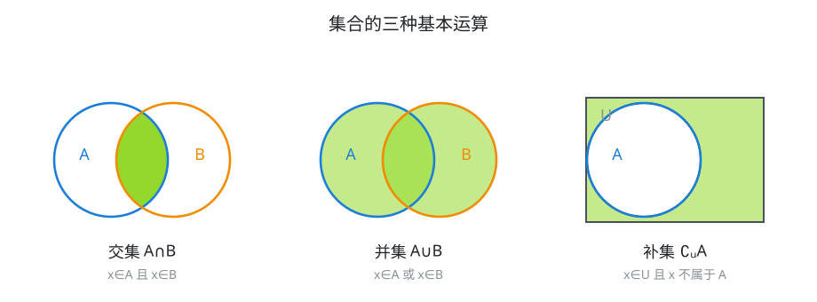
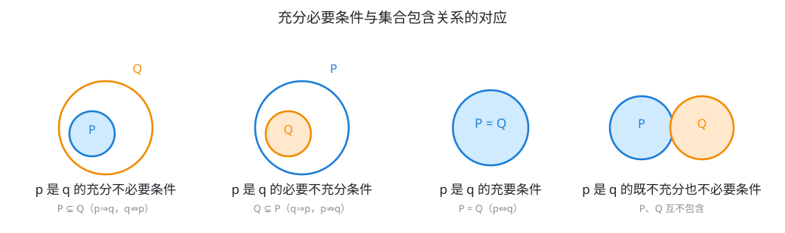

# 具身智能数学基础(05)：集合与常用逻辑

| 内容 | 必须掌握的 | 后面在哪用到 |
| --- | --- | --- |
| 集合的概念与关系 | 三要素（确定性、互异性、无序性）；子集 $\subseteq$、真子集 $\subsetneq$；子集个数 $2^n$ | 状态空间与约束集合的描述语言 |
| 集合的运算 | 交 $\cap$、并 $\cup$、补 $\complement_U$；德摩根律 | 传感器视野融合、点云范围筛选、可行域的交并运算 |
| 充分条件与必要条件 | 四种类型的判断；与集合包含关系的对应 | 控制系统稳定性判据的表述、算法正确性证明的逻辑链条 |
| 全称量词与存在量词 | $\forall$、$\exists$；量词命题的否定 | $\varepsilon$-$\delta$ 极限定义的语言基础、形式化安全性规约 |

## 一、集合的概念与运算

一组对象构成一个**集合**，每个对象叫**元素**。集合的元素必须满足三条性质：

- **确定性**：任何一个对象，要么属于这个集合，要么不属于，不允许模棱两可
- **互异性**：同一集合中的元素互不相同，重复出现只算一个，比如 $\{1,1,2\}$ 就是 $\{1,2\}$
- **无序性**：元素的排列顺序不影响集合本身，$\{1,2\}$ 和 $\{2,1\}$ 是同一个集合

$a$ 是集合 $A$ 的元素记作 $a \in A$，不是则记作 $a \notin A$。集合可以用**列举法**（把元素一一列出，如 $\{1,2,3\}$）或**描述法**（写出元素满足的条件，如 $\{x \mid x^2 \lt 4\}$）表示。

$A$ 的每个元素都是 $B$ 的元素，称 $A$ 是 $B$ 的**子集**，记 $A \subseteq B$；若还存在 $B$ 中元素不在 $A$ 中，则 $A$ 是 $B$ 的**真子集**，记 $A \subsetneq B$。$A \subseteq B$ 且 $B \subseteq A$ 等价于 $A = B$——这是判断两个集合相等的标准手段：不去比较"看起来像不像"，而是证明双向包含。不含任何元素的集合叫**空集** $\varnothing$，是任何集合的子集。

**子集个数**：若集合 $A$ 有 $n$ 个元素，则 $A$ 的子集共有 $2^n$ 个。

**证明**：构造 $A$ 的一个子集，等价于对 $A$ 的每个元素独立做一次"选入"或"不选入"的二选一决定。$n$ 个元素各自两种选择、互不影响，一共产生 $2^n$ 种不同的选择组合；每种组合对应唯一一个子集（全部选入对应 $A$ 本身，全部不选对应 $\varnothing$），不同组合给出的子集也各不相同，所以子集总数就是 $2^n$。

由此可以进一步数出：真子集有 $2^n-1$ 个（排除"全选"这一种，也就是 $A$ 自身）；非空子集有 $2^n-1$ 个（排除"全不选"对应的 $\varnothing$）；非空真子集有 $2^n-2$ 个（两种都排除）。

### 三种基本运算

设全集为 $U$，$A$、$B$ 是 $U$ 的子集：

- 交集 $A \cap B = \{x \mid x \in A \text{ 且 } x \in B\}$
- 并集 $A \cup B = \{x \mid x \in A \text{ 或 } x \in B\}$
- 补集 $\complement_U A = \{x \mid x \in U \text{ 且 } x \notin A\}$

运算律里最值得记住的是**德摩根律**：

$\complement_U(A \cap B) = (\complement_U A) \cup (\complement_U B)$，$\complement_U(A \cup B) = (\complement_U A) \cap (\complement_U B)$

**证明**（以第一条为例，用元素对应法）：

$x \in \complement_U(A \cap B) \iff x \notin A \cap B \iff \neg(x \in A \text{ 且 } x \in B) \iff x \notin A \text{ 或 } x \notin B \iff x \in \complement_U A \text{ 或 } x \in \complement_U B \iff x \in (\complement_U A) \cup (\complement_U B)$

关键的一步是"$\neg(p \text{ 且 } q) \iff \neg p \text{ 或 } \neg q$"——**否定一个"且"命题，等于把两边分别否定后改成"或"**。第二条德摩根律同理，把"且"换成"或"即可。这条否定规则在第三节的量词否定里会再出现一次，是同一个逻辑结构。

## 二、充分条件与必要条件

若 $p$ 成立能推出 $q$ 成立，记 $p \Rightarrow q$，称 $p$ 是 $q$ 的**充分条件**，$q$ 是 $p$ 的**必要条件**。按 $p \Rightarrow q$ 与 $q \Rightarrow p$ 是否同时成立，分四种情况：

- $p \Rightarrow q$ 成立但 $q \Rightarrow p$ 不成立：$p$ 是 $q$ 的**充分不必要条件**
- $q \Rightarrow p$ 成立但 $p \Rightarrow q$ 不成立：$p$ 是 $q$ 的**必要不充分条件**
- $p \Rightarrow q$ 且 $q \Rightarrow p$：$p$ 是 $q$ 的**充要条件**，记 $p \iff q$
- 两个方向都不成立：$p$ 是 $q$ 的**既不充分也不必要条件**

**这四种情况和集合包含关系完全对应。** 把命题 $p$、$q$ 各自对应它的成立集合 $P = \{x \mid p(x)\}$、$Q = \{x \mid q(x)\}$，则 $p \Rightarrow q$ 就是 $P \subseteq Q$——因为"$p$ 成立能推出 $q$ 成立"逐字翻译过来正是"$P$ 中的每个元素都在 $Q$ 中"。

于是判断充分必要关系，可以直接转化成判断两个集合谁包含谁：$P \subsetneq Q$ 对应充分不必要，$Q \subsetneq P$ 对应必要不充分，$P = Q$ 对应充要，两者互不包含则既不充分也不必要。遇到抽象的命题不好直接判断推出关系时，先把 $p$、$q$ 各自的成立范围写成集合，画个包含图，答案就直观了。

## 三、全称量词与存在量词

**全称量词**"所有""任意"记作 $\forall$，全称命题写成 $\forall x \in M, \ p(x)$，意思是 $M$ 中每个 $x$ 都使 $p(x)$ 成立。**存在量词**"存在""有一个"记作 $\exists$，存在命题写成 $\exists x \in M, \ p(x)$，意思是 $M$ 中至少有一个 $x$ 使 $p(x)$ 成立。

**量词命题的否定**遵循固定规则：

$\neg(\forall x \in M, \ p(x)) \iff \exists x \in M, \ \neg p(x)$

$\neg(\exists x \in M, \ p(x)) \iff \forall x \in M, \ \neg p(x)$

**全称的否定是存在，存在的否定是全称，同时把内部的判断也否定掉。** 这条规则本质上是第一节德摩根律的推广：把"且"换成"对所有 $x$ 都……"（相当于把 $M$ 中所有元素的判断结果逐个"且"起来），把"或"换成"存在某个 $x$……"（相当于逐个"或"起来），德摩根律"否定且变或、否定或变且"就自然扩展成了"否定全称变存在、否定存在变全称"。

要证明一个全称命题为假，只需举出**一个反例**——这正是存在命题的否定形式，也是反证法的出发点。

## 对应视频

正文看得懂就跳过，卡住了再看对应那一段。下面只列真正值得看的。

- **集合**
  - [P4 集合的概念](https://www.bilibili.com/video/BV147411K7xu?p=4)（25:09）— **必看**
  - [P5 子集的概念](https://www.bilibili.com/video/BV147411K7xu?p=5)（39:50）— **必看**
  - [P6 交并补运算](https://www.bilibili.com/video/BV147411K7xu?p=6)（23:29）— **必看**
- **常用逻辑用语**
  - [P10 充分必要条件](https://www.bilibili.com/video/BV147411K7xu?p=10)（30:03）— **必看**
  - [P11 全称与存在量词](https://www.bilibili.com/video/BV147411K7xu?p=11)（15:31）— **必看**

实际要看的约 2 小时 14 分。合集里另有"综合大题练习""易错大盘点""新定义问题"三集，标题就是应试技巧和高考创新题型，与本篇内容无关，跳过。

以上集数、标题、时长通过浏览器打开合集页面直接读取播放列表核实，未逐集观看。
