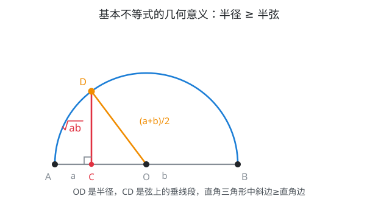

# 具身智能数学基础(06)：不等式

| 内容 | 必须掌握的 | 后面在哪用到 |
| --- | --- | --- |
| 不等式的性质 | 作差法比较大小；对称性、传递性、可加性、可乘性 | 收敛性证明与各类放缩的基本工具 |
| 绝对值不等式 | $\lt a$/$\gt a$ 型的解法；三角不等式 $\lvert a+b\rvert\le\lvert a\rvert+\lvert b\rvert$ 及证明 | 误差与距离估计的代数基础，范数三角不等式的雏形 |
| 一元二次不等式 | "三个二次"的转化关系 | 可行域的一维情形、Lyapunov 二次型正定性判断的雏形 |
| 基本不等式 | $a+b \ge 2\sqrt{ab}$ 及证明；等号成立条件 | 优化中的下界估计，是 AM-GM、Cauchy-Schwarz 不等式的起点 |
| 恒成立问题 | 转化为最值问题：$f(x)\ge0$ 恒成立 $\iff f(x)_{\min}\ge0$ | 鲁棒性验证"对所有输入都满足"的标准转化思路 |

## 一、不等式的性质

比较两个实数大小的根本方法是**作差法**：

$a \gt b \iff a-b \gt 0$，$a = b \iff a-b=0$，$a \lt b \iff a-b \lt 0$

由此可以推出四条基本性质，都是对"作差法"的直接应用：

- **对称性**：$a \gt b \iff b \lt a$
- **传递性**：$a \gt b$ 且 $b \gt c \implies a \gt c$。证明：$a-c=(a-b)+(b-c)$，两个正数相加还是正数
- **可加性**：$a \gt b \implies a+c \gt b+c$。证明：$(a+c)-(b+c)=a-b \gt 0$
- **可乘性**：$a \gt b$ 且 $c \gt 0 \implies ac \gt bc$；$a \gt b$ 且 $c \lt 0 \implies ac \lt bc$。证明：$ac-bc=(a-b)c$，$a-b \gt 0$ 时符号由 $c$ 决定

**可乘性里乘负数要变号**，根源就在这个证明：$(a-b)$ 恒为正，乘上负的 $c$ 之后整个式子变负，所以 $ac-bc \lt 0$，即 $ac \lt bc$。这条规则不是规定，是作差法算出来的必然结果。

## 二、绝对值不等式

绝对值 $|x|$ 表示 $x$ 到 $0$ 的距离。由此直接得到两个基本解法：

$|x| \lt a \iff -a \lt x \lt a$（$a \gt 0$）

$|x| \gt a \iff x \gt a \text{ 或 } x \lt -a$（$a \gt 0$）

前者是"距离小于 $a$，夹在中间"，后者是"距离大于 $a$，甩到两边"，把这句话直接翻译成不等式就是上面两条。

**三角不等式**：

$|a+b| \le |a|+|b|$

**证明**：由绝对值的定义，$-|a| \le a \le |a|$，$-|b| \le b \le |b|$，两式相加：

$-(|a|+|b|) \le a+b \le |a|+|b|$

这正是 $|a+b| \le |a|+|b|$ 的定义形式。等号成立 $\iff a,b$ 同号（或至少一个为 $0$），此时中间的两个不等号同时取等。

由三角不等式还能推出一个常用变形：

$|a-b| \ge \big||a|-|b|\big|$

**证明**：把 $a$ 写成 $(a-b)+b$，代入三角不等式：$|a| = |(a-b)+b| \le |a-b|+|b|$，移项得 $|a|-|b| \le |a-b|$。同理把 $b$ 写成 $(b-a)+a$，可得 $|b|-|a| \le |a-b|$。两式合在一起就是 $|a-b| \ge \big||a|-|b|\big|$。

"三角不等式"这个名字来自它的几何意义：把 $a$、$b$ 看成数轴上先后两段位移，$|a+b|$ 是"直接走到终点"的距离，$|a|+|b|$ 是"先走 $a$ 再走 $b$"的总路程——直接走永远不会比绕路更远。这正是三角形"两边之和大于第三边"的代数版本，以后遇到向量或函数的范数不等式 $\Vert a+b\Vert \le \Vert a\Vert+\Vert b\Vert$，是同一个道理的推广。

## 三、一元二次不等式

一元二次不等式 $ax^2+bx+c \gt 0$（或 $\lt 0$）的解集，直接由对应二次函数图像在 $x$ 轴上方（或下方）的部分决定；判别式 $\Delta$ 的符号决定图像与 $x$ 轴的交点个数——这套判别式与解集的完整对照表、图像解法，第 2 篇已经证明过，这里不重复。

真正要记住的是"**三个二次**"之间的转化关系：一元二次方程 $ax^2+bx+c=0$ 的根，就是二次函数 $y=ax^2+bx+c$ 的零点，也是一元二次不等式解集的分界点。三者说的是同一条抛物线，只是问的问题不同——方程问"在哪里等于零"，不等式问"在哪个范围大于或小于零"，函数问"整体长什么样"。遇到含参数的二次不等式，先把它看成一条抛物线，参数变化时抛物线怎么移动、开口怎么变，解集就跟着怎么变。

## 四、基本不等式

对任意 $a,b \ge 0$：

$\dfrac{a+b}{2} \ge \sqrt{ab}$

等号成立当且仅当 $a=b$。左边叫**算术平均数**，右边叫**几何平均数**。

**代数证明**：

$(\sqrt{a}-\sqrt{b})^2 \ge 0$

展开：

$a-2\sqrt{ab}+b \ge 0 \implies a+b \ge 2\sqrt{ab} \implies \dfrac{a+b}{2} \ge \sqrt{ab}$

等号成立 $\iff (\sqrt{a}-\sqrt{b})^2=0 \iff \sqrt{a}=\sqrt{b} \iff a=b$。

**几何证明**：

以 $a+b$ 为直径作半圆，$C$ 是直径上一点，$AC=a$，$CB=b$。过 $C$ 作垂线交半圆于 $D$。$\angle ADB$ 是直径所对的圆周角，等于 $90°$（第 3 篇圆周角定理的推论），所以 $\triangle ACD \sim \triangle DCB$（两个直角三角形共享 $\angle ACD=\angle DCB=90°$，且 $\angle ADC=\angle DBC$，AA 判定），对应边成比例给出

$CD^2 = AC \cdot CB = ab \implies CD = \sqrt{ab}$

半径 $OD = \dfrac{a+b}{2}$ 是定值，而 $CD$ 是直角三角形 $OCD$ 的一条直角边，$OD$ 是斜边（$OC \perp CD$）。**斜边永远不小于直角边**：$OD \ge CD$，即

$\dfrac{a+b}{2} \ge \sqrt{ab}$

等号成立 $\iff OC=0 \iff C$ 与 $O$ 重合 $\iff a=b$——这时 $D$ 恰好是半圆的最高点。

**常见变形**：取 $b=\dfrac{1}{a}$（$a \gt 0$），代入得 $a+\dfrac{1}{a} \ge 2$，等号当 $a=1$ 成立。这是同一个定理的直接代入，不是新结论。

## 五、恒成立问题

"不等式 $f(x) \ge 0$ 对某个范围内所有 $x$ 都成立"（恒成立问题），是全称命题 $\forall x \in D, \ f(x) \ge 0$（第 5 篇）的具体化。判断它是否成立、或者求参数取值范围使它成立，标准做法是**转化为最值问题**：

$f(x) \ge 0$ 对 $x \in D$ 恒成立 $\iff f(x)$ 在 $D$ 上的最小值 $\ge 0$

$f(x) \le 0$ 对 $x \in D$ 恒成立 $\iff f(x)$ 在 $D$ 上的最大值 $\le 0$

道理很直接：只要最不利的那个点（最小值点）都不小于零，其余所有点自然都不小于零；反过来，只要最小值本身小于零，就已经找到了一个不满足条件的反例（存在命题的否定形式，第 5 篇量词否定的直接应用）。含参数的恒成立问题，通常是先把参数分离出来，问题就变成"参数 $\ge$ 某个函数的最大值"或"参数 $\le$ 某个函数的最小值"，转而去求那个函数的最值。

## 对应视频

正文看得懂就跳过，卡住了再看对应那一段。下面只列真正值得看的。

- [P12 不等式的性质](https://www.bilibili.com/video/BV147411K7xu?p=12)（24:10）— **必看**
- [P13 基本不等式](https://www.bilibili.com/video/BV147411K7xu?p=13)（37:40）— **必看**

合集里还有一集 [P14 基本不等式进阶篇](https://www.bilibili.com/video/BV147411K7xu?p=14)（52:19），标题写"进阶""稍难"，是拔高技巧，跳过。

以上集数、标题、时长通过浏览器打开合集页面直接读取播放列表核实，未逐集观看。
