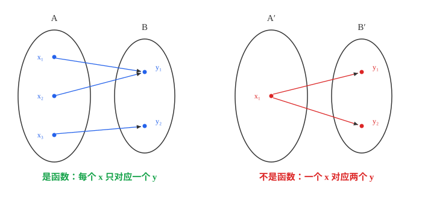
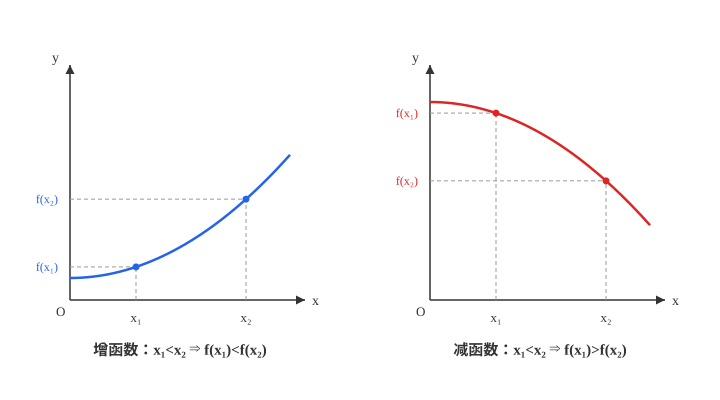
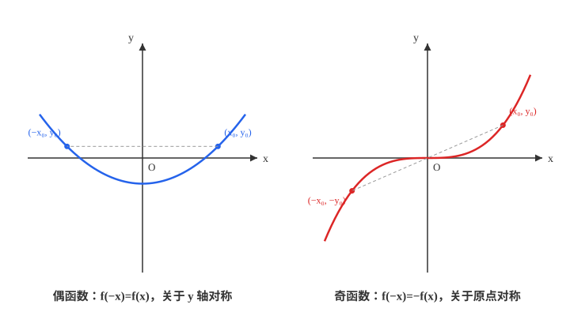
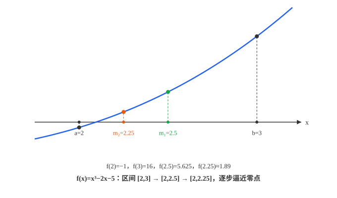

# 具身智能数学基础(07)：函数的概念与性质

| 内容 | 必须掌握的 | 后面在哪用到 |
| --- | --- | --- |
| 函数的概念 | 三要素（定义域、对应法则、值域）；两个函数相同的判定标准 | 描述"输入到输出"关系的通用语言，模型的定义域即输入的合法范围 |
| 定义域与值域 | 常见函数定义域的求法；换元法、判别式法求值域 | 检查输入是否落在模型的有效范围内 |
| 函数的单调性 | 定义法证明单调性；复合函数单调性判断（同增异减） | 损失函数下降性、凸性判断的基本语言 |
| 函数的奇偶性 | 定义、图像对称性、判断顺序 | 利用对称性化简计算量 |
| 函数的零点 | 零点存在定理；二分法求零点近似值 | 数值求根、平衡点与收敛判据的基本方法 |

## 一、函数的概念

设 $A$、$B$ 是两个非空数集，如果按照某种确定的对应关系 $f$，使得对于集合 $A$ 中的**任意一个**数 $x$，在集合 $B$ 中都有**唯一确定**的数 $f(x)$ 和它对应，那么就称 $f: A \to B$ 为从 $A$ 到 $B$ 的一个函数，记作 $y=f(x)$，$x \in A$。

"唯一确定"是这个定义的核心：一个 $x$ 只能对应一个 $y$，但反过来允许多个 $x$ 对应同一个 $y$（比如 $y=x^2$ 里，$x=1$ 和 $x=-1$ 都对应 $y=1$）。上图右边那种"一个 $x$ 引出两条箭头"的对应关系不是函数。

一个函数由**三要素**唯一确定：

- **定义域** $A$：$x$ 的取值范围
- **对应法则** $f$：把 $x$ 变成 $f(x)$ 的具体规则
- **值域**：$\{f(x) \mid x \in A\}$，是 $B$ 的子集，由定义域和对应法则共同决定

判断两个函数是不是同一个函数，只需比较**定义域和对应法则**是否都相同——值域相同不能说明两个函数一样：$y=x^2$（$x\in\mathbb{R}$）和 $y=|x|$，值域都是 $[0,+\infty)$，但对应法则不同，不是同一个函数；定义域不同也不是同一个函数：$y=x$（$x\in\mathbb{R}$）和 $y=\dfrac{x^2}{x}$（$x\ne0$），化简后表达式一样，但定义域不同，是两个不同的函数。

## 二、定义域与值域

### 定义域的求法

定义域由使表达式**有意义**的所有限制条件联立求出，常见限制来自：

- 分式：分母 $\ne 0$
- 偶次根式：被开方数 $\ge 0$
- 复合函数 $f(g(x))$：$x$ 要落在 $g$ 的定义域里，同时 $g(x)$ 要落在 $f$ 的定义域里——两层条件都要满足，不能只看其中一层

### 值域的求法

- **直接法**：对简单函数直接观察，比如 $y=x^2+1$ 的值域是 $[1,+\infty)$
- **配方法**：把二次函数配方成顶点式求最值，进而得到值域（第 2 篇已经证明过配方法本身，这里是它的直接应用）
- **换元法**：把式子里的复杂部分换成新变量 $t$，转化成更简单的函数求值域。比如求 $y=x+\sqrt{1-2x}$ 的值域，令 $t=\sqrt{1-2x}$（$t\ge0$），则 $x=\dfrac{1-t^2}{2}$，代入得 $y=\dfrac{1-t^2}{2}+t=-\dfrac12(t-1)^2+1$（$t\ge0$），转化成关于 $t$ 的二次函数，再用配方法求值域
- **判别式法**：形如 $y=\dfrac{ax^2+bx+c}{dx^2+ex+f}$ 的分式函数，把 $y$ 看成已知数，两边乘分母整理成关于 $x$ 的一元二次方程，用判别式 $\Delta \ge 0$（方程有实数解）反推 $y$ 的取值范围

## 三、函数的单调性

设函数 $f(x)$ 的定义域为 $D$，区间 $I \subseteq D$：若对任意 $x_1,x_2 \in I$，当 $x_1 \lt x_2$ 时都有 $f(x_1) \lt f(x_2)$，称 $f(x)$ 在 $I$ 上是**增函数**；都有 $f(x_1) \gt f(x_2)$，称为**减函数**。

**定义法证明单调性**的标准步骤：在 $I$ 上任取 $x_1 \lt x_2$ → 作差 $f(x_1)-f(x_2)$ → 变形（因式分解、通分等）判断这个差的符号 → 根据符号得出增减结论。这一套流程本身就是证明。

### 复合函数的单调性

设 $u=g(x)$ 在区间 $I$ 上单调，$y=f(u)$ 在 $g(I)$ 上单调，复合函数 $y=f(g(x))$ 在 $I$ 上的单调性遵循**同增异减**：内外两层同方向（都增或都减）则复合函数是增函数，方向相反则复合函数是减函数（证明见后面）。

## 四、函数的奇偶性

设函数 $f(x)$ 的定义域关于原点对称（这是奇偶性成立的前提，定义域不对称直接判定"非奇非偶"）：

- 若对定义域内任意 $x$ 都有 $f(-x)=f(x)$，称 $f(x)$ 为**偶函数**，图象关于 $y$ 轴对称
- 若对定义域内任意 $x$ 都有 $f(-x)=-f(x)$，称 $f(x)$ 为**奇函数**，图象关于原点对称

判断奇偶性的顺序固定：**先看定义域是否关于原点对称，再验证 $f(-x)$ 与 $f(x)$ 的关系**。两步都要做，只验证了 $f(-x)=f(x)$ 而没检查定义域对称性，结论可能是错的。

常数函数 $f(x)=0$（定义域取 $\mathbb{R}$）同时是奇函数也是偶函数，是唯一同时满足两条定义的函数；若奇函数 $f(x)$ 在 $x=0$ 处有定义，则必有 $f(0)=0$（两条都推导见后面）。

## 五、函数的零点

使 $f(x)=0$ 成立的实数 $x$，叫函数 $f(x)$ 的**零点**。"零点"这个概念把三件事统一了起来：$x_0$ 是 $f(x)$ 的零点 $\iff$ 方程 $f(x)=0$ 有实数根 $x_0$ $\iff$ 函数图象与 $x$ 轴的交点横坐标为 $x_0$——这正是第 6 篇"三个二次"讲的转化关系，从二次函数推广到一般函数。

**零点存在定理**：若函数 $f(x)$ 在闭区间 $[a,b]$ 上的图象是一条连续不断的曲线，且 $f(a)\cdot f(b) \lt 0$（两端点函数值异号），则 $f(x)$ 在开区间 $(a,b)$ 内至少存在一个零点。曲线从 $x$ 轴一侧走到另一侧，中途不断开，必然要穿过 $x$ 轴至少一次，这就是定理成立的直观道理。

### 图示：二分法求零点

零点存在定理只保证零点存在，不给出具体位置，**二分法**用来求它的近似值：取区间 $[a,b]$ 的中点 $m=\dfrac{a+b}{2}$，计算 $f(m)$——若 $f(m)=0$，$m$ 就是零点；若 $f(m)$ 与 $f(a)$ 异号，零点在 $[a,m]$ 里，把 $[a,m]$ 当作新区间；若 $f(m)$ 与 $f(b)$ 异号，零点在 $[m,b]$ 里，把 $[m,b]$ 当作新区间。不断重复这个过程，区间长度每次减半，直到区间长度小于预先设定的精度要求，取这时区间的中点作为零点的近似值。

上图以 $f(x)=x^3-2x-5$ 为例：$f(2)=-1 \lt 0$，$f(3)=16 \gt 0$，异号，零点在 $(2,3)$ 内；取中点 $2.5$，$f(2.5)=5.625 \gt 0$，与 $f(2)$ 异号，零点缩小到 $(2,2.5)$；再取中点 $2.25$，$f(2.25)\approx1.89 \gt 0$，零点进一步缩小到 $(2,2.25)$。区间越缩越窄，逼近真实零点。

## 推导与证明

### 复合函数单调性的证明

任取 $x_1 \lt x_2 \in I$。若 $g$ 在 $I$ 上递增，则 $g(x_1) \lt g(x_2)$；此时若 $f$ 在 $g(I)$ 上也递增，把 $g(x_1) \lt g(x_2)$ 代入 $f$ 的增性定义，得 $f(g(x_1)) \lt f(g(x_2))$，即复合函数递增；若 $f$ 递减，则 $f(g(x_1)) \gt f(g(x_2))$，复合函数递减。若 $g$ 在 $I$ 上递减，则 $g(x_1) \gt g(x_2)$，同样代入 $f$ 的增减性，可得"异号则复合减、同号则复合增"的结论对称成立。

### 常数函数与奇函数在 0 处取值的证明

常数函数 $f(x)=0$ 同时是奇函数也是偶函数：$f(-x)=f(x)$ 且 $f(-x)=-f(x)$ 联立，直接推出 $f(x)=-f(x) \implies f(x)=0$。

若奇函数 $f(x)$ 在 $x=0$ 处有定义，则必有 $f(0)=0$：把 $x=0$ 代入 $f(-x)=-f(x)$ 得 $f(0)=-f(0)$，同样推出 $f(0)=0$。

## 对应视频

正文看得懂就跳过，卡住了再看对应那一段。下面只列真正值得看的，合计约 3 小时 12 分。

- [P18 函数概念+定义域](https://www.bilibili.com/video/BV147411K7xu?p=18)（39:35）— **必看**
- [P20 分式函数的值域](https://www.bilibili.com/video/BV147411K7xu?p=20)（38:19）— **必看**
- [P21 函数单调性](https://www.bilibili.com/video/BV147411K7xu?p=21)（43:52）— **必看**
- [P22 函数奇偶性](https://www.bilibili.com/video/BV147411K7xu?p=22)（38:21）— **必看**
- [P37 零点存在性定理的运用](https://www.bilibili.com/video/BV147411K7xu?p=37)（31:55）— **必看**

合集里另有"引导课：为什么用 f(x)"（P17）、"函数解析式求法"（P19），是记号动机说明和求表达式的技巧，与本篇内容无关；"单调奇偶考法复习""单调奇偶综合拓展""抽象函数、恒成立、构造函数"（P23-P25）是应试考法和拔高压轴题型，都跳过。合集中没有专门讲二分法的一集。

以上集数、标题、时长通过浏览器打开合集页面直接读取播放列表核实，未逐集观看。
