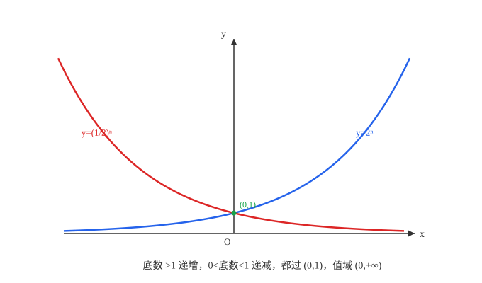
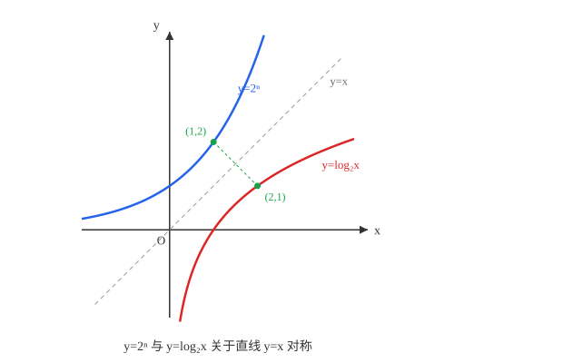
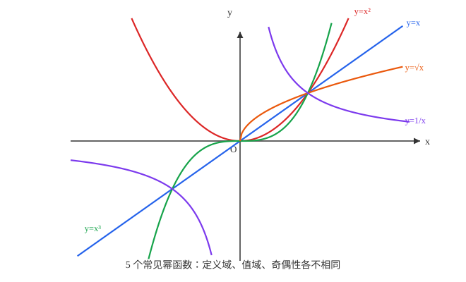

# 具身智能数学基础(08)：指数函数与对数函数、幂函数

| 内容 | 必须掌握的 | 后面在哪用到 |
| --- | --- | --- |
| 指数的扩展 | $n$ 次方根定义；分数指数幂与根式的互化；实数指数幂的运算法则 | 指数运算（增长与衰减模型）的记号基础 |
| 指数函数 | 定义、图像与单调性（按底数 $\gt1$、$0\lt$底数$\lt1$ 分两种情形） | 指数衰减/增长模型；softmax 与神经网络激活函数的组成部件 |
| 对数的概念 | 对数的定义、对数恒等式、换底公式、运算法则 | 把乘法转成加法的标准工具，对数似然的记号基础 |
| 对数函数 | 定义、图像与单调性；与指数函数互为反函数（图像关于 $y=x$ 对称） | log-sum-exp、信息熵等对数记号的数学基础 |
| 幂函数 | 定义 $y=x^{\alpha}$；常见几个幂函数的图像与性质 | 多项式模型、幂律分布的基本单元 |

## 一、指数的扩展

若 $x^n=a$（$n\gt1$，$n\in\mathbb{N}^*$），则 $x$ 叫 $a$ 的 **$n$ 次方根**：

- $n$ 为奇数时，任意实数 $a$ 都有唯一的 $n$ 次方根，记作 $\sqrt[n]{a}$
- $n$ 为偶数时，正数 $a$ 有两个互为相反数的 $n$ 次方根，正的那个记作 $\sqrt[n]{a}$（算术根）；负数在实数范围内没有偶次方根

由此得到 $\sqrt[n]{a^n}$ 的取值：$n$ 为奇数时 $\sqrt[n]{a^n}=a$；$n$ 为偶数时 $\sqrt[n]{a^n}=|a|$，这是第 1 篇 $\sqrt{a^2}=|a|$ 的直接推广。

**分数指数幂**：规定 $a^{\frac{m}{n}}=\sqrt[n]{a^m}$（$a\gt0$，$m,n\in\mathbb{N}^*$，$n\gt1$），$a^{-\frac{m}{n}}=\dfrac{1}{a^{\frac{m}{n}}}$（$a\gt0$）。这样定义之后，根式和分数指数幂可以自由互化，且整数指数幂的运算法则可以推广到全体实数指数：

$a^r a^s = a^{r+s}$，$(a^r)^s = a^{rs}$，$(ab)^r = a^r b^r$（$a\gt0$，$b\gt0$，$r,s$ 为任意实数）

## 二、指数函数

函数 $y=a^x$（$a\gt0$ 且 $a\ne1$，$x\in\mathbb{R}$）叫**指数函数**。

指数函数的性质：定义域 $\mathbb{R}$，值域 $(0,+\infty)$，图象恒过点 $(0,1)$（因为 $a^0=1$ 对任意 $a$ 都成立）；当 $a\gt1$ 时在 $\mathbb{R}$ 上单调递增，当 $0\lt a\lt1$ 时单调递减。

## 三、对数的概念

若 $a^x=N$（$a\gt0$，$a\ne1$，$N\gt0$），则 $x$ 叫做**以 $a$ 为底 $N$ 的对数**，记作 $x=\log_a N$，$a$ 叫底数，$N$ 叫真数。常用对数 $\lg N=\log_{10}N$；自然对数 $\ln N=\log_e N$，$e$ 是一个无理数（约等于 $2.71828$）的专用记号。

对数的定义直接给出两条**对数恒等式**：$a^{\log_a N}=N$，$\log_a a^x=x$——两者都是"指数与对数互为逆运算"的直接表现。

**对数运算法则**（$a\gt0$，$a\ne1$，$M\gt0$，$N\gt0$）：

$\log_a(MN)=\log_aM+\log_aN$，$\log_a\dfrac{M}{N}=\log_aM-\log_aN$，$\log_a(M^n)=n\log_aM$（$n\in\mathbb{R}$）

**证明**（以第一条为例）：设 $\log_aM=p$，$\log_aN=q$，则 $M=a^p$，$N=a^q$。由指数运算法则，$MN=a^p a^q=a^{p+q}$，两边取以 $a$ 为底的对数，得 $\log_a(MN)=p+q=\log_aM+\log_aN$。

**换底公式**：$\log_a N=\dfrac{\log_c N}{\log_c a}$（$a,c\gt0$ 且 $\ne1$，$N\gt0$）。

**证明**：设 $\log_aN=x$，则 $a^x=N$，两边取以 $c$ 为底的对数：$\log_c(a^x)=\log_cN$，由对数运算法则第三条得 $x\log_ca=\log_cN$，所以 $x=\dfrac{\log_cN}{\log_ca}$。

## 四、对数函数

函数 $y=\log_a x$（$a\gt0$ 且 $a\ne1$，$x\gt0$）叫**对数函数**。

性质：定义域 $(0,+\infty)$，值域 $\mathbb{R}$，图象恒过点 $(1,0)$（因为 $\log_a1=0$ 对任意 $a$ 都成立）；当 $a\gt1$ 时单调递增，当 $0\lt a\lt1$ 时单调递减。

对数函数与指数函数**互为反函数**，图象关于直线 $y=x$ 对称：把 $y=a^x$ 中的 $x,y$ 互换位置解出 $y$，得 $x=a^y \iff y=\log_a x$，这正是反函数的构造过程；而 $x,y$ 互换对应的几何操作就是关于直线 $y=x$ 作对称。

## 五、幂函数

形如 $y=x^{\alpha}$（$\alpha$ 为常数）的函数叫**幂函数**。

图中五个函数 $y=x$、$y=x^2$、$y=x^3$、$y=\sqrt{x}$、$y=\dfrac{1}{x}$（即 $\alpha$ 分别取 $1,2,3,\dfrac12,-1$）是高中阶段最常见的幂函数：它们的定义域、值域、奇偶性各不相同（$y=x^2$ 的定义域是 $\mathbb{R}$ 但 $y=\sqrt{x}$ 只在 $x\ge0$ 有定义；$y=x$、$y=x^3$、$y=\dfrac1x$ 是奇函数，$y=x^2$ 是偶函数，$y=\sqrt{x}$ 非奇非偶），但都经过点 $(1,1)$——因为 $1^{\alpha}=1$ 对任意 $\alpha$ 都成立。

## 对应视频

正文看得懂就跳过，卡住了再看对应那一段。下面只列真正值得看的，合计约 2 小时 1 分。

- [P26 幂函数](https://www.bilibili.com/video/BV147411K7xu?p=26)（19:35）— **必看**
- [P27 分数指数幂的计算](https://www.bilibili.com/video/BV147411K7xu?p=27)（16:12）— **必看**
- [P28 指数函数](https://www.bilibili.com/video/BV147411K7xu?p=28)（21:25）— **必看**
- [P29 对数定义+基本运算规则](https://www.bilibili.com/video/BV147411K7xu?p=29)（26:24）— **必看**
- [P30 对数换底公式+练习](https://www.bilibili.com/video/BV147411K7xu?p=30)（15:27）— **必看**
- [P31 对数函数](https://www.bilibili.com/video/BV147411K7xu?p=31)（22:10）— **必看**

合集里另有"初等函数知识串讲复习""指数、对数大小比较题型解析""初等函数图像与性质考点解析""指数、对数的常见重要丑函数""函数问题的解题流程总结"几集，都是复习课、大小比较技巧或拔高压轴题型，与本篇概念无关，跳过。

以上集数、标题、时长通过浏览器打开合集页面直接读取播放列表核实，未逐集观看。
