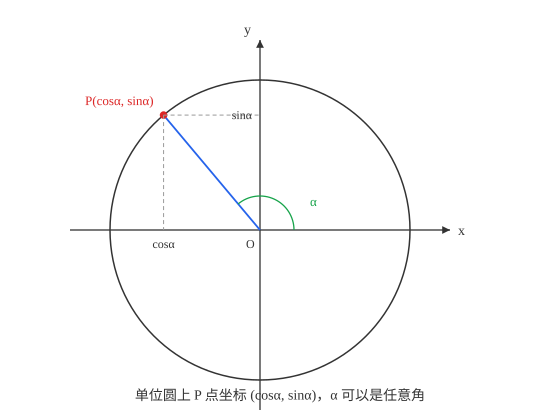
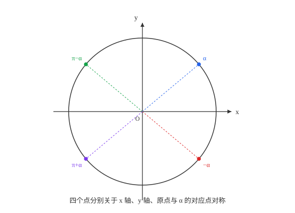
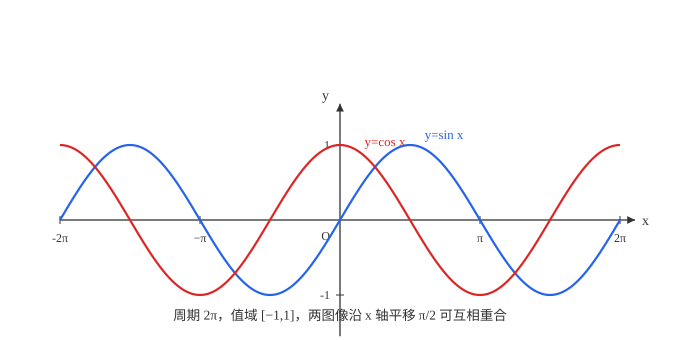
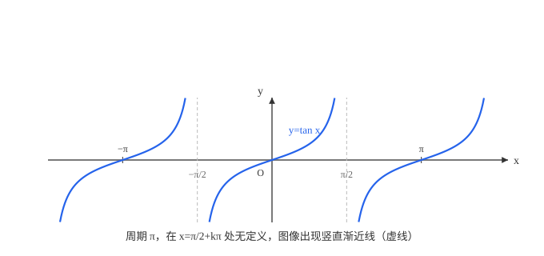
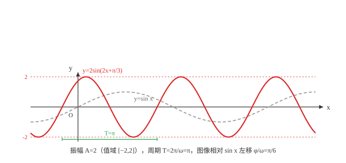
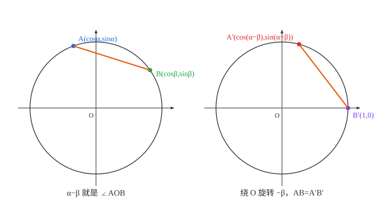
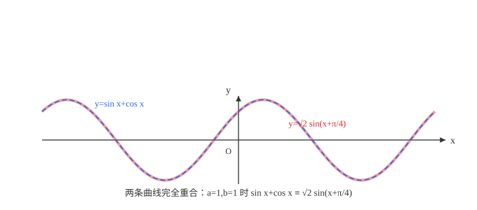

# 具身智能数学基础(09)：三角函数与恒等变换

| 内容 | 必须掌握的 | 后面在哪用到 |
| --- | --- | --- |
| 弧度制 | 弧度与角度换算；弧长公式、扇形面积公式 | 角的统一记号，后续三角运算一律用弧度 |
| 任意角的三角函数 | 单位圆定义；各象限符号；特殊角的值 | 描述旋转与周期性现象的统一语言 |
| 同角关系与诱导公式 | $\sin^2\alpha+\cos^2\alpha=1$；四组诱导公式及推导思路 | 化简三角表达式的基本工具 |
| 三角函数的图像与性质 | 周期性、单调区间、对称轴与对称中心 | 周期信号分析的图像基础 |
| $y=A\sin(\omega x+\varphi)$ 的图像变换 | 振幅、周期、初相的几何含义；图像变换的正确顺序 | 描述振荡与波动现象的标准模型 |
| 两角和差公式 | $\cos(\alpha-\beta)$ 的几何证明；由它推出其余三条 | 三角恒等变形与角度复合运算的代数基础 |
| 二倍角与辅助角公式 | 二倍角公式、降幂公式；辅助角公式及证明 | 把多个三角函数项合并成一个的标准手段 |

## 一、任意角与弧度制

按逆时针方向旋转形成的角是**正角**，顺时针方向旋转形成的角是**负角**，射线没有旋转时构成**零角**。与角 $\alpha$ 终边相同的角构成集合 $\{\beta \mid \beta=\alpha+k\cdot360°, k\in\mathbb{Z}\}$（弧度制下是 $\{\beta \mid \beta=\alpha+2k\pi, k\in\mathbb{Z}\}$）。

**弧度制**：把长度等于半径长的弧所对的圆心角叫做 $1$ 弧度的角。设圆心角 $\alpha$（弧度）对应的弧长为 $l$，半径为 $r$，则 $\alpha=\dfrac{l}{r}$——弧度数就是弧长与半径的比值，这个比值不依赖圆的大小，只由角的张开程度决定。

整个圆周对应弧长 $2\pi r$，所以周角 $360°$ 对应的弧度数是 $\dfrac{2\pi r}{r}=2\pi$，即 $360°=2\pi \text{ rad}$，$180°=\pi \text{ rad}$。由此 $1°=\dfrac{\pi}{180}\text{ rad}$，$1\text{ rad}=\left(\dfrac{180}{\pi}\right)°\approx57.30°$。

**弧长公式**：$l=|\alpha|r$（$\alpha$ 为弧度数，直接由 $\alpha=l/r$ 移项得到）。

**扇形面积公式**：扇形面积与圆心角成正比——整圆面积 $\pi r^2$ 对应圆心角 $2\pi$，扇形面积 $S$ 对应圆心角 $\alpha$，由比例关系 $\dfrac{S}{\pi r^2}=\dfrac{\alpha}{2\pi}$，解得

$S=\dfrac12\alpha r^2=\dfrac12(\alpha r)r=\dfrac12 lr$

## 二、任意角的三角函数

以坐标原点为圆心作单位圆（半径 $1$），角 $\alpha$ 的顶点在原点，始边与 $x$ 轴正半轴重合，终边与单位圆交于点 $P(x,y)$，定义：

$\sin\alpha=y$，$\cos\alpha=x$，$\tan\alpha=\dfrac{y}{x}$（$x\ne0$）

这是第 4 篇锐角三角比定义的推广：把"角"从直角三角形里的锐角（$0°$ 到 $90°$）扩展到任意角。当 $\alpha$ 是锐角时，$P$ 点坐标就是以原点为直角顶点的直角三角形对边、邻边与斜边（半径 $1$）的比值，与第 4 篇的定义完全一致。

**各象限符号**由 $P$ 点坐标符号直接给出：第一象限 $x,y$ 都为正，$\sin,\cos$ 都为正；第二象限 $x$ 负 $y$ 正，$\sin$ 正 $\cos$ 负；第三象限都负，$\sin,\cos$ 都负；第四象限 $x$ 正 $y$ 负，$\sin$ 负 $\cos$ 正。$\tan\alpha=y/x$ 的符号是 $\sin\alpha$ 与 $\cos\alpha$ 符号之商，第一、三象限为正，第二、四象限为负。

**特殊角的值**：结合第 4 篇已推导的 $30°,45°,60°$ 的值，加上单位圆上直接读出的 $0°,90°,180°,270°,360°$ 的值（$P$ 点分别在 $(1,0),(0,1),(-1,0),(0,-1),(1,0)$），$0$ 到 $2\pi$ 之间所有"特殊角"（$\pi/6$、$\pi/4$ 的整数倍）的三角函数值都可以由对称性推出，不需要另外死记——这正是下一节要做的事。

## 三、同角三角函数的基本关系

$P(x,y)=(\cos\alpha,\sin\alpha)$ 落在单位圆 $x^2+y^2=1$ 上，直接代入得：

$\sin^2\alpha+\cos^2\alpha=1$

这是第 4 篇"同角关系"（当时用勾股定理证明）的推广：单位圆上这条关系本质上仍是勾股定理，只是半径（斜边）取 $1$，退化成了这个更简洁的形式。商数关系同样由定义直接得出：

$\tan\alpha=\dfrac{\sin\alpha}{\cos\alpha}$（$\alpha\ne\dfrac{\pi}{2}+k\pi$，$k\in\mathbb{Z}$）

## 四、诱导公式

单位圆具有四种对称性，每一种给出一组诱导公式：

- **关于 $x$ 轴对称**：角 $-\alpha$ 的终边与角 $\alpha$ 的终边关于 $x$ 轴对称，坐标从 $(x,y)$ 变成 $(x,-y)$，所以 $\sin(-\alpha)=-\sin\alpha$，$\cos(-\alpha)=\cos\alpha$
- **关于 $y$ 轴对称**：角 $\pi-\alpha$ 的终边与角 $\alpha$ 的终边关于 $y$ 轴对称，坐标变成 $(-x,y)$，所以 $\sin(\pi-\alpha)=\sin\alpha$，$\cos(\pi-\alpha)=-\cos\alpha$
- **关于原点对称**：角 $\pi+\alpha$ 的终边与角 $\alpha$ 的终边关于原点对称，坐标变成 $(-x,-y)$，所以 $\sin(\pi+\alpha)=-\sin\alpha$，$\cos(\pi+\alpha)=-\cos\alpha$
- **关于直线 $y=x$ 对称**：角 $\dfrac{\pi}{2}-\alpha$ 的终边与角 $\alpha$ 的终边关于直线 $y=x$ 对称，坐标变成 $(y,x)$，所以 $\sin\left(\dfrac{\pi}{2}-\alpha\right)=\cos\alpha$，$\cos\left(\dfrac{\pi}{2}-\alpha\right)=\sin\alpha$（这正是第 4 篇"互余关系"的推广）

四组公式遵循同一个规律：加减 $\pi$ 的整数倍不改变函数名，加减 $\dfrac{\pi}{2}$ 的奇数倍会把 $\sin$ 变 $\cos$、$\cos$ 变 $\sin$；符号则由"把 $\alpha$ 当成锐角时，原式所在象限的符号"决定。这套规律就是四条公式的合并记忆方式，本质上都是单位圆对称性的直接结果。

## 五、三角函数的图像与性质

单位圆上 $P$ 点随 $\alpha$ 连续转动，把纵坐标 $y=\sin\alpha$、横坐标 $x=\cos\alpha$ 随 $\alpha$ 展开成平面直角坐标系里的图像，就得到正弦函数、余弦函数的图像。

- **周期性**：$\sin(\alpha+2\pi)=\sin\alpha$，$\cos(\alpha+2\pi)=\cos\alpha$ 对任意 $\alpha$ 成立（单位圆转一整圈回到同一点），最小正周期都是 $2\pi$
- **单调性**：正弦函数在 $\left[-\dfrac{\pi}{2}+2k\pi, \dfrac{\pi}{2}+2k\pi\right]$ 上单调递增，在 $\left[\dfrac{\pi}{2}+2k\pi, \dfrac{3\pi}{2}+2k\pi\right]$ 上单调递减（$k\in\mathbb{Z}$）；余弦函数在 $[2k\pi-\pi,2k\pi]$ 上递增，在 $[2k\pi,2k\pi+\pi]$ 上递减
- **对称性**：正弦函数图像关于点 $(k\pi,0)$ 中心对称，关于直线 $x=\dfrac{\pi}{2}+k\pi$ 轴对称；余弦函数图像关于点 $\left(\dfrac{\pi}{2}+k\pi,0\right)$ 中心对称，关于直线 $x=k\pi$ 轴对称——对称轴和对称中心正好落在函数取最值（轴）或取零值（心）的位置

正切函数的图像与前两者不同：

- 定义域是 $\alpha\ne\dfrac{\pi}{2}+k\pi$（$\cos\alpha=0$ 时 $\tan\alpha$ 无定义），图像在每个 $\alpha=\dfrac{\pi}{2}+k\pi$ 处断开，出现竖直渐近线
- 最小正周期是 $\pi$（不是 $2\pi$）：$\tan(\alpha+\pi)=\dfrac{\sin(\alpha+\pi)}{\cos(\alpha+\pi)}=\dfrac{-\sin\alpha}{-\cos\alpha}=\tan\alpha$
- 在每个区间 $\left(-\dfrac{\pi}{2}+k\pi,\dfrac{\pi}{2}+k\pi\right)$ 上单调递增

## 六、函数 $y=A\sin(\omega x+\varphi)$ 的图像变换

一般形式 $y=A\sin(\omega x+\varphi)$（$A\gt0$，$\omega\gt0$）中三个参数各自控制一件事：

- **振幅 $A$**：决定纵向伸缩，值域变为 $[-A,A]$
- **角频率 $\omega$**：决定周期 $T=\dfrac{2\pi}{\omega}$，$\omega$ 越大周期越短
- **初相 $\varphi$**：决定图像左右平移，图像相对 $y=\sin x$ 向左平移 $\dfrac{\varphi}{\omega}$ 个单位

从 $y=\sin x$ 变换到 $y=A\sin(\omega x+\varphi)$ 的标准顺序是：先把 $x$ 替换成 $x+\varphi$ 得到 $y=\sin(x+\varphi)$（左移 $\varphi$ 个单位）→ 再把 $x$ 替换成 $\omega x$ 得到 $y=\sin(\omega x+\varphi)$（横向压缩为原来的 $\dfrac1\omega$）→ 最后纵向伸缩 $A$ 倍得到 $y=A\sin(\omega x+\varphi)$。第二步压缩的是替换后表达式里的整个 $x$，所以最终的水平位移是 $\varphi/\omega$ 而不是 $\varphi$——这是这套变换里唯一需要留意顺序的地方，颠倒"平移"和"压缩"的顺序会得到不同的位移量。

## 七、两角和差公式

**$\cos(\alpha-\beta)$ 公式**（其余所有和差角公式都由它推出）：

$\cos(\alpha-\beta)=\cos\alpha\cos\beta+\sin\alpha\sin\beta$（几何证明见后面）

由这一条可以推出其余三条：

$\cos(\alpha+\beta)=\cos\alpha\cos\beta-\sin\alpha\sin\beta$

$\sin(\alpha+\beta)=\sin\alpha\cos\beta+\cos\alpha\sin\beta$

$\sin(\alpha-\beta)=\sin\alpha\cos\beta-\cos\alpha\sin\beta$

**正切的和差角公式**：

$\tan(\alpha+\beta)=\dfrac{\tan\alpha+\tan\beta}{1-\tan\alpha\tan\beta}$，$\tan(\alpha-\beta)=\dfrac{\tan\alpha-\tan\beta}{1+\tan\alpha\tan\beta}$

（以上推导过程见后面）

## 八、二倍角公式

在和差角公式中令 $\beta=\alpha$，直接得到：

$\sin2\alpha=2\sin\alpha\cos\alpha$

$\cos2\alpha=\cos^2\alpha-\sin^2\alpha$

结合 $\sin^2\alpha+\cos^2\alpha=1$，$\cos2\alpha$ 还有两种等价形式：

$\cos2\alpha=2\cos^2\alpha-1=1-2\sin^2\alpha$

$\tan2\alpha=\dfrac{2\tan\alpha}{1-\tan^2\alpha}$（由 $\tan(\alpha+\beta)$ 公式令 $\beta=\alpha$ 得到）

**降幂公式**是 $\cos2\alpha$ 后两种形式反解出来的：

$\sin^2\alpha=\dfrac{1-\cos2\alpha}{2}$，$\cos^2\alpha=\dfrac{1+\cos2\alpha}{2}$

## 九、辅助角公式

$a\sin x+b\cos x=\sqrt{a^2+b^2}\sin(x+\varphi)$，其中 $\cos\varphi=\dfrac{a}{\sqrt{a^2+b^2}}$，$\sin\varphi=\dfrac{b}{\sqrt{a^2+b^2}}$（$\varphi$ 由这两个式子共同确定所在象限，证明见后面）

上图用 $a=1,b=1$ 验证：$\sin x+\cos x$ 与 $\sqrt2\sin\left(x+\dfrac{\pi}{4}\right)$ 两条曲线完全重合。

## 推导与证明

### 两角差余弦公式的证明

在单位圆上取两点 $A(\cos\alpha,\sin\alpha)$、$B(\cos\beta,\sin\beta)$，用两点间距离公式：

$AB^2=(\cos\alpha-\cos\beta)^2+(\sin\alpha-\sin\beta)^2=2-2(\cos\alpha\cos\beta+\sin\alpha\sin\beta)$

（展开后用两次 $\sin^2+\cos^2=1$ 化简）另一方面，把 $A$、$B$ 绕原点旋转 $-\beta$，变成 $A^{\prime}(\cos(\alpha-\beta),\sin(\alpha-\beta))$、$B^{\prime}(1,0)$，旋转不改变两点间距离：

$AB^2=A^{\prime}B^{\prime2}=(\cos(\alpha-\beta)-1)^2+\sin^2(\alpha-\beta)=2-2\cos(\alpha-\beta)$

两个 $AB^2$ 的表达式相等，得 $2-2(\cos\alpha\cos\beta+\sin\alpha\sin\beta)=2-2\cos(\alpha-\beta)$，即证。

### 其余和差角公式的推导

$\cos(\alpha+\beta)=\cos(\alpha-(-\beta))=\cos\alpha\cos\beta-\sin\alpha\sin\beta$

$\sin(\alpha+\beta)=\cos\left(\dfrac{\pi}{2}-(\alpha+\beta)\right)=\cos\left(\left(\dfrac{\pi}{2}-\alpha\right)-\beta\right)=\sin\alpha\cos\beta+\cos\alpha\sin\beta$（第四节的诱导公式代入化简）

$\sin(\alpha-\beta)=\sin(\alpha+(-\beta))=\sin\alpha\cos\beta-\cos\alpha\sin\beta$

**正切的和差角公式**由 $\tan=\dfrac{\sin}{\cos}$ 直接推出：分子分母同除以 $\cos\alpha\cos\beta$，得 $\tan(\alpha+\beta)=\dfrac{\tan\alpha+\tan\beta}{1-\tan\alpha\tan\beta}$；把 $\beta$ 换成 $-\beta$ 直接得到 $\tan(\alpha-\beta)=\dfrac{\tan\alpha-\tan\beta}{1+\tan\alpha\tan\beta}$。

### 辅助角公式的证明

把 $\sqrt{a^2+b^2}$ 提出来：

$a\sin x+b\cos x=\sqrt{a^2+b^2}\left(\dfrac{a}{\sqrt{a^2+b^2}}\sin x+\dfrac{b}{\sqrt{a^2+b^2}}\cos x\right)$

因为 $\left(\dfrac{a}{\sqrt{a^2+b^2}}\right)^2+\left(\dfrac{b}{\sqrt{a^2+b^2}}\right)^2=1$，这两个系数可以看成某个角 $\varphi$ 的余弦和正弦，代入并用和角公式：

$=\sqrt{a^2+b^2}(\cos\varphi\sin x+\sin\varphi\cos x)=\sqrt{a^2+b^2}\sin(x+\varphi)$

## 对应视频

正文看得懂就跳过，卡住了再看对应那一段。下面只列真正值得看的，合计约 6 小时 9 分。

- [P45 任意角的表示](https://www.bilibili.com/video/BV147411K7xu?p=45)（19:57）— **必看**
- [P46 弧度制](https://www.bilibili.com/video/BV147411K7xu?p=46)（17:39）— **必看**
- [P47 弧长与扇形面积公式](https://www.bilibili.com/video/BV147411K7xu?p=47)（17:05）— **必看**
- [P48 三角函数的定义](https://www.bilibili.com/video/BV147411K7xu?p=48)（28:00）— **必看**
- [P49 同角三角函数关系](https://www.bilibili.com/video/BV147411K7xu?p=49)（16:25）— **必看**
- [P50 诱导公式](https://www.bilibili.com/video/BV147411K7xu?p=50)（34:34）— **必看**
- [P51 sinx 的图像与性质](https://www.bilibili.com/video/BV147411K7xu?p=51)（32:14）— **必看**
- [P52 cosx 的图像与性质](https://www.bilibili.com/video/BV147411K7xu?p=52)（13:43）— **必看**
- [P53 tanx 的图像与性质](https://www.bilibili.com/video/BV147411K7xu?p=53)（07:40）— **必看**
- [P55 三角函数的平移伸缩](https://www.bilibili.com/video/BV147411K7xu?p=55)（15:02）— **必看**
- [P56 三角函数一般形式的各参数含义](https://www.bilibili.com/video/BV147411K7xu?p=56)（10:49）— **必看**
- [P59 三角函数对称性](https://www.bilibili.com/video/BV147411K7xu?p=59)（34:08）— **必看**
- [P60 三角函数的单调性](https://www.bilibili.com/video/BV147411K7xu?p=60)（24:11）— **必看**
- [P62 sincos 两角和差公式](https://www.bilibili.com/video/BV147411K7xu?p=62)（32:46）— **必看**
- [P63 tan 两角和差公式](https://www.bilibili.com/video/BV147411K7xu?p=63)（13:08）— **必看**
- [P65 二倍角公式](https://www.bilibili.com/video/BV147411K7xu?p=65)（23:41）— **必看**
- [P68 辅助角公式](https://www.bilibili.com/video/BV147411K7xu?p=68)（27:43）— **必看**

合集里另有"三角 4 个解题妙招""整体换元法""图像解决三角函数不等式问题""三角函数难题克星——整体换元法""两角和差公式进阶练习""二倍角公式进阶变形""二倍角与半角公式复习""和差化积积化和差（选学）"几集，都是解题技巧、进阶练习或选学拔高内容，与本篇概念无关，跳过。

以上集数、标题、时长通过浏览器打开合集页面直接读取播放列表核实，未逐集观看。
