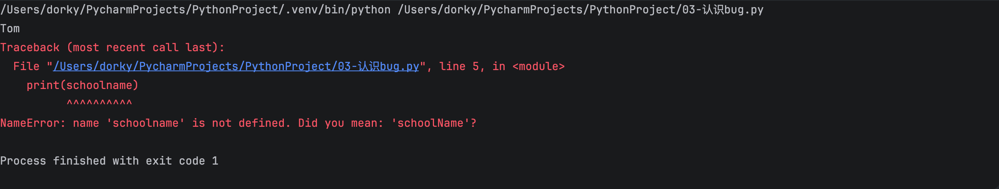
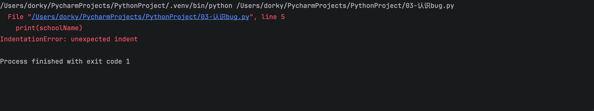
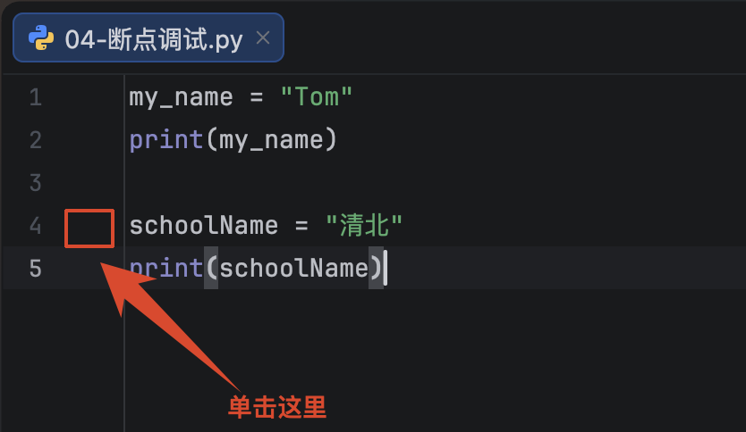
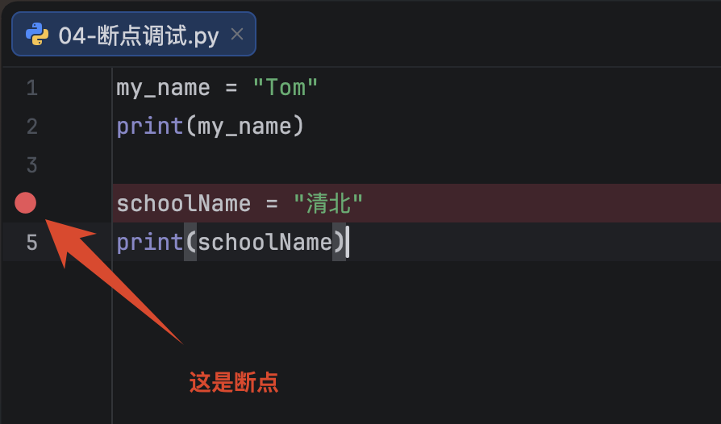
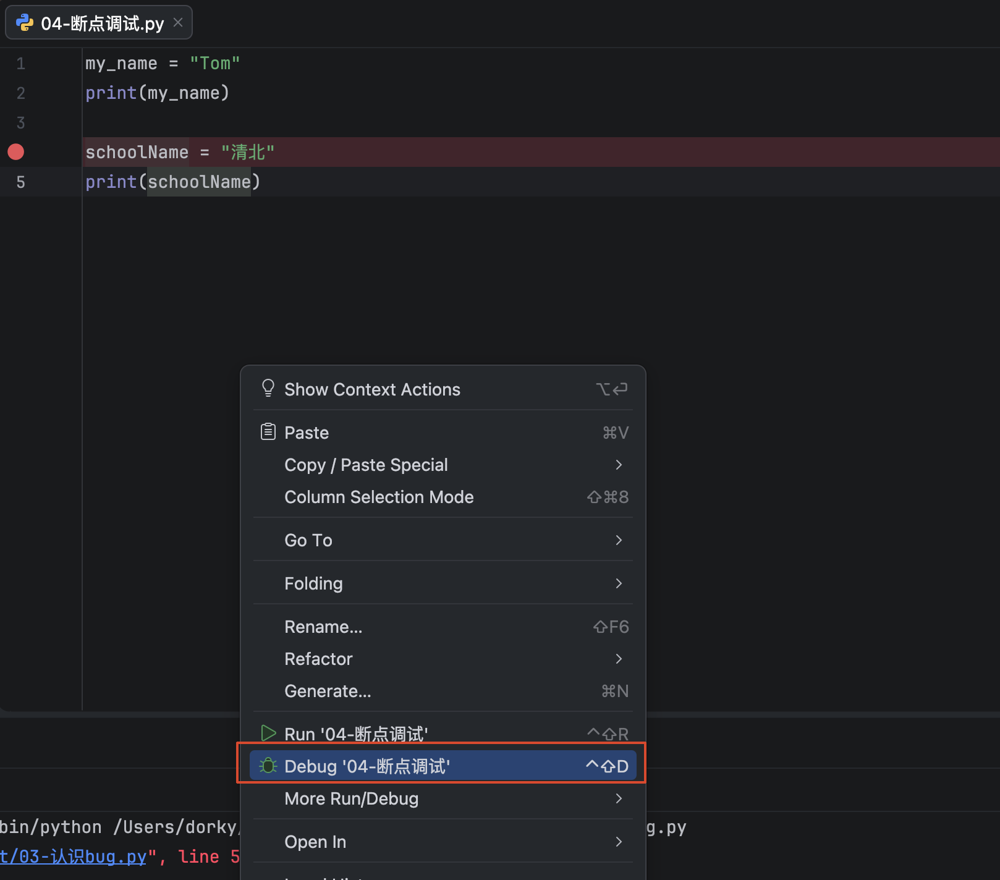
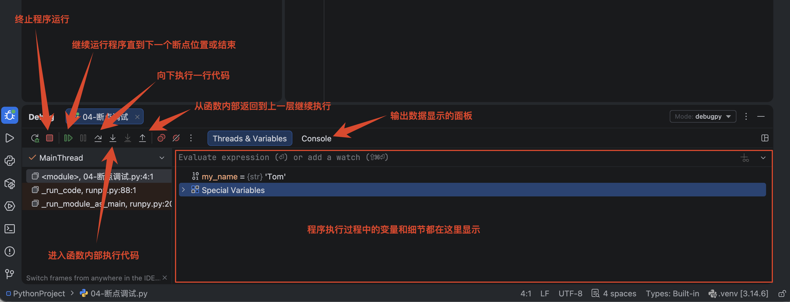
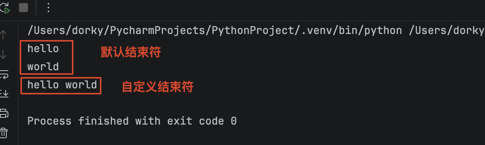
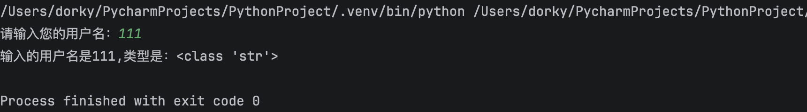
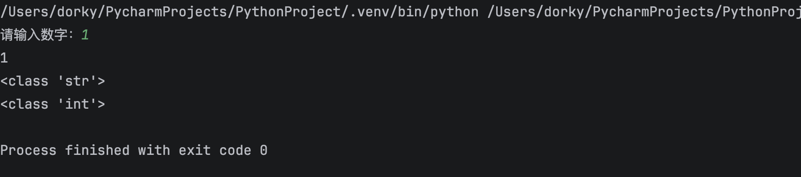
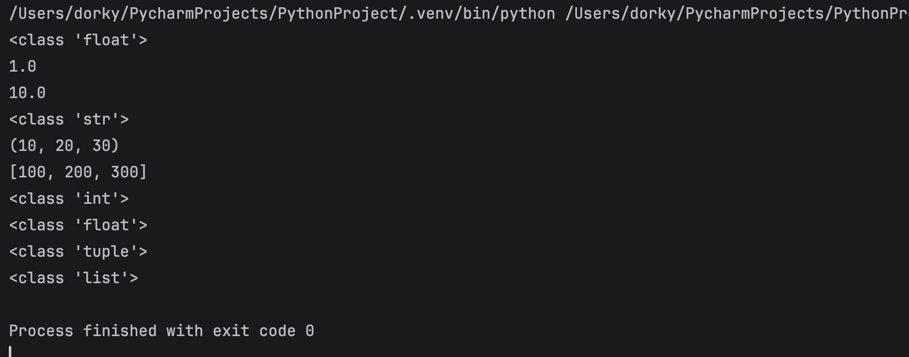

# 02-Python入门

## 注释
:::info
注释的作用

注释的分类及语法

注释的特点

:::

### 注释的作用
+ 注释的作用：通过自己熟悉的语言，在程序中对某些代码进行标注说明，这就是注释的所用，能够大大增强程序的可读性

### 注释的分类及语法
+ 注释分类：**<font style="color:#DF2A3F;">单行注释和多行注释</font>**
+ 单行注释：**<font style="color:#DF2A3F;">Ctrl + /</font><font style="color:#000000;">（快捷键）</font>**
    - 只能注释一行内容

```python
# 单行注释
```

+ 多行注释：
    - 可以注释多行内容，一般用在注释一段代码的情况

```python
"""
    第一行注释
    第二行注释
    第三行注释
"""

'''
    注释1
    注释2
    注释3
'''
```

### 注释的特点
+ 解释器不执行任何注释内容

## 标识符
### 标识符命名规则（必须遵守）
标识符命名规则是 Python 中定义各种名字的时候的统一规范，具体如下：

+ 由数字、字母、下划线组成
+ 不能数字开头
+ 不能使用内置关键字
+ 严格区分大小写

```python
False		None		True		and			as			assert		break		class		continue
del			elfi		else		except		finally		for			form		global		if	
import		in			is			lambda		nonlocal	not			or			pass		raise
return		try			while		with		yield
```

### 标识符命名习惯（建议）
+ 见名知意
+ 大驼峰：即每个单词首字母都大些，例如：MyName
+ 小驼峰：第二个（含）以后的每个单词首字母大写，例如：myName
+ 下划线：例如：my_name

## Bug
### 认识 Bug
所谓 Bug ，就是程序中的错误，如果程序中有错误，需要程序员排查问题，纠正错误。





### Debug 调试工具
Debug 工具是 PyCharm IDE 中集成的用来调试程序的工具。在这里程序员可以查看程序的执行细节和流程或者调解 Bub

+ Debug 工具使用步骤
    - 1、打断点
    - 2、Debug 调试

:::info
打断点

+ 1、断点位置
    - 目标要调试的代码块的第一行代码即可，即一个段段即可。
+ 2、打断点的方法
    - 单机目前代码的行号右侧空白位置




:::

:::info
调试程序

+ 运行的时候，选择 Debug 模式运行程序





:::

## 输出
:::info
+ 格式化输出
    - 格式化符号
    - f-字符串
+ print 结束符

:::

作用：程序输出内容给用户

### 认识格式化符号
| **格式化符号** | | |
| --- | --- | --- |
| **符号** | **说明** | **示例** |
| `%s` | **<font style="color:#DF2A3F;">字符串（调用 str ()，通用首选）</font>** | `'%s' % 123`<br/>→ `"123"` |
| `%d` | **<font style="color:#DF2A3F;">十进制整数（有符号）</font>** | `'%d' % -20`<br/> → `"-20"` |
| `%f` | **<font style="color:#DF2A3F;">浮点数（默认保留 6 位小数）</font>** | `'%f' % 3.14`<br/> → `"3.140000"` |
| `%c` | 单个字符（数字 / 字符） | `'%c' % 65`<br/> → `"A"` |
| `%r` | 原始字符串（调用 repr ()，调试用） | `'%r' % 'hi'`<br/> → `"'hi'"` |
| `%i` | 同 % d，十进制整数 | `'%i' % 50`<br/> → `"50"` |
| `%u` | 无符号整数（Python3 等价 % d，基本废弃） | - |
| `%o` | 八进制整数 | `'%o' % 10`<br/> → `"12"` |
| `%x` | 小写十六进制 | `'%x' % 11`<br/> → `"b"` |
| `%X` | 大写十六进制 | `'%X' % 11`<br/> → `"B"` |
| `%F` | 浮点数，大写 NaN/Inf | - |
| `%e` | 科学计数法（小写 e） | `'%e' % 1234`<br/> → `1.234000e+03` |
| `%E` | 科学计数法（大写 E） | `'%E' % 1234`<br/> → `1.234000E+03` |
| `%g` | 自动选择 % f / % e，去除末尾无效 0 | `'%g' % 3.14000`<br/> → `"3.14"` |
| `%G` | 自动选择 % F / % E | - |
| `%%` | 输出字面量 `%` | `'%%'`<br/> → `"%"` |


+ 字符串：可以通过 **<font style="color:#DF2A3F;">%.mf </font>**（m 为要保留的小数位）的形式保留指定的小数位
+ 数字：可以通过 **<font style="color:#DF2A3F;">%0md</font>**（m 为显示的位数）的形式显示指定位数，不足以 0 补齐，超出则原样输出

### 格式化符号基础使用方法
+ 1、在输出字符串内部使用格式化符号进行占位
+ 2、在字符串后面通过%连接要输出的变量

```python
"""
 1、准备数据
 2、格式化符号输出数据
"""
age = 18
name = "Tom"
weight = 75.5
stu_id = 1

# 1、今年我的年龄是x岁
print("今年我的年龄是%d岁" % age)

# 2、我的名字名x
print("我的名字名%s" % name)

# 3、我的体重是x公斤
print("我的体重是%.2f公斤" % weight)
```

### 格式化符号高级使用方法
+ 对于有多个变量要输出的语句，在%后面使用小括号将多个变量依次输出
+ 对于输出的数据，可以进行数学运算

```python
"""
 1、准备数据
 2、格式化符号输出数据
"""
age = 18
name = "Tom"
weight = 75.5
stu_id = 1

# 4、我的学号是x
print("我的学号是%06d" % stu_id)

# 5、我的名字是x，今年x岁了
print("我的名字是%s，今年%d岁了" % (name, age))

# 5.1、我的名字是x，明年x岁了
print("我的名字是%s，明年%d岁了" % (name, age+1))

# 6、我的名字是x，今年x岁了，体重x公斤，学号是x
print("我的名字是%s，今年%d岁了，体重%.2f公斤，学号是%06d" % (name, age, weight, stu_id))
```

### 拓展格式化字符串：%s
+ 所有的数据都可以用%s 输出

```python
name = "Tom"
age = 21
weight = 75.7

print("我的名字是%s，今年%s岁了，体重%s公斤" % (name, age, weight))
```

### f-格式化字符串
+ 格式化字符串，除了使用%s，还可以写为：**<font style="color:#DF2A3F;">f'{表达式}'</font>**
    - 字符串内部，使用大括号将表达式括起来，就不需要后面指定要输出的变量了

```python
name = "Tom"
age = 21

print(f"我的名字是{name}，今年{age}岁了")
```

### 转义字符
+ **<font style="color:#DF2A3F;">\n</font>**：换行
+ **<font style="color:#DF2A3F;">\t</font>**：制表符，一个 tab（4 个空格）的距离

### print 结束符
+ 在 Python 中 print()，默认自带 **<font style="color:#DF2A3F;">end="\n" </font>**这个换行结束符，所以导致每两个 print 直接会换行展示
+ 可以按需求修改结束符

```python
# 默认结束符 end = "\n"
print("hello")
print("world")

# 自定义结束符：将换行替换为空格
print("hello",end=" ")
print("world")
```



## 输入
:::info
+ 输入功能的语法
+ 输入 input 的特点

:::

在 Python 中，程序接收用户输入的数据的功能即是输入。

### 输入的语法
```python
input("提示信息")
```

### 输入的特点
+ 当程序执行到 input，等待用户输入，输入完成后才继续执行
+ 在 Python 中，input 接收用户输入后，一般存储到变量，方便使用
+ 在 Python 中，input 会把接收到的任意用户输入饿数据都当作字符串处理

```python
"""
    1、书写input
        input("提示信息")
    2、观察特点
        1、遇到input，等待用户输入
        2、接收input存变量
        3、input接收到的数据类型是字符串
"""

username = input("请输入您的用户名：")
print(f"输入的用户名是{username},类型是：{type(username)}")
```



## 数据类型转换
:::info
+ 数据类型转换的必要性
+ 数据类型转换常用方法

:::

### 转换数据类型的作用
> 问： input()接收用户输入的数据都是字符串类型，如果用户输入 1，想要得到整形该如何操作？
>
> 答：转换数据类型即可，即将字符串类型转换成整形。
>

```python
"""
1、input

2、检测input数据类型

3、int() 转换数据类型

4、检测是否转换成功
"""

num = input("请输入数字：")
print(num)
print(type(num))
print(type(int(num)))
```



### 转换数据类型的函数
+ 基础数据类型转换

| **函数** | **作用** | **示例** | **备注** |
| --- | --- | --- | --- |
| `int(x, base=10)` | **<font style="color:#DF2A3F;">转为整数</font>** | `int("66")`<br/> → `66`<br/>`int("1010",2)`<br/> → `10` | base 指定进制 (2~36)；字符串必须是合法数字 |
| `float(x)` | **<font style="color:#DF2A3F;">转为浮点型</font>** | `float("3.14")`<br/> → `3.14` | 支持整数、数字字符串 |
| `bool(x)` | 转为布尔值 | `bool(0)`<br/>→`False`<br/>`bool(5)`<br/>→`True` | 空 / 0/None→False；其余大多 True |
| `str(x)` | **<font style="color:#DF2A3F;">转为字符串</font>** | `str(123)`<br/> → `"123"` | 所有对象都可以转字符串 |
| `complex(real,imag)` | 转为复数 | `complex(2,3)`<br/> → `(2+3j)` | `complex("5+2j")`<br/> 也支持字符串 |
| **<font style="color:#DF2A3F;">eval(expr)</font>** | <font style="color:#DF2A3F;">执行字符串内的表达式，</font>**<font style="color:#DF2A3F;background-color:rgba(0, 0, 0, 0);">自动推导结果类型</font>** | `eval("1+2")` → 3<br />`eval("[1,2,3]")` → <br />[1,2,3]<br/>`eval("3.14")` →3.14 | 只能执行**<font style="color:rgb(0, 0, 0);background-color:rgba(0, 0, 0, 0);">表达式</font>**，不能执行语句；风险极高 |


+ 序列容器类型转换

| **函数** | **作用** | **示例** | **备注** |
| --- | --- | --- | --- |
| `list(x)` | **<font style="color:#DF2A3F;">转为列表</font>** | `list((1,2))`<br/> → `[1,2]` | 接收可迭代对象：**<font style="color:#DF2A3F;">元组、字符串、集合等</font>** |
| `tuple(x)` | **<font style="color:#DF2A3F;">转为元组</font>** | `tuple([1,2])`<br/> → `(1,2)` | **<font style="color:#DF2A3F;">不可变序列</font>** |
| `set(x)` | 转为集合 | `set([1,2,2])`<br/> → `{1,2}` | **自动去重，无序**；不能转换不可哈希类型 |
| `frozenset(x)` | 不可变集合 | `frozenset([1,2])` | 集合不能作为字典 key，frozenset 可以 |
| `dict()` | 转为字典 | `dict([("a",1),("b",2)])` | 需要成对的数据序列 |


+ 字符、字节编码

| **函数** | **作用** | **示例** |
| --- | --- | --- |
| `bytes(x,encoding)` | 字符串 → 字节 | `bytes("你好",encoding="utf-8")` |
| `bytearray(x,encoding)` | 可变字节数组 | `bytearray("hi","utf-8")` |
| `chr(num)` | ASCII/Unicode 码值 → 字符 | `chr(65)`<br/> → `"A"` |
| `ord(char)` | 单个字符 → Unicode 码值 | `ord("A")`<br/> → `65` |


```python
num1 = 1
str1 = "10"

# 1、float() -- 将数据转换为浮点型
print(type(float(num1)))
print(float(num1))
print(float(str1))

# 2、str() -- 将数据转换成字符串
print(type(str(num1)))

# 3、tuple() -- 将一个系列转换为元组
list1 = [10, 20, 30]
print(tuple(list1))

# 4、list() -- 将一个序列转换为列表
t1 = (100, 200, 300)
print(list(t1))

# 5、eval() -- 计算在字符串中有效的python表达式，并返回一个对象
str2 = "1"
str3 = "1.1"
str4 = "(1000, 2000, 3000)"
str5 = "[199, 299, 300]"
print(type(eval(str2)))
print(type(eval(str3)))
print(type(eval(str4)))
print(type(eval(str5)))
```



