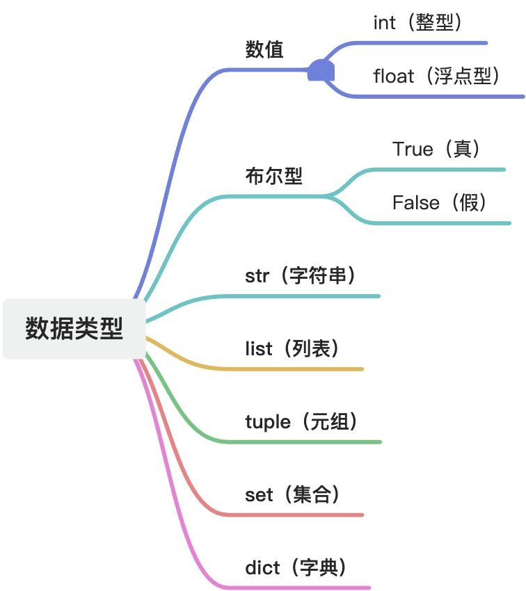

# 变量
:::info
变量的作用

定义变量

认识数据类型

:::

## 变量的作用
+ 程序中，数据都是临时存储在内存中，为了更快速的查找或使用这个数据，通常我们会把这个数据在内存中存储之后定义一个名称，这个名称就是变量。
+ 变量就是一个存储数据的时候，当前数据所在的内存地址的名字而已

## 定义变量
```python
变量名 = 值
```

变量名自定义，要满足标识符命名规则

## 使用变量
+ **<font style="color:#DF2A3F;">先定义，后使用</font>**

```python
"""
    1、定义变量
        变量名 = 值
        
    2、使用变量
        
    3、看变量的特点
"""

# 定义变量，有数据存储
my_name = "TOM"

# 使用变量
print(my_name)
```

# 运算符
## 算数运算符
| **运算符** | **名称** | **示例 & 输出结果** |
| --- | --- | --- |
| `+` | 加法 | `5 + 2` → `7` |
| `-` | 减法 / 负号 | `5 - 2` → `3` |
| `*` | 乘法 | `5 * 2` → `10` |
| `/` | 浮点除法 | `5 / 2` → `2.5` |
| `//` | 地板除 (向下取整) | `5 // 2` → `2`；<br/>`-5 // 2` → `-3` |
| `%` | 取模 (余数) | `5 % 2` → `1` |
| `**` | 幂运算 | `5 ** 2` → `25`；<br/>`2 ** 3` → `8` |
| `()` | 小括号 | 小括号用来提高算数优先级，即（1+2）*3 =9 |


## 赋值运算符
| **运算符** | **等价写法** | **示例 & 结果** |
| --- | --- | --- |
| `=` | 赋值 | `a = 10`，a = `10` |
| `+=` | `a = a + b` | `a += 3`，a = `13` |
| `-=` | `a = a - b` | `a -= 3`，a = `7` |
| `*=` | `a = a * b` | `a *= 3`，a = `30` |
| `/=` | `a = a / b` | `a /= 2`，a = `5.0` |
| `//=` | `a = a // b` | `a //= 3`，a = `3` |
| `%=` | `a = a % b` | `a %= 3`，a = `1` |
| `**=` | `a = a ** b` | `a **= 2`，a = `100` |


## 比较运算符
| **运算符** | **含义** | **示例 & 结果** |
| --- | --- | --- |
| `==` | 等于 | `10 == 5` → `False`；<br/>`5 == 5` → `True` |
| `!=` | 不等于 | `10 != 5` → `True` |
| `>` | 大于 | `10 > 5` → `True` |
| `<` | 小于 | `10 < 5` → `False` |
| `>=` | 大于等于 | `10 >= 10` → `True` |
| `<=` | 小于等于 | `5 <= 3` → `False` |


## 逻辑运算符
| **运算符** | **说明** | **示例 & 结果** |
| --- | --- | --- |
| `and` | 逻辑与 | `True and False` → `False`；<br/>`3>1 and 5>2` → `True` |
| `or` | 逻辑或 | `True or False` → `True`；<br/>`1>5 or 2<4` → `True` |
| `not` | 逻辑非 | `not True` → `False`；<br/>`not 0` → `True` |


+ 数字之间进行逻辑运算
    - and：只要有一个为 0，则结果为 0
    - or：只有所有结果为 0，才返回 0

## 位运算符
| **运算符** | **名称** | **示例 & 结果** |
| --- | --- | --- |
| `&` | 按位与 | `6 & 3` → `2` |
| `|` | 按位或 | `6 | 3` → `7` |
| `^` | 按位异或 | `6 ^ 3` → `5` |
| `~` | 按位取反 | `~6` → `-7` |
| `<<` | 左移 | `2 << 1` → `4` |
| `>>` | 右移 | `4 >> 1` → `2` |


## 成员运算符
| **运算符** | **说明** | **示例 & 结果** |
| --- | --- | --- |
| `in` | 存在于序列 | `3 in [1,2,3]` → `True`；<br/>`"a" in "abc"` → `True` |
| `not in` | 不在序列中 | `4 not in [1,2,3]` → `True` |


## 身份运算符（判断内存地址是否相同）
| **运算符** | **说明** | **示例 & 结果** |
| --- | --- | --- |
| `is` | 是同一个对象 | `a=[1];b=a;`<br/>`a is b` → `True`；<br/>`1000 is 1000`（环境有关） |
| `is not` | 不是同一个对象 | `[1] is [1]` → `False` |


# 分支语句
+ 条件语句的作用
+ if 语法
+ if……else……
+ 多重判断
+ if 嵌套

## if 语句
```python
if 条件:
    条件成立执行的代码1
    条件成立执行的代码2
    ……
```

## if……else……语句
```python
if 条件:
    条件成立执行的代码1
    条件成立执行的代码2
    ……
else:
    条件不成立执行的代码1
    条件不成立执行的代码2
    ……
```

## if……elif……else……语句
```python
if 条件1:
    条件1成立执行的代码1
    条件1成立执行的代码2
    ……
elif 条件2:
    条件2成立执行的代码1
    条件2成立执行的代码2
    ……
……
else:
    以上条件都不成立执行的代码1
    以上条件都不成立执行的代码2
    ……
```

## if 嵌套
```python
if 条件1:
    条件1成立执行的代码1
    条件1成立执行的代码2
    ……
    if 条件2:
        条件2成立执行的代码1
        条件2成立执行的代码2
        ……
    else:
        条件2不成立执行的代码1
        条件2不成立执行的代码2
        ……
else:
    条件1不成立执行的代码1
    条件1不成立执行的代码2
    ……
```

## 三目运算符
三目运算符也叫三元运算符或三元表达式

```python
条件成立执行的表达式 if 条件 else 条件不成立执行的表达式
```

```python
a = 1
b = 2
c = a if a > b else b
print(c) # 2
```

# 循环语句
+ 循环的作用：让代码更高效的重复执行

## while 循环
```python
while 条件:
    条件成立重复执行的代码
    ……
```

+ **<font style="color:#DF2A3F;">while 循环要有结束条件，不然就是死循环</font>**
    - 内部有循环增量，可以通过条件判断退出循环
    - 内部有 break，可以退出循环

## break 和 continue
+ break：直接退出当前循环
+ continue：退出本次循环，不执行后续代码，继续执行当前循环的下一次循环
    - **<font style="color:#DF2A3F;">continue 之前一定要有循环增量，如果循环增量在 continue 之后，会造成死循环</font>**

## while 循环嵌套
```python
while 条件1:
    条件1成立执行的代码
    ……
    while 条件2:
        条件2成立执行的代码
        ……
```

## for 循环
```python
for 临时变量 in 序列:
    重复执行的代码1
    重复执行的代码2
    ……
```

+ 序列：
    - 字符串、列表、元组都是数据序列
    - 一个数据内部有多个数据组成，这样的数据叫做序列
+ 临时变量：
    - 序列中的每一项
+ for 循环中，也可以使用 break 和 continue

## while 循环中的 else
循环也可以和 else 配合使用，else 下方缩进的代码指的是**<font style="color:#DF2A3F;">当循环正常结束之后要执行的代码</font>**。

```python
while 条件:
    条件成立执行的代码
    ……
else:
    循环正常结束之后要执行的代码
    ……
```

+ 注意：**<font style="color:#DF2A3F;">通过 break 结束的循环，不会执行 else 中的内容</font>**
+ 循环中的 continue 跳过单次循环，不会影响 else 的执行

## for 循环中的 else
```python
for 临时变量 in 序列:
    重复执行的代码
    ……
else:
    循环正常结束之后执行的代码
    ……
```

# 数据类型
在 Python 中，为了应对不同的业务需求，也把数据分为不同的类型。



检测数据类型

```python
type(要检测的数据)
```

## 切片
切片是指对操作对象截取一部分的操作。**<font style="color:#DF2A3F;">字符串、列表、元素都支持切片</font>**

+ 切片的语法

```python
序列[开始位置下标: 结束位置下标: 步长]
```

+ 注意：
    - 1、不包含结束位置的下标对应的数据，正负整数均可
    - 2、步长是选取间隔，正负整数均可，默认步长是 1

```python
str1 = "0123456789"

# 起始位置索引是2，结束位置索引是5，步长是1，左闭右开
print(str1[2:5:1]) # 234

# 起始位置索引是2，结束位置索引是5，步长是2，左闭右开
print(str1[2:5:2]) # 24

# 默认步长是1
print(str1[2:5]) # 234

# 如果不写开始，默认从0开始
print(str1[:5]) # 01234

# 如果不写结束，表示选取到最后
print(str1[2:]) # 23456789

# 如果不写开始和结束，表示选取所有
print(str1[:]) # 0123456789

# 如果步长为负数，表示倒序选取
print(str1[::-1]) # 9876543210

# 如果开始/结束下标取负数，-1代表最后一个数据，依次类推
print(str1[-4:-1])  # 678

# 如果从开始到结束的方向，和步长方向相反，无法获取数据
print(str1[1:4:-1]) # 获取不到数据
```

## 运算符
| **运算符** | **描述** | **支持的容器类型** |
| :---: | :---: | :---: |
| **<font style="color:#DF2A3F;">+</font>** | 合并 | 字符串、列表、元组 |
| **<font style="color:#DF2A3F;">*</font>** | 复制 | 字符串、列表、元组 |
| **<font style="color:#DF2A3F;">in</font>** | 元素是否存在 | 字符串、列表、元组、字典 |
| **<font style="color:#DF2A3F;">not in</font>** | 元素是否不存在 | 字符串、列表、元组、字典 |


```python
str1 = "aa"
str2 = "bb"

list1 = [1,2]
list2 = [10,20]

t1 = (1,2)
t2 = (10,20)

dict1 = {"name":"Tom"}
dict2 = {"age":18}

# +
print(str1 + str2) # aabb
print(list1 + list2) # [1, 2, 10, 20]
print(t1 + t2) # (1, 2, 10, 20)

# *
print(str1 * 2) # aaaa
print(list1 * 2) # [1, 2, 1, 2]
print(t1 * 2) # (1, 2, 1, 2)

# in：针对字典，字典名，默认表示字典中的key
print("a" in str1) # True
print("name" in dict1) # True
print("Tom" in dict1) # False
```

## 公共方法
| **函数名** | **作用** | **说明** |
| --- | --- | --- |
| **<font style="color:#DF2A3F;">len(容器)</font>** | 计算容器中元素个数 | 字符串、列表、元组、集合、字典 |
| **<font style="color:#DF2A3F;">del 或 del()</font>** | 删除 | |
| **<font style="color:#DF2A3F;">max()</font>** | 返回容器中元素最大值 | |
| **<font style="color:#DF2A3F;">min()</font>** | 返回容器中元素最小值 | |
| **<font style="color:#DF2A3F;">range(start, end, step)</font>** | 生成丛 start 到 end 的数字，步长为 step，供 for 循环使用 | [start,end)，不包含结束位的数字   如果 start 不写，从 0 开始<br/>如果 step 不写，默认为 1 |
| **<font style="color:#DF2A3F;">enumerate(可遍历对象，start=0)</font>** | 将一个可遍历的数据对象（如列表、元组、字符串）组合为一个索引序列，同时列出数据和下标，一般用在 for 循环当中 | 索引默认从 0 开始，返回的是字典数组的迭代对象   **字典的迭代对象使用的是字典的 key** |


```python
str1 = "abcdefg"
list1 = [10, 20, 30, 40, 50]
t1 = (10, 20, 30, 40, 50)
s1 = {10, 20, 30, 40, 50}
dict1 = {"name":"Tom","age":20}

# len
print(len(str1)) # 7
print(len(list1)) # 5
print(len(t1)) # 5
print(len(s1)) # 5
print(len(dict1)) # 2

# del
# del str1
# print(str1)
'''
Traceback (most recent call last):
  File "/Users/dorky/PycharmProjects/PythonProject/07-.py", line 16, in <module>
    print(str1)
          ^^^^
NameError: name 'str1' is not defined. Did you mean: 'str'?
'''

# max
print(max(str1)) # g
print(max(dict1)) # name

# min
print(min(str1)) # a
print(min(dict1)) # age

# range(start,end,step)
for i in range(1,10,2):
    print(i)

# enumerate：(0, 'a') (1, 'b') (2, 'c') (3, 'd') (4, 'e') (5, 'f') (6, 'g')
for item in enumerate(str1):
    print(item, end=" ")
print()

# (1, 'a') (2, 'b') (3, 'c') (4, 'd') (5, 'e') (6, 'f') (7, 'g')
for item in enumerate(str1, start=1):
    print(item, end=" ")
print()

# (0, 'name') (1, 'age') 
for item in enumerate(dict1):
    print(item, end=" ")

```

## 容器类型转换
| **函数名** | **作用** | **说明** |
| --- | --- | --- |
| **<font style="color:#DF2A3F;">tuple(序列)</font>** | 将序列转换成元组 |  |
| **<font style="color:#DF2A3F;">list(序列)</font>** | 将序列转换成列表 |  |
| **<font style="color:#DF2A3F;">set(序列）</font>** | 将序列转换成集合 |  |


## 推导式
:::info
+ 列表推导式
+ 字典推到式
+ 集合推到式

:::

### 列表推导式
+ 用一个表达式创建一个有规律的列表或控制一个有规律的列表
+ 列表推导式又叫列表生成式

```python
# 创建一个 0-10 的列表

# while循环实现
list1 = []
i = 0
while i < 10:
    list1.append(i)
    i += 1
print(list1)

# for循环实现
list2 = []
for i in range(10):
    list2.append(i)
print(list2)

# 使用列表推导式:for循环的简化
list3 = [i for i in range(10)]
print(list3) # [0, 1, 2, 3, 4, 5, 6, 7, 8, 9]

# 带if的列表推导式
list4 = [i for i in range(10) if i % 2 == 0]
print(list4) # [0, 2, 4, 6, 8]

# 多for列表推导式
list5 = [(i,j) for i in range(1,3) for j in range(3)]
print(list5) # [(1, 0), (1, 1), (1, 2), (2, 0), (2, 1), (2, 2)]
```

### 字典推导式
> 思考：如果有如下两个列表：如何快速合并为一个字典？
>

```python
list1 = ["name", "age", "gender"]
list2 = ["tom", 20, "man"]
```

> 答：字典推导式
>

字典推导式的作用：快速合并列表为字典或提取字典中目标数据

```python
# 简单的字典
dict1 = {i:i**2 for i in range(1,6)}
print(dict1) # {1: 1, 2: 4, 3: 9, 4: 16, 5: 25}

# 将两个列表合并为一个字典：如果两个列表中的数据个数不同，使用短的，不然报错
list1 = ["name","age","gender"]
list2 = ["Tom",18,"男"]
dict2 = {list1[i]:list2[i] for i in range(len(list1))}
print(dict2) # {'name': 'Tom', 'age': 18, 'gender': '男'}
```

提取字典中的目标数据

```python
counts = {"MBP":268,"HP":125,"DELL":201,"Lenovo":199,"acer":99}

# 提取字典中的目标数据：过滤值大于200的数据
res = {key:value for key,value in counts.items() if value > 200}
print(res) # {'MBP': 268, 'DELL': 201}
```

### 集合推导式
```python
list1 = [1, 1, 2]

# 集合推导式
set1 = {i**2 for i in list1}
print(set1) # {1, 4}
```

## 字符串
:::info
+ 认识字符串
+ 下标
+ 切片
+ 常用操作方法

:::

### 认识字符串
字符串是 Python 中最常用的数据类型。我们一般使用引号来创建字符串，创建字符串很简单，只要为变量分配一个值即可。

+ 字符串的写法
    - 单引号
    - 双引号
    - 三引号：支持回车换行
+ 字符串内部有引号，可以使用转义字符 \

```python
"""
    三引号的写法，支持回车换行，输出也带换行
"""
str1 = 'hello'

str2 = "hello"

str3 = '''hello'''

str4 = """hello"""
```

### 字符串的输出
```python
# 直接输出字符串
print("hello world")

name = "Tom"
# 通过格式化输出字符串
print("我的名字是：%s" % name)

# f格式化输出字符串
print(f"我的名字是：{name}")
```

### 字符串输入
在 Python 中，使用 input() 接收用户输入

```python
"""
    1、input：内部放入提示信息
    2、使用变量接收输入的内容
    注意：
        接收到的数据，不管输入的是什么，默认是字符串类型
"""
password = input("请输入您的密码：")
print(f"您输入的密码是：{password}")
```

### 下标
+ 下标，又叫索引，就是编号
+ 下标的作用：通过下标可以快速找到对应的数据

```python
str1 = "abcdefg"

# 直接输出整个字符串
print(str1)

"""
    如果想得到字符串中某个特定的数据：
    内存为整个字符数据从0开始顺序分配一个编号，使用这个编号精确找到某个字符数据 -- 下标或索引
"""
print(str1[0]) # a
print(str1[1]) # b
```

### 字符串常用操作--查找
+ 查找的方法
    - 1、子串在字符串中的位置
    - 2、子串在字符串中出现的次数

| **方法名** | **作用** | **说明** |
| --- | --- | --- |
| **<font style="color:#DF2A3F;">字符串序列.find(子串， 开始位置下标， 结束位置下标)</font>** | 检测某个子串是否包含在这个字符串中，如果在返回这个子串开始的位置下标，**否则返回-1** | 开始和结束位置下标可以省略，表示在整个字符串中查找 |
| **<font style="color:#DF2A3F;">字符串序列.index(子串， 开始位置下标， 结束位置下标)</font>** | 检测某个子串是否包含在这个字符串中，如果在返回这个子串开始的位置下标，**否则则报异常** | |
| **<font style="color:#DF2A3F;">字符串序列.count(子串， 开始位置下标， 结束位置下标)</font>** | 返回某个子串在字符串中出现的次数 | |
| 字符串序列.rfind(子串， 开始位置下标， 结束位置下标) | 和 find 功能相同，但是查找方向为右侧开始 | |
| 字符串序列.rindex(子串， 开始位置下标， 结束位置下标) | 和 rindex 功能相同，但是查找方向为右侧开始 | |


```python
mystr = "hello world and hello china and hello python"

# find查找
print(mystr.find("and")) # 12
print(mystr.find("and",15,40)) # 28,在指定区间内查找
print(mystr.find("ands")) # -1，如果要查找的子串不存在，返回-1

# index查找
print(mystr.index("and")) # 12
print(mystr.index("and",15,40)) # 28,在指定区间内查找

# print(mystr.index("ands")) # 如果要查找的子串不存在，报错
'''
Traceback (most recent call last):
  File "/Users/dorky/PycharmProjects/PythonProject/test.py", line 11, in <module>
    print(mystr.index("ands")) # 如果要查找的子串不存在，报错
          ~~~~~~~~~~~^^^^^^^^
ValueError: substring not found
'''

# count
print(mystr.count("and",15,40)) # 1
print(mystr.count("and")) # 2
print(mystr.count("ands")) # 0

# rfind
print(mystr.rfind("and")) # 28
print(mystr.rfind("ands")) # -1

# rindex
print(mystr.rindex("and")) # 28
```

### 字符串常用操作--修改
所谓修改字符串，指的就是通过函数的形式修改字符串中的数据

| **函数名** | **作用** | **备注** |
| --- | --- | --- |
| **<font style="color:#DF2A3F;">字符串序列.replace(旧子串, 新子串, 替换次数)</font>** | 将字符串中的旧子串替换为新子串，返回修改后的新字符串 | 如果指定的替换次数 > 旧子串出现的次数，替换旧子串出现的次数 |
| **<font style="color:#DF2A3F;">字符串序列.split(分割字符, num)</font>** | 按照指定字符分割字符串，返回分割后子串组成的列表 | num 表示的是分割字符出现的次数，即将来返回 num+1 个字符组成的数组   分割后，会丢失分割字符 |
| **<font style="color:#DF2A3F;">字符或子串.join(多字符串组成的序列)</font>** | 用一个字符或子串合并字符串，即是将多个字符串合并为一个新的字符串 |  |
| 字符串序列.capitalize() | 将字符串第一个字符转换成大写 | capitalize()转换后，只有第一个字符是大写的，其余字符全部都小写 |
| 字符串序列.title() | 将字符串每个单词首字母转换成大写 |  |
| 字符串序列.lower() | 将字符串中大写转小写 |  |
| 字符串序列.upper() | 将字符串中小写转大写 |  |
| 字符串序列.lstrip() | 删除字符串左侧的空白字符 |  |
| 字符串序列.rstrip() | 删除字符串右侧的空白字符 |  |
| 字符串序列.strip() | 删除字符串两侧的空白字符 |  |
| 字符串序列.ljust(长度, 填充字符) | 返回一个原字符串左对齐，并使用指定字符（默认空格）填充至对应长度的新字符串 |  |
| 字符串序列.rjust(长度, 填充字符) | 返回一个原字符串右对齐，并使用指定字符（默认空格）填充至对应长度的新字符串 |  |
| 字符串序列.center(长度, 填充字符) | 返回一个原字符串两端对齐，并使用指定字符（默认空格）填充至对应长度的新字符串 |  |


```python
mystr = "hello world and hello china and hello python and hello python"

# replace：把 and 替换为 和
new_str1 = mystr.replace("and", "和")
print(new_str1) # hello world 和 hello china 和 hello python 和 hello python

# 指定替换次数：1
new_str2 = mystr.replace("and", "和", 1)
print(new_str2) # hello world 和 hello china and hello python and hello python

# split：返回列表, 会丢失分割字符
list1 = mystr.split('and')
print(list1) # ['hello world ', ' hello china ', ' hello python ', ' hello python']

# 指定分割次数
list2 = mystr.split('and', 2)
print(list2) # ['hello world ', ' hello china ', ' hello python and hello python']

# join：使用子串连接列表中的数据
mylist = ["aa", "bb", "cc"]
new_str = "-".join(mylist)
print(new_str) # aa-bb-cc

# capitalize：将字符串的首字母转换为大写，其余全部小写
new_str2 = mystr.capitalize()
print(new_str2) # Hello world and hello china and hello python and hello python

# title：将每个单词的首字母转换为大写，其余小写
new_str3 = mystr.title()
print(new_str3) # Hello World And Hello China And Hello Python And Hello Python

# upper：将所有字母都转换为大写
new_str4 = mystr.upper()
print(new_str4) # HELLO WORLD AND HELLO CHINA AND HELLO PYTHON AND HELLO PYTHON

# lower：将所有字母都转换为小写
new_str5 = mystr.lower()
print(new_str5) # hello world and hello china and hello python and hello python

my_str2 = "   abc   "
# lstrip：删除字符串左侧空白字符
new_str6 = my_str2.lstrip()
print(new_str6) # abc

# rstrip：删除字符串右侧空白字符
new_str7 = my_str2.rstrip()
print(new_str7) #    abc

# strip：删除字符串两侧空白字符
new_str8 = my_str2.strip()
print(new_str8) # abc

my_str3 = "abc"
# ljust：左对去
new_str9 = my_str3.ljust(10,".")
print(new_str9) # abc.......

# rjust：右对齐
new_str10 = my_str3.rjust(10,".")
print(new_str10) # .......abc

# center：剧中对齐
new_str11 = my_str3.center(10,".")
print(new_str11) # ...abc....
```

### 字符串常用操作--判断
所谓判断即判断真假，返回的结果是布尔类型数据：True 或 False

| **函数名** | **作用** | **说明** |
| --- | --- | --- |
| **<font style="color:#DF2A3F;">字符串序列.startswith(子串, 开始位置下标, 结束位置下标)</font>** | 检测字符串是否以指定子串开头，是则返回 True，否则返回 False | 如果设置开始位置和结束位置，则在指定范围内检查 |
| **<font style="color:#DF2A3F;">字符串序列.endswith(子串, 开始位置下标, 结束位置下标)</font>** | 检测字符串是否以指定子串结尾，是则返回 True，否则返回 False | |
| 字符串序列.isalpha() | 如果字符串中至少有一个字符，并且所有字符都是字母则返回 True，否则返回 False | 都要求非空，空都返回 False |
| 字符串序列.isdigit() | 如果字符串只包含数字则返回 True，否则返回 False | |
| 字符串序列.isalnum() | 如果字符串至少有一个字符，并且所有字符都是字母或数字则返回 True，否则返回 False | |
| 字符串序列.isspace() | 如果字符串中只包含空白，则返回 True，否则返回 False | |


```python
str1 = "http://www.baidu.com"
str2 = "cat.png"

# startswith：是否以指定子串开头
print(str1.startswith("http:")) # True
print(str1.startswith("https:")) # False

# endswith：是否以指定子串结尾
print(str2.endswith("png")) # True
print(str2.endswith("jpg")) # False

str3 = ""
str4 = "abc123"
str5 = "abc"
str6 = "123"
str7 = " "
str8 = "abc123-"

# isalpha：非空 且 全是字母
print(str3.isalpha()) # False
print(str4.isalpha()) # False
print(str5.isalpha()) # True

# isdigit：非空 且 全是数字
print(str3.isdigit()) # False
print(str4.isdigit()) # False
print(str6.isdigit()) # True

# isalnum：非空 且 只包含字母或数字
print(str3.isalnum()) # False
print(str8.isalnum()) # False
print(str4.isalnum()) # True

# isspace：非空 且 只包含空格
print(str3.isspace()) # False
print(str4.isspace()) # False
print(str7.isspace()) # True
```

## 列表
:::info
+ 列表的应用场景
+ 列表的格式
+ 列表常用操作
+ 列表的循环遍历
+ 列表的嵌套使用

:::

### 列表的应用场景
> 思考：有一个人的姓名（TOM），要怎么书写？
>
> 答：变量
>
>  
>
> 思考：如果是一个班的学生姓名呢？
>
> 答：列表，列表可以一次性存储多个数据
>

### 列表的格式
```python
[数据1, 数据2, 数据3, 数据4, ……]
```

列表可以一次性存储多个数据，**且可以为不同数据类型，但是每个数据类型的数据操作方法是不同的，所以我们尽量存储相同数据**

### 列表常用操作 -- 查找
| **方法名** | **作用** | **说明** |
| --- | --- | --- |
| **<font style="color:#DF2A3F;">列表序列 [ 下标 ]</font>** | 通过下标查找指定下标的数据 |  |
| **<font style="color:#DF2A3F;">列表序列.index(数据, 开始位置下标, 结束位置下标)</font>** | 返回指定数据所在位置的下标，如果找不到则报错 |  |
| **<font style="color:#DF2A3F;">列表序列.count(数据, 开始位置下标, 结束位置下标)</font>** | 统计指定数据在当前列表中出现的次数 |  |
| **<font style="color:#DF2A3F;">len(列表序列)</font>** | 访问列表长度，即列表中数据的个数 | 公共方法 |
| **<font style="color:#DF2A3F;">数据元素  in 列表序列</font>** | 判断指定数据在某个列表序列，如果在返回 True，否则返回 False | |
| **<font style="color:#DF2A3F;">数据元素  not in 列表序列</font>** | 判断指定数据不在某个列表序列，如果不在返回 True，否则返回 False | |


```python
name_list = ["Tom", "John", "Michael"]

# []：通过下标找到指定的数据
print(name_list[0]) # Tom
print(name_list[1]) # John

# index()：返回指定数据所在位置的下标
print(name_list.index("Tom")) # 0
# print(name_list.index("Lucy")) # 如果要查找的数据不在列表中报错
'''
Traceback (most recent call last):
  File "/Users/dorky/PycharmProjects/PythonProject/07-.py", line 9, in <module>
    print(name_list.index("Lucy")) # 如果要查找的数据不在列表中报错
          ~~~~~~~~~~~~~~~^^^^^^^^
ValueError: list.index(x): x not in list
'''

# count：统计元素在列表中出现的次数
print(name_list.count("Tom")) # 1
print(name_list.count("Lucy")) # 0

# len(列表序列)：统计列表中元素的个数
print(len(name_list)) # 3

# in：判断数据是否在列表中
print("Tom" in name_list)  # True
print("Lucy" in name_list)  # False

# not in：判断数据是否不在列表中
print("Tom" not in name_list)  # False
print("Lucy" not in name_list)  # True
```

### 列表常用操作 -- 增加
| **函数名** | **作用** | **说明** |
| --- | --- | --- |
| **<font style="color:#DF2A3F;">列表序列.append(数据)</font>** | 列表结尾追加数据 | 如果追加的数据是一个序列，将整个序列追加到结尾 |
| **<font style="color:#DF2A3F;">列表序列.extend(列表序列)</font>** | 列表结尾追加数据，如果数据是一个序列，则将这个序列的每一项逐一添加到列表 | 如果追加的不是序列，会报错 |
| **<font style="color:#DF2A3F;">列表序列.insert(位置下标, 数据)</font>** | 在指定位置新增数据 |  |


```python
name_list = ["Tom", "John", "Michael"]

# append：结尾增加
name_list.append('Jack')
print(name_list) # ['Tom', 'John', 'Michael', 'Jack']

# 如果append追加的数据是序列，则将整个序列追加到末尾
name_list.append(["张三", "李四"])
print(name_list) # ['Tom', 'John', 'Michael', 'Jack', ['张三', '李四']]

name_list = ["Tom", "John", "Michael"]

# extend追加字符串:会讲字符串的每一项逐一追加
name_list.extend("Lucy")
print(name_list) # ['Tom', 'John', 'Michael', 'L', 'u', 'c', 'y']

# extend追加序列：会讲序列的每一项分别追加
name_list.extend(["张三", "李四"])
print(name_list) # ['Tom', 'John', 'Michael', 'L', 'u', 'c', 'y', '张三', '李四']

# extend追加的不是序列，会报错
# name_list.extend(11)
# print(name_list)
'''
Traceback (most recent call last):
  File "/Users/dorky/PycharmProjects/PythonProject/07.py", line 22, in <module>
    name_list.extend(11)
    ~~~~~~~~~~~~~~~~^^^^
TypeError: 'int' object is not iterable
'''

name_list = ["Tom", "John", "Michael"]

# insert：指定位置增加数据
name_list.insert(1, "Lucy")
print(name_list) # ['Tom', 'Lucy', 'John', 'Michael']
```

### 列表常用操作 -- 删除
| **函数名** | **作用** | **说明** |
| --- | --- | --- |
| **<font style="color:#DF2A3F;">del 目标</font>** | 删除整个列表序列/或列表中的数据 | 如果后面跟列表名，就是删除列表<br/>如果后面跟列表中的某一项，就是删除指定项 |
| **<font style="color:#DF2A3F;">列表序列.pop(下标)</font>** | 删除指定下标的数据（默认为最后一个），并返回该数据 |  |
| **<font style="color:#DF2A3F;">列表序列.remove(数据)</font>** | 移除列表中某个数据的第一匹配项 | **如果指定的数据不存在，报错** |
| **<font style="color:#DF2A3F;">列表序列.clear()</font>** | 清空列表 |  |


```python
name_list = ["Tom", "John", "Michael"]

# del：删除单个元素
del name_list[0]
print(name_list) # ['John', 'Michael']

# del：删除整个序列
del name_list
# print(name_list)
'''
Traceback (most recent call last):
  File "/Users/dorky/PycharmProjects/PythonProject/07.py", line 9, in <module>
    print(name_list)
          ^^^^^^^^^
NameError: name 'name_list' is not defined
'''

name_list = ["Tom", "John", "Michael"]

# pop：删除指定下标的数据
res = name_list.pop(0)
print(name_list) # ['John', 'Michael']
print(res) # Tom

# pop:如果不指定，则默认删除最后一个
res = name_list.pop()
print(name_list) # ['John']
print(res) # Michael

name_list = ["Tom", "John", "Michael", "Tom", "John"]

# remove：删除指定数据,删除第一个匹配项
name_list.remove("Tom")
print(name_list)

# remove:如果指定的数据不存在，报错
# name_list.remove("Toms")
'''
Traceback (most recent call last):
  File "/Users/dorky/PycharmProjects/PythonProject/07-.py", line 36, in <module>
    name_list.remove("Toms")
    ~~~~~~~~~~~~~~~~^^^^^^^^
ValueError: list.remove(x): x not in list
'''

name_list = ["Tom", "John", "Michael", "Tom", "John"]

# clear：清空列表
name_list.clear()
print(name_list) # []
```

### 列表常用操作 -- 修改
| **函数名** | **作用** | **说明** |
| --- | --- | --- |
| **<font style="color:#DF2A3F;">列表序列 [ 下标 ] = 新数据</font>** | 修改制定下标的数据 |  |
| **<font style="color:#DF2A3F;">列表序列.reverse()</font>** | 逆置 |  |
| **<font style="color:#DF2A3F;">列表序列.sort(key=None,reverse=False)</font>** | 排序：    | reverse：表示排序规则（True 降序，False 升序（默认））   key：排序   一个函数，接收列表中的每个元素，返回一个用于比较的值。排序时比较的是这个函数的返回值，而不是元素本身。 |


```python
name_list = ["Tom", "John", "Michael"]

# 修改指定下标的数据
name_list[1] = "张三"
print(name_list) # ['Tom', '张三', 'Michael']

list1 = [1,3,5,7,9,2,4,6,8]
# reverse：逆序
list1.reverse()
print(list1) # [8, 6, 4, 2, 9, 7, 5, 3, 1]

# sort:排序(默认升序)
list1.sort()
print(list1) # [1, 2, 3, 4, 5, 6, 7, 8, 9]

# sort排序，降序
list1.sort(reverse=True)
print(list1) #  [9, 8, 7, 6, 5, 4, 3, 2, 1]

list2 = [
    {"name":"张三","age":18},
    {"name":"李四","age":20},
    {"name":"王五","age":19}
]
# 根据列表中每一项中的age大小进行排序
list2.sort(key = lambda x:x["age"])
print(list2) # [{'name': '张三', 'age': 18}, {'name': '王五', 'age': 19}, {'name': '李四', 'age': 20}]
```

### 列表的复制：copy
+ 使用复制后的数据，不会影响源数据

```python
name_list = ["Tom", "John", "Michael"]

# 复制列表，使用复制后的列表进行操作，不会污染源数据
list1 = name_list.copy()
print(list1) # ['Tom', 'John', 'Michael']
print(name_list) # ['Tom', 'John', 'Michael']

```

### 列表的循环遍历
```python
name_list = ["Tom", "John", "Michael"]

# 使用while进行循环遍历
i = 0
while i < len(name_list):
    print(name_list[i])
    i += 1

# 使用for循环遍历
for name in name_list:
    print(name)

```

### 列表的嵌套
```python
name_list = [["Tony", "Mary", "John"], ["张三", "李四", "王五"],["小明","小红","小刚"]]

# for嵌套
for names in name_list:
    for name in names:
        print(name,end = "\t")
    print()

# while嵌套
i = 0
while i < len(name_list):
    j = 0
    while j < len(name_list[i]):
        print(name_list[i][j],end = "\t")
        j += 1
    i += 1
    print()
```

## 元组
:::info
+ 元组的应用场景
+ 定义元组
+ 元组常用操作

:::

### 元组的应用场景
> 思考：如果想要存储多个数据，但是这些数据是不能修改的数据，怎么做？
>
> 答：列表可以一次存储多个数据，但是列表中的数据允许修改，使用元组，元组中的数据不能修改
>

**一个元组可以存储多个数据，元组内的数据是不能修改的**。

```python
t1 = (10,20,30)
print(t1) # (10, 20, 30)
print(type(t1)) # <class 'tuple'>
```

### 定义元组
+ 定义元组使用小括号，且逗号隔开各个数据，数据可以是不同数据类型

```python
# 多个数据元组
t1 = (10,20,30)

# 单个数据元组
t2 = (10,)
```

注意：如果定义的元组**<font style="color:#DF2A3F;">只有一个数据</font>**，那么这个数据**<font style="color:#DF2A3F;">后面也要添加逗号</font>**，否则数据类型为唯一的这个数据的数据类型

### 元组常见操作 -- 查找
| **函数名** | **作用** | **说明** |
| --- | --- | --- |
| **<font style="color:#DF2A3F;">元组序列 [ 下标 ]</font>** | 查找指定下标的数据 |  |
| **<font style="color:#DF2A3F;">元组序列.index(数据)</font>** | 查找某个数据，如果数据存在，返回对应的下标，否则报错 |  |
| **<font style="color:#DF2A3F;">元组序列.count()</font>** | 统计某个数据在当前元组中出现的次数 |  |
| **<font style="color:#DF2A3F;">len(元组序列)</font>** | 统计元组中数据的个数 |  |


```python
t1 = ("aa","bb","cc","dd","dd")

# 下标
print(t1[0]) # aa

# index:
print(t1.index("bb")) # 1

# count
print(t1.count("dd")) # 2

# len
print(len(t1)) # 5
```

### 元组数据的修改
+ 直接修改元组中的数据，会报错
+ 如果元组中的某个数据是序列，那么修改序列内的数据是可以的

```python
t1 = ("aa","bb","cc","dd")

# 直接修改元组中的数据
# t1[0] = "aaa"
'''
Traceback (most recent call last):
  File "/Users/dorky/PycharmProjects/PythonProject/07-.py", line 4, in <module>
    t1[0] = "aaa"
    ~~^^^
TypeError: 'tuple' object does not support item assignment
'''

t2 = ("aa","bb",["cc","dd"])

# 修改元组内，可变序列的数据
t2[2][0] = "ccc"
print(t2) # ('aa', 'bb', ['ccc', 'dd'])

```

## 字典
:::info
+ 字典的应用场景
+ 创建字典的语法
+ 字典常见操作
+ 字典的循环遍历

:::

### 字典的应用场景
> 思考：如果有多个数据，例如："Tom","男",20，如何存储
>
> 答：列表？
>
> list = ["Tom","男",20]
>
>  
>
> 思考：如何查找数据 "Tom"
>
> 答：查找到下标为 0 的数据即可
>
>  
>
> 思考：如果将来数据顺序发生变换，还能用 list[0] 找到对应的数据么？
>
> 答：不能
>
>  
>
> 思考：数据顺序发生变化，每个数据的下标也会发生变化，如何保证数据顺序变化前后使用统一的标准查找数据？
>
> 答：字典，字典里的数据是以键值对形式出现，字典数据和顺序没有关系，即字典不支持下标，后期无论数据如何变化，只需要按照对应的键的名字查找数据即可
>

### 创建字典的语法
+ 字典的特点：
    - 符号为大括号
    - 数据为键值对形式出现
    - 各个键值对之间用逗号分隔

```python
# 有数据字典
dict1 = {"name":"Tom","age":20,"gender":"男"}
print(dict1)
print(type(dict1))

# 空字典
dict2 = {}
print(dict2)

# 空字典
dict3 = dict()
print(dict3)
```

### 字典的常见操作 -- 增
| **函数名** | **作用** | **说明** |
| --- | --- | --- |
| **<font style="color:#DF2A3F;">字典序列 [key] = 值</font>** | 添加一对键值对到字典中 | 如果 key 存在，则修改这个 key 对应的值<br/>如果 key 不存在则新增此键值对 |


```python
dict1 = {"name":"Tom","age":20,"gender":"男"}

# 新增数据
dict1["id"] = 110
print(dict1) # {'name': 'Tom', 'age': 20, 'gender': '男', 'id': 110}

# 如果key存在，则是修改
dict1["age"] = 30
print(dict1) # {'name': 'Tom', 'age': 30, 'gender': '男', 'id': 110}
```

### 字典的常见操作 -- 删
| **函数名** | **作用** | **说明** |
| --- | --- | --- |
| **<font style="color:#DF2A3F;">del 字典/字典 [key]</font>** | 删除字典或字典中的键值对 |  |
| **<font style="color:#DF2A3F;">del(字典/字典 [key])</font>** | 删除字典或字典中的键值对 |  |
| **<font style="color:#DF2A3F;">字典序列.clear()</font>** | 清空字典 |  |


```python
dict1 = {"name":"Tom","age":20,"gender":"男"}

# del：删除字典中的键值对
del dict1["age"]
print(dict1) # {'name': 'Tom', 'gender': '男'}

# del()
del(dict1["name"])
print(dict1) # {'gender': '男'}

# del 删除字典
del dict1
# print(dict1)
'''
Traceback (most recent call last):
  File "/Users/dorky/PycharmProjects/PythonProject/07-.py", line 13, in <module>
    print(dict1)
          ^^^^^
NameError: name 'dict1' is not defined. Did you mean: 'dict'?
'''

dict1 = {"name":"Tom","age":20,"gender":"男"}

# 清空字典
dict1.clear()
print(dict1) # {}

```

### 字典的常见操作 -- 改
| **函数名** | **作用** | **说明** |
| --- | --- | --- |
| **<font style="color:#DF2A3F;">字典序列 [key] = 值</font>** | 修改 key 对应的值 | 如果 key 存在，则修改这个 key 对应的值<br/>如果 key 不存在则新增此键值对 |


### 字典的常见操作 -- 查
| **函数名** | **作用** | **说明** |
| --- | --- | --- |
| **<font style="color:#DF2A3F;">字典序列 [key]</font>** | 查看 key 对应的值 | 如果 key 不存在，报错 |
| **<font style="color:#DF2A3F;">字典序列.get(key，默认值)</font>** | 查找 key 对应的值，如果 key 不存在，返回默认值（默认为 None） | 不写默认值，key 不存在，返回 None |
| **<font style="color:#DF2A3F;">字典序列.keys()</font>** | 返回所有 key 组成的迭代器 |  |
| **<font style="color:#DF2A3F;">字典序列.values()</font>** | 返回所有 value 组成的迭代器 |  |
| **<font style="color:#DF2A3F;">字典序列.items()</font>** | 返回所有 (key, value) 组成的迭代器，迭代器内部是元组 |  |


```python
dict1 = {"name":"Tom","age":20,"gender":"男"}

# 查找
print(dict1["name"]) # Tom

# 如果要查找的数据不存在，报错
# print(dict1["ages"])
'''
Traceback (most recent call last):
  File "/Users/dorky/PycharmProjects/PythonProject/07-.py", line 5, in <module>
    print(dict1["ages"])
          ~~~~~^^^^^^^^
KeyError: 'ages'
'''

# get：
print(dict1.get("name","张三")) # Tom
print(dict1.get("ages", 30)) # 30
print(dict1.get("ages")) # None

# keys
print(dict1.keys()) # dict_keys(['name', 'age', 'gender'])

# values
print(dict1.values()) # dict_values(['Tom', 20, '男'])

# items
print(dict1.items()) # dict_items([('name', 'Tom'), ('age', 20), ('gender', '男')])
```

### 字典的循环遍历
```python
dict1 = {"name":"Tom","age":20,"gender":"男"}

# 遍历所有的key
for key in dict1.keys():
    print(key)

# 遍历所有的value
for value in dict1.values():
    print(value)

# 遍历所有的item
for item in dict1.items():
    print(item)

# 拆包遍历所有的item
for key, value in dict1.items():
    print(key, value)
```

## 集合
:::info
+ 创建集合
+ 集合数据的特点
+ 集合的常见操作

:::

### 创建集合
+ 创建集合使用 { }  或 set()，但是如果想要创建空集合只能使用 set() ，因为 { } 创建出来的是字典

```python
# 创建集合
s1 = {10, 20, 30, 40, 50}
print(s1)

# 创建空集合
s2 = set()
print(s2)
```

### 集合数据的特点
+ 去重：集合中的数据不重复
+ 无序：集合中的数据没有顺序，不能通过下标获取数据

### 集合常见操作 -- 增
| **函数名** | **作用** | **说明** |
| --- | --- | --- |
| **<font style="color:#DF2A3F;">集合序列.add(数据)</font>** | 将指定数据添加到集合 | 因为集合有去重特性，所以，当向集合内追加的数据是当前集合已有数据的话，则不进行任何操作   数据是序列，报错 |
| **<font style="color:#DF2A3F;">集合序列.update(序列)</font>** | 将指定序列中的数据，分别添加到集合 | 追加单个数据报错 |


```python
s1 = {10, 20}

# add：增加数据
s1.add(30)
print(s1) # {10, 20, 30}

# add增加已经存在的数据
s1.add(10)
print(s1) # {10, 20, 30}

# add追加序列：报错
# s1.add([1,2,3])
'''
Traceback (most recent call last):
  File "/Users/dorky/PycharmProjects/PythonProject/07-.py", line 12, in <module>
    s1.add([1,2,3])
    ~~~~~~^^^^^^^^^
TypeError: cannot use 'list' as a set element (unhashable type: 'list')
'''

# update:追加序列
s1.update([1,2,3])
print(s1) # {1, 2, 3, 10, 20, 30}

# uodate追加单个数据:报错
# s1.update(4)
print(s1)
'''
Traceback (most recent call last):
  File "/Users/dorky/PycharmProjects/PythonProject/07-.py", line 26, in <module>
    s1.update(4)
    ~~~~~~~~~^^^
TypeError: 'int' object is not iterable
'''
```

### 集合常见操作 -- 删
| **函数名** | **作用** | **说明** |
| --- | --- | --- |
| **<font style="color:#DF2A3F;">集合序列.remove(数据)</font>** | 删除集合中指定数据，如果数据不存在则报错 |  |
| **<font style="color:#DF2A3F;">集合序列.discard(数据)</font>** | 删除集合中指定数据，如果数据不存在不报错 |  |
| **<font style="color:#DF2A3F;">集合序列.pop()</font>** | 随机删除一个数据，并返回删除的数据 |  |


```python
s1 = {10, 20, 30, 40, 50}

# remove：删除存在数据
s1.remove(10)
print(s1) # {50, 20, 40, 30}

# remove：删除不存在数据
# s1.remove(1)
'''
Traceback (most recent call last):
  File "/Users/dorky/PycharmProjects/PythonProject/07-.py", line 8, in <module>
    s1.remove(1)
    ~~~~~~~~~^^^
KeyError: 1
'''

# discard：删除存在数据
s1.discard(20)
print(s1) # {50, 40, 30}

# discard：删除存在数据
s1.discard(2)
print(s1) # {50, 40, 30}

# pop:随机删除一个数据，并返回被删除的数据
res = s1.pop()
print(s1)
print(res)
```

### 集合常见操作 -- 查
| **函数名** | **作用** | **说明** |
| --- | --- | --- |
| **<font style="color:#DF2A3F;">数据 in 集合序列</font>** | 判断数据是否在集合序列 |  |
| **<font style="color:#DF2A3F;">数据 not in 集合序列</font>** | 判断数据是否不在集合序列 |  |


```python
s1 = {10, 20, 30, 40, 50}

# in
print(10 in s1) # True
print(1 in s1) # False

# not in
print(10 not in s1) # False
print(11 not in s1) # True
```

# 函数
## 函数的定义和使用
+ 定义函数：使用 def

```python
# 定义函数
def 函数名(形参):
    函数体
    return 返回值
```

+ 函数调用：函数名(参数)

```python
函数名(实参)
```

+ 函数的注意事项
    - 1、先定义，后使用
    - 2、参数如果不需要，可以省略
    - 3、返回值如果不需要，也可以省略

```python
# 定义函数
def add(a,b):
    return a + b

# 调用函数
result = add(10,20)

print(result)
```

## 函数说明文档
+ 在定义函数下面缩紧的位置，使用多行注释的形式来定义函数的说明文档
+ 查看函数的说明文档
    - help(函数名)

```python
# 定义函数
def add(a,b):
    """
    求和函数
    :param a:求和函数的第一个参数
    :param b: 求和函数的第二个参数
    :return: 求和函数的返回值
    """
    return a + b

# 调用函数
result = add(10,20)

print(result)

# 查看函数的说明文档
help(add)

```

## 函数内修改全局变量
+ 直接修改全局变量，没有生效，因为是相当于定义了一个新的局部变量

```python
a = 100

def testA():
    print(a)

def testB():
    a = 200 # 这个a是局部变量
    print(a)

testA() # 100
testB() # 200
testA() # 100,这里访问的A仍然是全局变量

```

+ 要想在函数内部修改全局变量，使用 global

```python
a = 100

def testA():
    print(a)

def testB():
    # 使用global声明这里的a是全局变量
    global a
    a = 200
    print(a)

testA() # 100
testB() # 200
testA() # 200

```

## 函数多个返回值的写法
+ 使用逗号分隔多个返回值
+ 会自定将多个返回值当作元组来处理
+ 可以通过拆包的形式来接收（单个数据类型），也可以直接接收（元组）
+ 也可以主动返回列表或是字典

```python

def return_num():
    return 1,2

result = return_num()
print(result) # (1, 2)
print(type(result)) # <class 'tuple'>

result1, result2 = return_num() 
print(result1, result2) # 1 2
print(type(result1),type(result2)) # <class 'int'> <class 'int'>
```

## 函数参数
| **参数** | **定义** | **调用** | **特点** |
| :---: | --- | --- | --- |
| **<font style="color:#DF2A3F;">位置参数</font>** | def 函数名(行参 1, 行参 2, ……): | 函数名(实参 1, 实参 2, ……) | 调用参数时根据函数定义的参数位置来传递参数（数量和位置要一致） |
| **<font style="color:#DF2A3F;">关键字参数</font>** | 同上 | 函数名(实参 1=值 1，实参 2=值 2，……) | 可以改变顺序，但关键字参数，要在位置参数的后面 |
| **<font style="color:#DF2A3F;">缺省参数（默认参数）</font>** | def 函数名(行参 1 = 值 1, 行参 2 = 值 2, ……): | 函数名() | 对于指定默认值的行参，可以不穿入值，定义的时候，缺省参数要放在最后 |
| **<font style="color:#DF2A3F;">不定长参数（位置）</font>** | def 函数名(*args) | 函数名(函数名(实参 1, 实参 2, ……)) | 会将参数包裹成元组 |
| **<font style="color:#DF2A3F;">不定长参数（关键字）</font>** | def 函数名(**kwargs) | 函数名(实参 1=值 1，实参 2=值 2，……) | 会将参数包裹成字典 |


```python
# 位置参数
def fun1(name,age,gender):
    print(name,age,gender)

# 传递的顺序要和定义的顺序和个数要一致
fun1("张三",20,"男")

# 关键字参数：调用的时候，通过key=value的形式调用，位置参数需要写在关键字参数的前面
fun1("李四",gender="male",age=22)

# 缺省参数:缺省参数要放在后面
def fun2(name="王五",age=18,gender="male"):
    print(name,age,gender)

# 调用缺省参数
fun2()
fun2(name="Tom",age=18,gender="male")

# 不定长：位置参数
def fun3(name,age,*args):
    print(name,age)
    print(args)
    print(type(args))
    for arg in args:
        print(arg)

fun3("Tom",18,"男","北京")

# 不定长关键字参数
def fun4(name,age,**kwargs):
    print(name,age)
    print(kwargs)
    print(type(kwargs))
    for key,value in kwargs.items():
        print(key," = ",value)

fun4("Tom",18,gender="male",address="北京")
```

## 递归
+ 函数内部自己调用自己
+ 必须有出口

```python
# 递归
def add(num):
    if num == 1:
        # 递归的出口
        return num
    else:
        # 递归内部调用自己
        return num + add(num-1)

result = add(100)
print(result)
```

## lambda 表达式
如果一个函数有一个返回值，并且只有一句代码，可以使用 lambda 表达式

```python
lambda 参数 : 表达式(返回值)
```

+ lambda 表达式

```python
# 函数的写法
def func():
    return 100

print(func())

# lambda写法
fn2 = lambda : 100
print(fn2())
```

+ lambda 的参数形式

```python
# 无参数
fn1 = lambda : 100
print(fn1())

# 一个参数
fn2 = lambda a: a
print(fn2(10))

# 缺省参数
fn3 = lambda a = 10: a
print(fn3())

# 可变参数
fn4 = lambda *args: sum(args)
print(fn4(1,2,3,4,5))

# 可变参数
fn5 = lambda **kwargs: sum(kwargs.values())
print(fn5(a=10,b=20,c=30))
```

## 高阶函数
把函数作为参数传入，这样的函数称为高阶函数

+ 内置函数：abs：用于对数字求绝对值

```python
print(abs(10)) # 10

print(abs(-10)) # 10
```

+ 内置函数：round：用于对数字的四舍五入

```python
print(round(1.1)) # 1

print(round(1.9)) # 2
```

+ 高阶函数举例

```python
def sum_num(a,b,f):
    """
    求和
    :param a: 求和的第一个参数
    :param b: 求和的第二个参数
    :param f: 求和前的处理函数
    :return: 返回处理后求和的结果
    """
    return f(a) + f(b)

print(sum_num(-3,5,abs))
```

## map（func，lst）
+ 将 func 这个函数，作用到 lst 列表中的每一项，返回一个新的可迭代列表

```python
list1 = [1,2,3,4,5]

# 将列表中的每一项求平方，然后存储带list2中
list2 = map(lambda x: x**2, list1)

print(list2) # <map object at 0x103312ec0>

# 1	4	9	16	25
for item in list2:
    print(item,end="\t")
```

## reduce(func, lst)
+ func 必须要有两个参数：每次计算的结果和下一个元素做累积计算

```python
# 导入模块
from functools import reduce

list1 = [1,2,3,4,5]

# reduce：累积
result = reduce(lambda x, y: x * y, list1)
print(result)
```

## filter(func, lst)
+ 用于过滤序列，过滤掉不符合条件的元素，返回一个 filter 对象，可以使用 list 转为列表

```python
list1 = [1, 2, 3, 4, 5, 6, 7, 8, 9, 10]

# 筛选序列中的偶数
result = filter(lambda x: x % 2 == 0, list1)

print(result) # <filter object at 0x1031c22c0>

print(list(result)) # [2, 4, 6, 8, 10]
```

# 文件操作
文件操作的作用就是把一些内容（数据）存储起来，可以让程序下一次执行的时候，直接使用，而不必重新制作一份

## 访问模式
| **模式** | **描述** |
| --- | --- |
| **<font style="color:#DF2A3F;">r</font>** | 只读（默认）   如果文件不存在，报错   不支持写入 |
| **<font style="color:#DF2A3F;">w</font>** | 写入   如果文件不存在会创建文件   如果执行写入，会覆盖原有内容 |
| **<font style="color:#DF2A3F;">a</font>** | 追加<br/>如果文件不存在，创建文件   文件指针在末尾，写入文件在文件末尾继续追加 |
| **<font style="color:#DF2A3F;">rb、wb、ab</font>** | 带 b 的都是二进制模式 |
| **<font style="color:#DF2A3F;">r+、w+、a+</font>** | 带+的都是可读可写模式 |
| **<font style="color:#DF2A3F;">rb+、wb+、ab+</font>** | 二进制可读可写模式 |


## 打开文件：open
+ open(name, mode)
    - name：文件路径
    - mode：文件打开的模式（只读、只写、追加）
+ 如果文件不存在，创建一个新的文件

```python
# 返回的是文件对象
open(name,mode)
```

## 写入内容：write
+ 文件对象.write("要写入的内容")

## 读取：read(num)
+ 表示要从文件中读取指定长度的数据（单位是字节），如果没有传入 num，表示读取所有数据
+ 换行符也是占字节的

```python
# 打开
f = open("1.txt","r")

# 读取内容
res = f.read() # 不写参数，表示读取所有数据
print(res)

# 关闭文件
f.close()

```

## 读取：readlines()
+ 按照行的方式进行读取，一次性读取整个文件，返回一个列表，其中每一行的数据为一个元素

```python
# 打开
f = open("1.txt","r")

# 读取内容
lines = f.readlines()
for line in lines:
    print(line,end="")

# 关闭文件
f.close()

```

## 读取：readline()
+ 一次读取一行内容
+ 文件结尾，读到的内容为：""

```python
# 打开
f = open("1.txt","r")

# 读取内容
while True:
    line = f.readline()
    print(line,end="")
    if line == "":
        break

# 关闭文件
f.close()

```

## 关闭文件：close
+ 文件对象.close()

```python
# 打开
f = open("1.txt","w")

# 写入内容
f.write("Hello World")

# 关闭文件
f.close()
```

## 文件指针：seek
用来移动文件指针

+ 起始位置
    - 0：文件开头
    - 1：当前位置  
2：文件结尾

```python
文件对象.seek(偏移量,起始位置)
```

# 面向对象
+ 封装
    - 将属性和方法书写到类里面的操作即为封装
    - 封装可以为属性和方法添加私有权限
+ 继承
    - 子类默认继承父类的所有属性和方法
    - 子类可以重写父类属性和方法
+ 多态
    - 传入不同的对象，产生不同的结果

## 类和对象
+ 类：定义类的属性和方法
+ 对象：使用类创建对象

```python
# 定义类
class 类名():
    代码
    
# 实例化对象
对象名 = 类名()
```

## 类中的 self
+ self 指的是调用该函数的对象
    - 类中使用 self 可以调用类的其他属性或方法
    - 类外通过实例化对象进行调用

```python
# 定义类
class Person:
    # 属性
    def __init__(self):
        name = ""
        age = 0
    # 方法
    def eat(self):
        print(self.name + ":eat")

# 实例化对象
p1 = Person()
p1.name = "Tom"
p1.age = 10

print(p1.name)
print(p1.age)
p1.eat()
```

## 类的属性
+ 在类的外面添加获取属性

```python
# 类外添加属性
对象名.属性名 = 值

# 类外获取属性
对象名.属性名
```

+ 在类的里面添加属性

```python
# 类内添加属性
class 类名():
    def __init__(self):
        属性名 = 值
    
    def say(self):
        # 类中使用属性
        self.属性名

# 类外获取属性
对象名.属性名
```

## 初始化方法：__init__
+ 初始化对象的时候会调用这个方法。默认调用
+ 里面的 self 不需要开发者传递，python 解释器会自动传递

```python
class 类名():
    # 定义 __init__
    def __init__(self):
        # 初始化方法
```

```python
# 定义类
class Person:
    def __init__(self, name, age):
        # 添加实例属性
        self.name = name
        self.age = age

# 创建对象
p1 = Person("Tom", 20)

print(p1.name, p1.age)

```

## 修改默认输出：__str__
当使用 print 输出对象的时候，默认打印对象的内存地址，如果定义了 __str__ 方法，那么就会打印从这个方法 return 返回的数据

```python
# 定义类
class Person:
    def __init__(self, name, age):
        # 添加实例属性
        self.name = name
        self.age = age

    def __str__(self):
        return f"{self.name} is {self.age} years old"

# 创建对象
p1 = Person("Tom", 20)

print(p1) # Tom is 20 years old


```

## 删除对象：__del__
当删除对象时，python 解释器会默认调用 __del__ 方法

```python
# 定义类
class Person:
    def __init__(self, name, age):
        # 添加实例属性
        self.name = name
        self.age = age

    def __str__(self):
        return f"{self.name} is {self.age} years old"

    def __del__(self):
        print("del方法被调用了")

# 创建对象
p1 = Person("Tom", 20)

print(p1) # Tom is 20 years old

# 程序运行结束，会自动调用 __del__ 方法

```

## 继承
+ 子类默认继承父类的所有属性和方法（所有类，默认继承 object 类，object 类是顶级类或基类，其他子类叫做派生类）
+ 单继承
+ 多继承
    - 继承的多个类之间用逗号分隔
    - 当一个类有多个父类的时候，默认使用第一个父类的同名属性和方法
+ 多层继承

```python
# 单继承
class 类名(要继承的父类):
    代码

# 多继承
class 类名(要继承的父类1, 要继承的父类2, ……):
    代码
```

## 查看层级关系：__mro__
+ 类名.__mro__

```python
class Person(object):
   pass

class Student(Person):
    pass

print(Student.__mro__) # (<class '__main__.Student'>, <class '__main__.Person'>, <class 'object'>)
```

## 类中的 super
+ 当子父类中具有同名的属性或方法的时候，默认调用自己的
+ 如果想要调用父类的同名属性或方法，使用 super()

```python
class School(object):
    def __init__(self, name):
        self.name = name

    def sayHello(self):
        print("School Hello ")


class Student(School):
    def sayHello(self):
        print("Student Hello ")

    def sayHello2(self):
        super().sayHello()


s1 = Student("John")
s1.sayHello() # Student Hello
s1.sayHello2() # School Hello

```

## 私有权限：private
+ 默认的权限是 public
+ 想要设置私有权限，在属性和方法名前面提添加两个下划线 ： __name
+ 私有属性不能被子类继承
+ 一般获取和修改私有属性，需要提供 get__xx 和 set__xx 来获取和修改私有属性

```python
class Student(object):
    def __init__(self):
        __money = 0

    # 获取私有属性
    def get_money(self):
        return self.__money

    # 修改私有属性
    def set_money(self, money):
        self.__money = money

    def __init__(self):
        self.__money = 100

s1 = Student()
# print(s1.__money)
"""
Traceback (most recent call last):
  File "/Users/dorky/PycharmProjects/PythonProject/07-.py", line 11, in <module>
    print(s1.__money)
          ^^^^^^^^^^
AttributeError: 'Student' object has no attribute '__money'
"""

# 修改值
s1.set_money(999)
# 获取值
print(s1.get_money())
```

## 多态
+ 定义：多态是一种使用对象的方式，子类重写父类的方法，调用不同子类对象的相同父类方法，可以产生不同的执行结果

```python
class Animal(object):
    def sayHello(self):
        print("Hello")

class Dog(Animal):
    def sayHello(self):
        print("汪～汪～汪")

class Cat(Animal):
    def sayHello(self):
        print("喵～喵～喵")

class Person(object):
    def play(self,animal):
        animal.sayHello()

p1 = Person()
p1.play(Dog())
p1.play(Cat())
```

## 类属性
+ 类属性就是 类对象 所拥有的属性，它被 该类的所有实例对象 所共有
+ 类属性可以使用类对象或实例对象访问
+ 类属性的优点
    - 如果记录的某项属性始终保持一致，定义类属性
    - 实例属性，要求每个对象为其单独开辟一个空间
+ 类属性的修改：
    - **只能通过类对象修改**
    - 不能通过实例对象修改，如果通过实例对象修改类属性，表示创建了一个实例属性

```python
# 声明类属性
class 类名(object):
    属性名 = 值

# 访问类属性
类名.属性名
对象名.属性名
```

```python
# 定义类属性
class Dog(object):
    tooth = 10

# 通过类名访问
print(Dog.tooth)

# 通过对象访问
d1 = Dog()
print(d1.tooth)
```

```python
# 定义类属性
class Dog(object):
    tooth = 10

# 通过实例对象修改类属性：相当于创建了一个对象属性，并没有修改类属性
d1 = Dog()
d1.tooth = 12

print(Dog.tooth) # 10

# 通过类名修改类属性：正常修改
Dog.tooth = 15

d2 = Dog()
print(d2.tooth) # 15
```

## 类对象：@classmethod
+ 需要使用装饰器@classmethod 来标识其为类方法
+ 对于类方法，第一个参数必须是类对象，一般用 cls 作为第一个参数
+ 使用场景
    - 当方法中需要使用类对象（如访问私有类属性）时，定义类方法
    - 类方法一般和类属性配合使用

```python
# 定义类属性
class Dog(object):
    # 私有类属性
    __tooth = 10

    # 类方法
    @classmethod
    def get_tooth(cls):
        return cls.__tooth


d1 = Dog()
print(d1.get_tooth()) # 10

```

## 静态方法：@staticmethod
+ 静态方法的特点
    - 需要通过装饰器@staticmethod 来进行修饰，静态方法既不需要传递类对象也不需要传递实例对象（行参没有 self 和 cls）
    - 静态方法，也能够通过实例对象和类对象去访问
+ 静态方法的使用场景
    - 当方法中既不需要使用实例对象，也不需要使用类对象时，定义静态方法
    - 取消不需要的参数传递，有利于减少不必要的内存占用和性能消耗

```python
# 定义类
class Dog(object):
    # 静态方法
    @staticmethod
    def print_message():
        print("这是一个静态方法。。。")


# 通过类调用静态方法
Dog.print_message()

# 通过实例对象调用静态方法
d1 = Dog()
d1.print_message()

```

# 异常
+ 当检测到一个错误时，解释器就无法继续执行了，反而出现了一些错误的提示，这就是所谓的“异常”
+ 如果发生的异常和捕获的异常类型不一致，无法捕获异常
+ 一般 try 下面只放一行尝试执行的代码
+ as 后面可以跟捕获到的异常信息对象

```python
try:
    可能发生错误的代码
except (异常类型1,异常类型二) as 异常信息对象:
    如果出现异常执行的代码
else:
    当没有异常的时候，执行的代码
finally:
    无论是否发生异常都会执行的代码
```

## 捕获多个异常
+ 多个异常放在元组中

```python
# 异常
try:
    open("a.txt", "r")
# 捕获多个异常：使用元组的形式，将多个异常写在一起
except (FileNotFoundError, ZeroDivisionError) as result:
    print(type(result)) # <class 'FileNotFoundError'>
    print(result) # [Errno 2] No such file or directory: 'a.txt'
```

## 捕获所有异常
+ 如果想要捕获所有异常，使用 Exception（所有程序异常信息的基类）

```python
# 捕获所有异常
try:
    open("a.txt", "r")
# 捕获所有异常
except Exception as result:
    print(type(result)) 
    print(result) 
```

## 异常中的 else
+ 程序没有异常时执行

```python
try:
    print("ss")
except Exception as result:
    print(type(result)) 
    print(result) 
else:
    print("没有异常，执行的代码")
```

## 异常中的 finally
+ 一定会执行的部分

```python
try:
    print("ss")
except Exception as result:
    print(type(result))
    print(result)
else:
    print("没有异常，执行的代码")
finally:
    print("一定会执行的代码")
```

## 异常传递
+ 异常的嵌套书写

```python
import time

try:
    file = open("./02-变量.py", "r")
    try:
        while True:
            con = file.readline()
            # 如果读取完成，退出循环
            if len(con) == 0:
                break
            time.sleep(3)
            print(con)
    except:
        print("程序意外终止了")

except Exception as e:
    print(e)

```

## 自定义异常：主动报错 raise
+ 在 python 中，抛出自定义异常使用 raise 异常类对象
+ 将不满足程序逻辑要求的错误，抛出一个错误

```python
# 自定义异常类
class ShortException(Exception):
    def __init__(self, length,min_len):
        self.length = length
        self.min_len = min_len

    def __str__(self):
        return f"您输入的长度是{self.length},不能少于{self.min_len}个字符"


try:
    con = input("请输入密码：")
    if len(con)<6:
        # 抛出异常
        raise ShortException(len(con),6)
# 捕获异常
except ShortException as error:
    print(error)
```

# 
