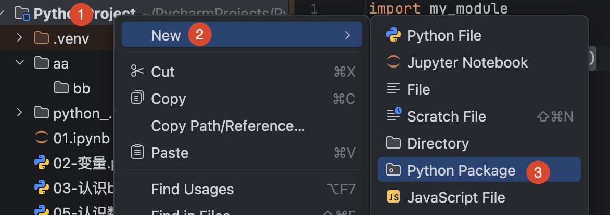
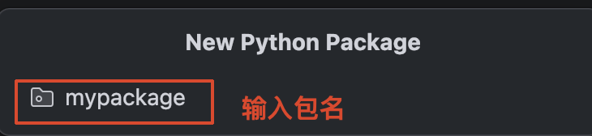
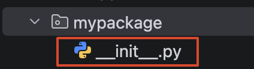

模块是一个 python 文件，以 .py 结尾，包含了 python 对象定义和 python 语句

模块能定义函数，类和变量，模块里也能包含可执行的代码

:::info
使用方式：

+ 1、 导入模块
+ 2、使用模块中的功能

:::

# 导入模块的三种方式
+ 1、 导入某个指定的模块

```python
# 导入模块
import 模块名
import 模块名1, 模块名2

# 调用功能
模块名.功能名()
```

+ 2、 导入模块中的指定功能

```python
# 导入模块中的指定功能
from 模块名 import 功能1, 功能2, 功能3, ……

# 使用功能
功能名()
```

+ 3、 导入模块中的所有功能

```python
# 导入模块中的所有功能
from 模块名 import *

# 使用功能
功能名()
```

+ as 定义别名
    - 使用的时候，只能使用别名

```python
# 模块名定义别名
import 模块名 as 别名

# 功能定义别名
from 模块名 import 功能名 as 别名
```

# 制作模块
+ python 中，每个 python 文件都可以作为一个模块，模块的名字就是文件的名字，也就是说自定义模块名必须要复合标识符命名规则

## 定义模块
+ 新建 python 文件，内部写需求

```python
# 需求：一个函数，完成任意两个数字加法运算
def testA(a, b):
    print(a + b)
```

## 测试模块
+ 直接调用，是测试信息
+ 测试信息，一般需要保留，所以需要加条件判断
+ __name__：
    - 如果程序是在当前文件运行的，值是：__main__
    - 如果程序不是在当前文件运行的，值是：模块名

```python
# 需求：一个函数，完成任意两个数字加法运算
def testA(a, b):
    print(a + b)

# 测试模块
if __name__ == '__main__': # 只有当前函数是主函数的时候，才会执行
    testA(1, 2)
```

## 使用模块
```python
import my_module

my_module.testA(2,2)
```

## __all__ 列表
+ 如果一个模块文件中有 __all__ 列表，当使用 from 模块名 import * 导入时，只能导入这个列表中的元素

```python
# 在 __all__ 列表中的功能，可以被 * 导出
__all__ = ["功能名1", "功能名2"，……]
```

# 模块的定位顺序
+ 当导入一个模块，python 解析器会对模块的位置进行搜索
    - 1、当前目录
    - 2、如果不在当前目录，python 会搜索在 shell 变量 PYTHONPATH 下的每个目录
    - 3、如果上面都找不到，python 会查看默认路径
+ 注意：
    - 自己的模块名，不要和已有模块名重名，否则导致功能无法使用

# 包
+ 包将有联系的模块组织在一起，即放在同一个文件下
+ 创建包的时候，会自动在这个文件夹下创建一个 __init__.py 文件

## 创建包
+ 【new】-【Python Package】-【输入报名】-【ok】-【新建功能模块】（有联系的模块）
+ 内部自动创建 __init__.py 文件，这个文件控制着包的导入行为







## 导入包
+ 导入包中的模块

```python
# 导入包中的模块
import 包名.模块名

# 调用
报名.模块名.功能名()
```

+ 导入包中的所有模块
    - 必须在 __init__.py 文件中设置 __all__ 列表，列表中指定的模块才可以被导出

```python
# 导入包中的所有模块
from 包名 import *

# 使用
模块名.功能名()
```

# random 模块
+ 导入模块：import random

## 生成随机整数
+ random.randint(开始, 结束)
    - 生成一个 [ 开始， 结束 ] 区间的随机数

```python
# 导入随机数模块
import random

# 调用模块中的方法，生成一个随机数
res = random.randint(0,10) # [开始, 结束]
print(res)
```

# functools 模块
+ 导入包：functools

## 累积方法
+ reduce(func, lst)
    - func：需要两个参数，每次计算的结果和下一个元素做累积计算
    - lst：累积的列表

```python
# 导入模块
import functools

list1 = [1,2,3,4,5]

# reduce：累积
result = functools.reduce(lambda x, y: x * y, list1)
print(result)
```

# os 模块
+ 导入模块：import os

## 重命名文件/文件夹
+ os.rename(原文件名, 新文件名)

```python
# 导入模块
import os

# 重命名
os.rename("1.txt", "2.txt")
```

## 删除文件
+ os.remove(文件名)

```python
# 导入模块
import os

# 删除文件
os.remove("2.txt")
```

## 创建文件夹
+ os.mkdir(文件夹名字)
    - 可以放文件夹
    - 也可以放带路径的文件夹

```python
import os

# 创建文件夹
os.mkdir("images")
```

## 删除文件夹
+ os.rmdir(文件夹名字)

```python
import os

# 删除文件夹
os.rmdir("images")
```

## 获取当前目录路径
+ os.getcwd()

```python
import os

# 获取当前文件所在路径:绝对路径
print(os.getcwd())
```

## 改变默认目录
+ os.chdir(目录）

```python
import os

# 创建文件夹
os.mkdir("aa")

# 改变默认目录：切换到aa目录
os.chdir("aa")

# 创建bb文件夹
os.mkdir("bb")
```

## 获取目录列表
+ os.listdir(目录)

```python
import os

# 获取目录下所有文件列表
print(os.listdir(os.getcwd()))
```

# time
## 休眠：sleep
```python
import time

# 执行到这里，等到固定之后继续执行（单位秒）
time.sleep(秒)
```

# math
## 开平方： sqrt
```python
import math

print(math.sqrt(16))
```

# json
| **函数** | **输入** | **输出** | **什么时候用** |
| --- | --- | --- | --- |
| `**<font style="color:#DF2A3F;">json.load(f)</font>**` | 一个**打开的文件对象** | Python 对象（字典/列表） | 从文件读，边读边解析 |
| `**<font style="color:#DF2A3F;">json.loads(s)</font>**` | 一个**字符串** | Python 对象 | 字符串已经在内存里了（比如网络请求返回的） |
| `**<font style="color:#DF2A3F;">json.dump(obj, f)</font>**` | Python 对象 + 一个**打开的文件对象** | 无返回值，直接写进文件 | 把结果存成文件 |
| `**<font style="color:#DF2A3F;">json.dumps(obj)</font>**` | Python 对象 | 一个**字符串** | 只是想看看/打印一下转换后的样子，不落盘 |


**详细见知识点补充**

# collections
| **collections 里的工具** | **解决什么问题** |
| :---: | --- |
| `**<font style="color:#DF2A3F;">Counter</font>**` | 统计每个元素出现的次数，自带 `most_common()`<br/> 取出现最多的几个 |
| `**<font style="color:#DF2A3F;">defaultdict</font>**` | 键不存在时自动生成默认值，不用先判断再赋值，避免 `KeyError` |
| `**<font style="color:#DF2A3F;">deque</font>**` | 两端增删都很快，配合 `maxlen`<br/> 做固定长度的滑动窗口（传感器数据缓冲） |
| `**<font style="color:#DF2A3F;">namedtuple</font>**` | 给元组的每一项起名字，用属性名代替裸下标取值，可读性好 |
| `**<font style="color:#DF2A3F;">OrderedDict</font>**` | 记住插入顺序的字典（Python 3.7+ 普通 `dict`<br/> 已有此特性，现在用得少） |
| `**<font style="color:#DF2A3F;">ChainMap</font>**` | 把多个字典串成一个来查，常用于"默认配置 + 用户配置"这种多层覆盖 |


**详细见知识点补充**

