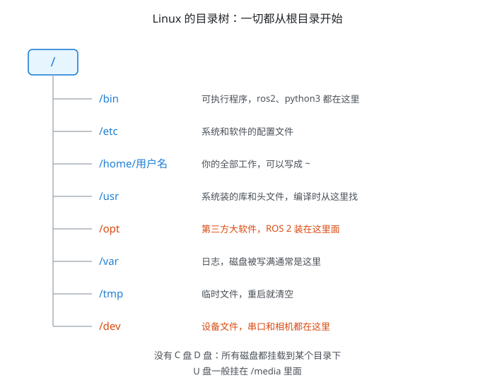
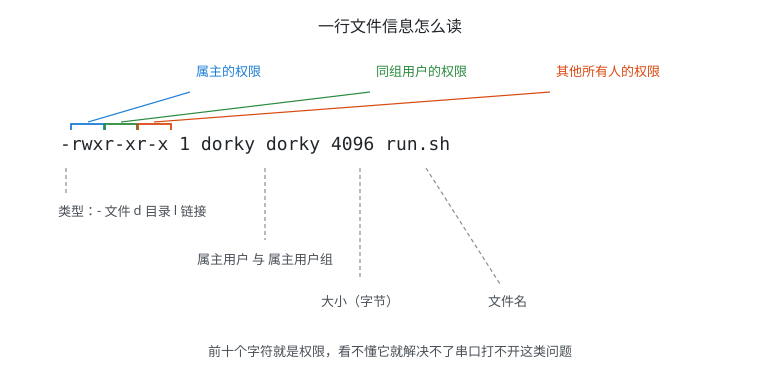
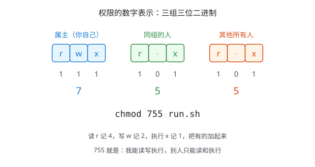
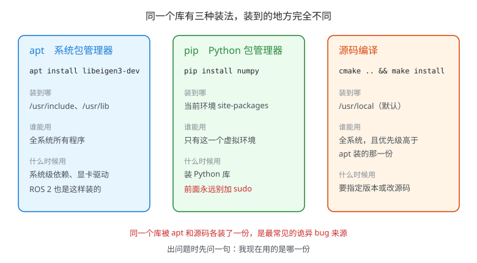

# 具身智能编程基础(13)：Linux 入门与开发环境

| 内容 | 必须掌握的 | 后面在哪用到 |
| --- | --- | --- |
| 装哪个版本 | **先定 ROS 2 版本，再定 Ubuntu 版本**；双系统、虚拟机、WSL2 的能力边界 | 第 46 行装 ROS 2、第 59 行仿真、第 82 行 Isaac Lab、第 97 行 Jetson |
| 目录结构与路径 | 主要目录各放什么；绝对路径与相对路径；`~`、`.`、`..` | 工作空间布局、launch 里的路径、编译时找不到头文件 |
| 用户与权限 | `ls -l` 前十个字符；rwx 与数字；chmod、chown | 串口和 CAN 设备打不开、脚本没有执行权限 |
| 软件从哪来 | apt、pip、源码编译三条路各装到哪 | 第 17 行的编译心智模型、第 18 行虚拟环境、一切"版本冲突" |
| sudo 的边界 | 什么时候该用、什么时候绝不能用 | 别把系统搞坏，也别把 Python 环境搞坏 |
| 一组基本命令 | 十几条，够用就行 | 从明天起每天都在敲 |

这一篇对应[学习路径](学习路径.md)第 13 行，12 小时。**最容易被低估的是第一节**：Ubuntu 版本选错，后面装 ROS 2 时会发现官方根本没有对应的包，只能重装系统。这件事排在最前面不是凑数。

> 这一版学习路径把 Python 与 NumPy（第 1 到 12 行）排到了 Linux 前面——那两块在 Windows、Mac 上装个 Python 就能学，不用等装好 Ubuntu。真正离不开 Linux 的从这一篇开始，一路到后面的 C++、ROS 2。

## 一、先决定装哪个版本

### 为什么必须是 Linux

不是偏好问题，是三条硬约束：

- **ROS 2 只在 Ubuntu 上有官方二进制包。** 其他系统要么自己编译整套源码，要么用容器绕，都不适合从零开始的人
- **仿真器、驱动、开源代码默认 Ubuntu。** Isaac Sim、MuJoCo、各家相机雷达的 SDK，文档里的安装步骤都是按 Ubuntu 写的
- **机器人身上那台电脑跑的就是 Linux。** Jetson 出厂就是 Ubuntu，工控机也装 Ubuntu。你在开发机上养成的习惯要能直接搬过去

所以这一步没有别的选项：**装 Ubuntu，而且是 LTS（长期支持）版本**。

### 版本不是越新越好

**先定 ROS 2 版本，再反推 Ubuntu 版本**——顺序反了就要重装。两个 LTS 组合：

| Ubuntu | 对应的 ROS 2 | ROS 2 支持到 | 适合谁 |
| --- | --- | --- | --- |
| 22.04（Jammy） | **Humble Hawksbill** | 2027 年 5 月 | 要复现前几年的开源项目，绝大多数论文代码基于它 |
| 24.04（Noble） | **Jazzy Jalisco** | 2029 年 5 月 | 从零开始、以学习为主，能用更久 |

**建议装 22.04 + Humble。** 理由不是它更新，恰恰相反：你接下来两年要读、要跑的开源仓库——legged_gym、各种 SLAM、大量论文代码——绝大部分只在 Humble 上验证过。学习阶段最怕的不是版本老，是**跑别人的代码时报的错没人遇到过**。

等第 106 行开始做自己的项目、不再依赖别人的仓库时，再考虑升到 Jazzy。

### 装在哪：双系统、虚拟机、还是 WSL2

| 方式 | GPU 训练 | 接真机（USB、串口、CAN） | 图形仿真 | 上手难度 |
| --- | --- | --- | --- | --- |
| **双系统** | 完整可用 | 完整可用 | 完整可用 | 要分区，有装坏的风险 |
| 虚拟机 | 基本用不了 | 能转发，但不稳定 | 卡 | 最简单，装错了删掉重来 |
| WSL2 | 可用 | **不支持 CAN，串口要额外折腾** | 需要额外配置 | 简单，但坑在后面才暴露 |

**结论**：只要你打算做到第 83 行（大规模并行 RL 训练）和第 98 行（接真实机器人），**最终一定要双系统**。

但没必要一步到位。**先用虚拟机把第 1 到 45 行走完**——Python、C++、科学计算这些完全不吃 GPU，虚拟机足够。等真要跑 Isaac Lab 或接机器人时再装双系统，那时你对 Linux 已经熟了，分区也不慌。

## 二、目录结构与路径

### 一切从根目录开始

Windows 有 C 盘 D 盘，Linux 没有。**整个系统只有一棵树，树根就是 `/`**。第二块硬盘、U 盘、SD 卡，都是被"挂载"到这棵树的某个目录上，访问它们就是访问那个目录。

### 图示：Linux 的目录树

八个目录里，**现在必须记住四个**：

- **`/home/用户名`**——你的地盘，简写成 `~`。所有代码、数据、笔记都放这里，这是唯一可以随便写的地方
- **`/opt`**——第三方大软件。**ROS 2 装在 `/opt/ros/humble`**，以后每次开终端都要 source 这个目录下的脚本
- **`/usr`**——系统装的库和头文件。第 36 行写 CMake 时，`find_package` 就是到这里来找
- **`/dev`**——设备文件。相机是 `/dev/video0`，USB 转串口是 `/dev/ttyUSB0`。**在 Linux 里，硬件也是文件**

`/etc` 放配置、`/var` 放日志（磁盘莫名其妙满了，先查这里）、`/tmp` 重启就清空、`/bin` 放可执行程序——知道是干什么的即可。

### 绝对路径与相对路径

- **绝对路径**从 `/` 开始写，比如 `/home/dorky/ws/src`。在哪儿执行都指向同一个地方
- **相对路径**从当前目录开始算，比如 `src/main.cpp`。换个目录执行，含义就变了

四个简写要认得：

- `~` 是你的家目录，等于 `/home/用户名`
- `.` 是当前目录。所以运行当前目录下的程序要写 `./run.sh`，**不能只写 `run.sh`**
- `..` 是上一级目录
- `-` 是"上一次待过的目录"，`cd -` 能在两个目录之间来回跳

**一条纪律：自己的东西全部放在 `~` 下面。** 教程里凡是让你往 `/` 或 `/usr` 下面复制文件的，先想清楚再动手——那些地方装错了不好清理。

## 三、用户与权限

### 为什么会有权限这回事

Linux 一开始就是多人共用一台机器的系统，所以每个文件都要回答三个问题：**谁能读、谁能写、谁能执行**。而且这三个问题要对三种人分别回答：**文件的属主、和属主同组的人、其他所有人**。

三乘三，就是九个开关。这九个开关就是权限。

### 图示：一行文件信息怎么读

`ls -l` 列出来的每一行，**开头十个字符是全部信息量所在**：

- 第 1 个字符是**类型**：`-` 普通文件，`d` 目录，`l` 符号链接，`c` 字符设备（串口就是它）
- 第 2 到 4 个字符是**属主**的读、写、执行权限
- 第 5 到 7 个是**同组用户**的
- 第 8 到 10 个是**其他所有人**的

后面依次是硬链接数、属主、属主组、大小、修改时间、文件名。

`r` 读、`w` 写、`x` 执行，位置是固定的，某一位是 `-` 就表示没有这个权限。所以 `-rwxr-xr-x` 读作：**普通文件，我能读写执行，别人只能读和执行。**

对**目录**来说三个字母的含义不太一样：`r` 是能列出里面有什么，`w` 是能在里面新建删除文件，`x` 是能 `cd` 进去。目录没有 `x`，就算有 `r` 也进不去。

### 图示：权限的数字表示

九个开关每三个一组，看成三位二进制数，再写成十进制，就得到 `chmod` 用的那三个数字：

- `r` 记 4，`w` 记 2，`x` 记 1，有哪个就加哪个
- `rwx` = 4+2+1 = **7**，`r-x` = 4+1 = **5**，`rw-` = 4+2 = **6**，`r--` = **4**

两个组合背下来就够用了：

- **`chmod 755`**——脚本和目录用这个。我能改，别人能运行不能改
- **`chmod 644`**——普通文件用这个。我能改，别人只能读

改属主用 `chown`，比如 `sudo chown -R dorky:dorky ~/ws`（`-R` 是连子目录一起改）。什么时候需要？**当你不小心用 sudo 创建了本该属于自己的文件时**——那些文件的属主会变成 root，之后你自己反而改不动。

### sudo 的边界

`sudo` 是"以管理员身份执行这一条命令"。它能解决一切权限问题，所以也最容易被滥用。三条纪律：

- **`pip install` 前面永远不要加 `sudo`。** 加了会把包装进系统 Python，和 apt 装的包互相覆盖，最后两边都坏。Ubuntu 23.04 之后系统会直接拦住你，报 `externally-managed-environment`——**那不是错误，那是保护**。正确做法在第 18 行：用虚拟环境
- **不要用 `chmod 777` 解决问题。** 它的意思是"所有人都能读写执行"，等于把门拆了。网上很多教程这么教，是因为这样最省事
- **设备权限用"加用户组"解决，不用 sudo。** 插上 USB 转串口后打不开 `/dev/ttyUSB0`，标准做法是 `sudo usermod -aG dialout $USER`，把自己加进 `dialout` 组，**注销重新登录后生效**。这条命令你以后会敲很多次

## 四、软件从哪来

### apt 和软件源

Ubuntu 的软件不是满世界下安装包，而是从**软件源**（一批服务器）统一装。两条命令：

- `sudo apt update`——**只更新"有哪些软件、什么版本"这份清单，不装任何东西**。这是新手最常见的误解
- `sudo apt install 包名`——真正下载并安装

装开发用的库时注意包名后面的 `-dev`：`libeigen3-dev` 比 `libeigen3` 多了头文件。**写代码要用的一律装 `-dev` 版**，否则编译时会报找不到头文件。

国内直接连官方源很慢，换成清华或中科大的镜像源能快十倍以上。**注意 Ubuntu 24.04 换了源文件的位置和格式**：22.04 改 `/etc/apt/sources.list`，24.04 改 `/etc/apt/sources.list.d/ubuntu.sources`。按你装的版本查对应的镜像站说明，别照抄旧教程。

### 图示：三条安装路径

同一个库有三种装法，**装到的位置和影响范围完全不同**：

- **apt** 装到 `/usr` 下面，全系统可见。系统级依赖、驱动、ROS 2 都走这条路
- **pip** 装到当前 Python 环境的 `site-packages`，只有这个环境看得见。Python 库走这条路
- **源码编译** 默认装到 `/usr/local`，全系统可见，而且**优先级高于 apt 装的那一份**

最后一条是关键：`/usr/local` 排在 `/usr` 前面。所以当你先用 apt 装了 Eigen，又从源码编译装了一份新版，**编译器会用源码那份，而你以为在用 apt 那份**。这就是"同样的代码在我这儿编不过"这类问题最常见的来源。

出问题时先问一句：**我现在用的到底是哪一份？** 第 17 行讲的 `PATH`、`LD_LIBRARY_PATH` 就是回答这个问题的工具。

## 五、这十几条命令先记住

不用背，敲几天就熟了。**每一条都自己在终端里试一遍**，比看十遍强。

| 命令 | 作用 | 例子 |
| --- | --- | --- |
| `pwd` | 我现在在哪 | `pwd` |
| `ls` | 列出文件，`-l` 详细，`-a` 含隐藏文件 | `ls -la` |
| `cd` | 换目录 | `cd ~/ws`、`cd ..`、`cd -` |
| `mkdir` | 建目录，`-p` 连父目录一起建 | `mkdir -p ws/src` |
| `cp` | 复制，`-r` 连目录一起 | `cp -r src bak` |
| `mv` | 移动，也用来改名 | `mv a.py b.py` |
| `rm` | 删除，`-r` 删目录 | `rm -r build` |
| `cat` | 打印整个文件 | `cat CMakeLists.txt` |
| `less` | 分页看大文件，`q` 退出 | `less log.txt` |
| `find` | 按名字找文件 | `find . -name "*.py"` |
| `grep` | 在文件里搜内容，`-r` 递归 | `grep -r "TODO" src` |
| `which` | 这条命令用的是哪个可执行文件 | `which python3` |
| `df` | 看磁盘还剩多少 | `df -h` |
| `chmod` | 改权限 | `chmod 755 run.sh` |
| `sudo` | 以管理员执行这一条 | `sudo apt install git` |

**`rm` 没有回收站，删了就是删了。** 尤其别在 `rm -r` 后面跟一个自己没看清的路径。养成习惯：删之前先用 `ls` 看一眼那个路径到底是什么。

`which` 这条容易被忽略，但排查问题时极其有用：**当你怀疑"我装的到底是哪一份"时，`which` 直接告诉你答案。**

## 对应视频

**本篇内容在主用资源里没有对应的视频合集**，说清楚原因，免得你去找：

- **[Missing Semester 中文版](https://missing-semester-cn.github.io/)**：这门课从 shell 讲起，**不讲装系统、不讲目录结构、不讲 apt**。它的第 1、2 讲对应本路径第 14 行（命令行日常），这一篇之后再看正好
- **鸟哥的 Linux 私房菜 基础学习篇**：目录结构、权限、软件安装讲得最全，但它是书不是视频，而且篇幅远超需要。**当手册查，不要通读**

装系统这件事本身，跟着 **[Ubuntu 官方安装教程](https://ubuntu.com/tutorials/install-ubuntu-desktop)** 一步步做即可，比任何二手教程都可靠。B 站上"Ubuntu 双系统安装"的视频很多，随便挑一个**发布时间在一年内**的跟着做，注意别照抄两三年前的分区步骤。

**本篇的正文就是主线**，看完动手做，卡住了再去查上面三个资源。

（Missing Semester 的讲次结构已联网核实：英文站 2026 版共 9 讲，中文站是 2020 版的翻译，两者编号不同，按讲次标题对照着找。）
